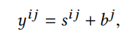
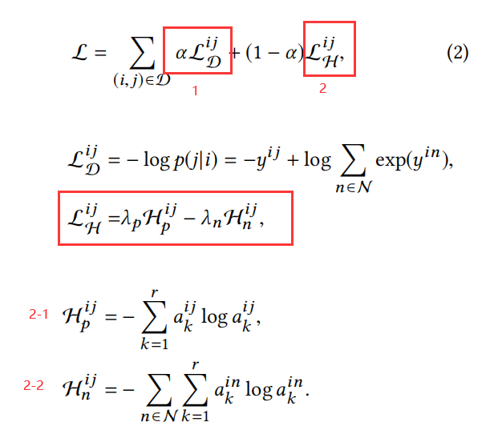

**Explainable Recommendations via Attentive Multi-Persona Collaborative Filtering**

AMP-CF，把用户的嵌入表示  用注意力加权多个persona的嵌入 来表示，这些注意力得分是根据物品来计算的。用户表示随物品动态构建。

另外提出了一种新颖的评估方案，根据与用户历史项目中“口味”的潜在分布的距离，比较推荐列表中的不同项目。

### AMP-CF

#### 模型结构

- 原始用户嵌入[r,d] 物品嵌入[d,1]
- 通过线性映射到注意力空间[r,da] [da,1] 然后计算注意力得分
- 原始用户嵌入和注意力分加权成 用户表示， 取出物品原始表示，预测得分（内积+物品偏置）

#### 损失函数

两部分：

- 一是让正样本概率大于负样本概率
- 二是使用信息熵来控制 多个角色的注意力分布：①对于正样本来说，每个角色的注意力分数分布尽量差距大，希望越是某个角色注意力得分为1，其他得分为0越好；对于负样本来说，由于随机抽取，不需要这样优化，而是希望每个角色的注意力分布尽量相同，希望每个觉得注意力得分相同

**<u>两点问题 没看懂：</u>**

- L_D 公式为啥是这种形式
- $H_n^{ij}$ 为啥对于每一个D中的(i,j) 都取所有负样本 而不是一个正样本对一个负样本

### 实验

提出了一种新的评估指标TDD，评估推荐算法模拟用户口味分布的能力。

- 使用交互矩阵每一列表示物品，PCA获取物品的100维表示，K-Means将物品聚成50类，相当于50种口味。

- 用户u 推荐列表中每个物品和50个聚类中心的余弦相似度（应该是使用那个100维的向量来计算），计算推荐列表的平均这个值，得到50维的 推荐列表口味分布
- 同上，计算用户历史行为的50维的 用户历史口味分布
- 计算两个分布间的差距

对于历史口味多样的用户，推荐列表应尽量多样和其口味相同；对于历史口味单一的用户，推荐列表应尽量是这一类口味物品。

