**Real-time Personalization using Embeddings for Search Ranking at Airbnb**

**2018-KDD**

Airbnb作为一个短期租赁市场，面对的RS问题比较独特：双边市场，需要为房主和租客优化，用户很少消费同一个item两次，一个listing在确定的一组预定中只能接受一个租客。

### 1 INTRODUCTION

双边匹配市场中的搜索排序需要同时满足供应方和需求方。

Airbnb的搜索ranking很清晰：

- 输入query是位置和旅行日期
- 将房屋按照位置、价格、风格、评论等进行排名
- 使用L2R进行resort

### 3 METHODOLOGY

#### 3.1 item嵌入

点击session $s=(l_1,l2,...,l_M)$ ，会话集合 $S$，目标是学习到每个item(房间、listing)的嵌入，相似的item的嵌入要接近，损失函数为：

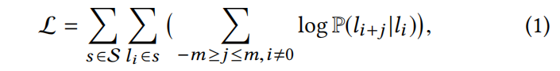

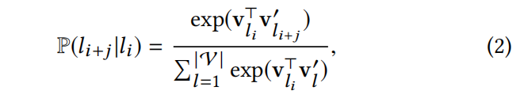

m是滑动窗口前后的长度（总邻居为2m），窗口内的item称为context/neighborhood。分母计算量太大，进行负采样，item $l$，context $c$ （即每个item有2m个）：

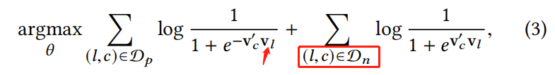

**预定的item作为全局context**

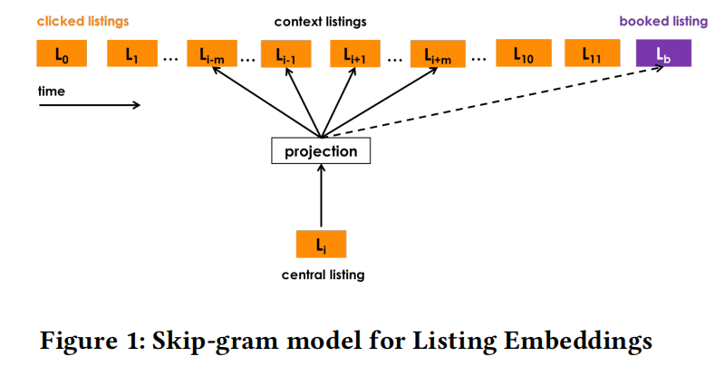

两种session:

- 预定会话：最后一个点击item被预定，该session结束
- 探索性会话：仅仅是浏览，这一个session中的item没有被预定

在预定的会话中，把booked item做为该 $s$ 中所有item的context，并且label=1：

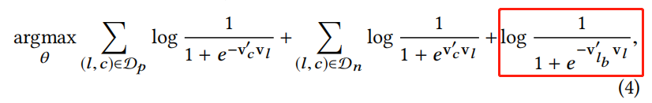

**用于聚集性搜索的自适应训练**

由于用户的旅游目的地是确定的，因此一个session中相邻的item大概率都是一个城市下的不同item。因此对于中心item，其pos样本item都是同一个城市，然而随机负采样item很可能和中心item不在同一个城市，因此造成不平衡。因此除了随机负采样，还增加了相同城市内的负采样。

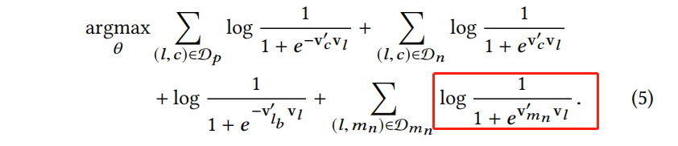

**冷启动item嵌入**

对于新的item，根据meta-data（距离相近、类型、价格）找到最相似的3个item，嵌入取平均

**检查item嵌入**

k-means聚类，相同城市的item嵌入更接近

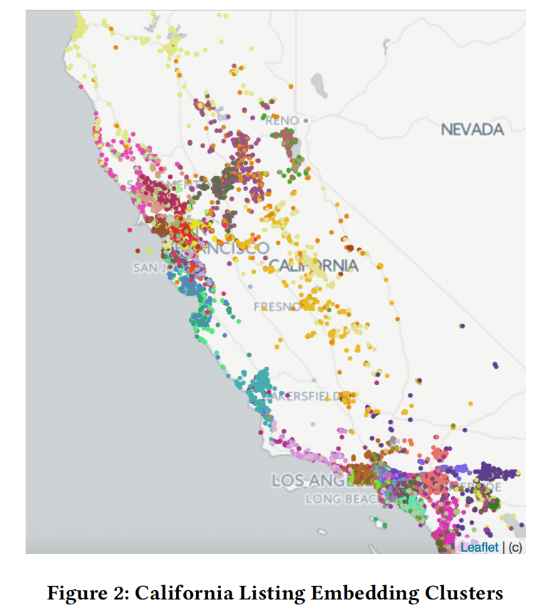

同一个城市不同类型的item平均cos

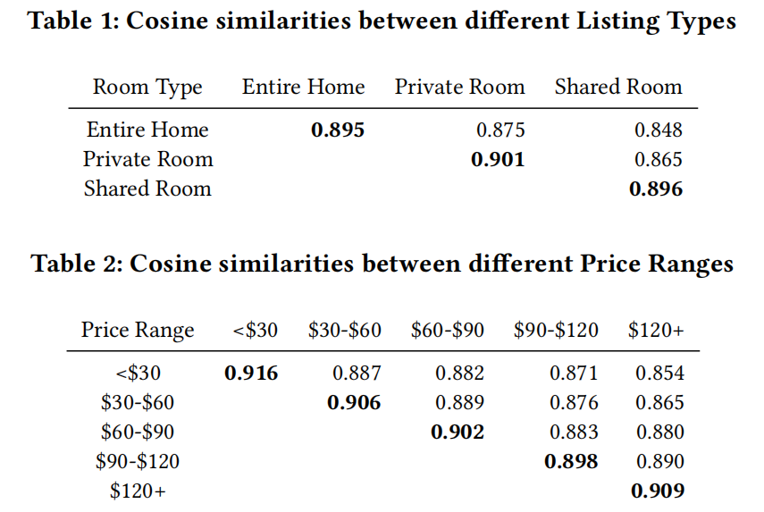

对于一个item，进行KNN，发现风格类似

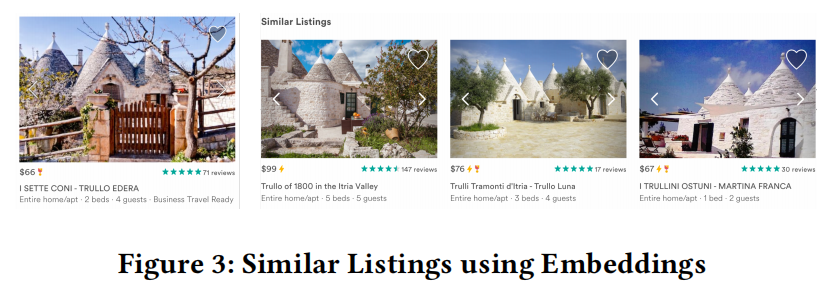

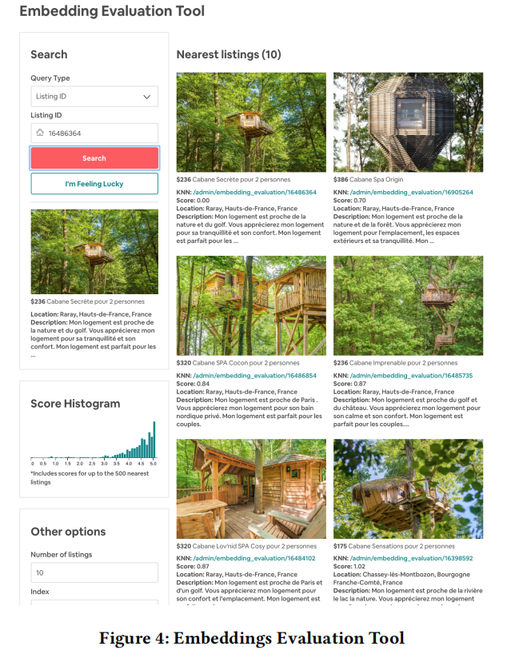

#### 3.2 user类型 & item类型 嵌入

3.1得到的物品嵌入适用于短期(session级别)的个性化，但是用户仍然有长期的偏好。直接用用户的预定历史item为每个id的item学嵌入在Airbnb不太好实现，因为很多用户的历史很稀疏，就预定过1个item。因此不根据id为item学长期嵌入，而是使用item的其他meta-data来学习这种type item的嵌入。同样根据user的meta-data来学习这种type user的嵌入。

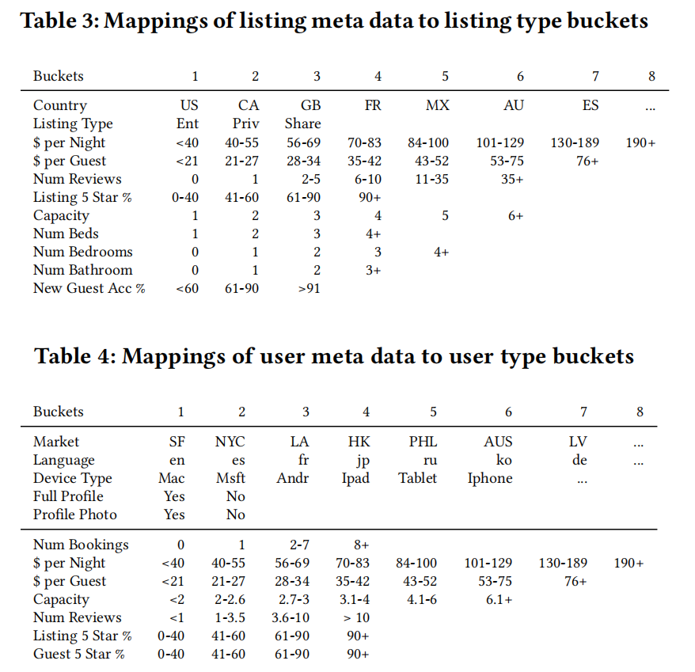

预定序列为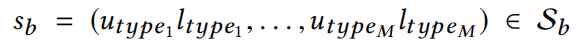，序列中的每个元素为 (u type, i type)

*（注：这个预定序列是一个user的还是所有user的？）*

user type、item type分别做中心词

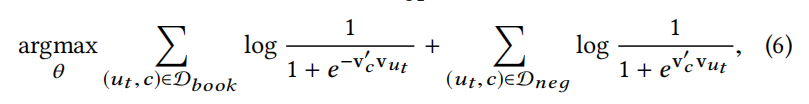

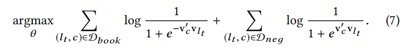

**房主拒绝做显式负样本**

房主对租客的拒绝也反映出房主的偏好。将拒绝信号引入训练的目的是让一些 item type对于没有预定成功的user type 没那么敏感。

中心词是user type、item type 分别如下：

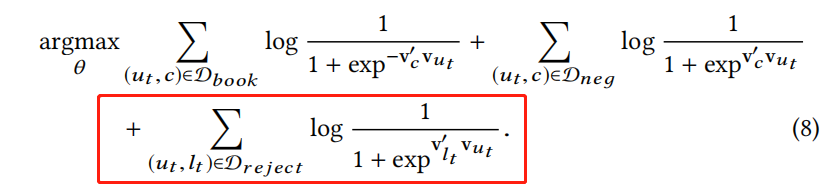

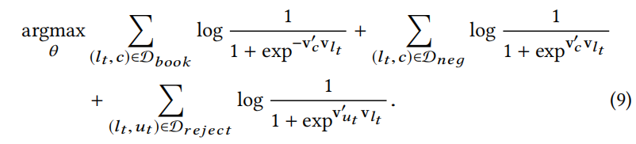

