**BERT4Rec: Sequential Recommendation with Bidirectional Encoder Representations from Transformer**

**2019-CIKM**

### ABSTRACT

之前的研究使用序列神经网络，从左到右编码用户的交互记录，编码为隐藏表示。本文认为这种从左到右的单向模型是次优解，因为：

- 单向架构限制了用户行为序列中隐藏表示的能力；
- 它们通常假设有一个严格有序的顺序，而这并不总是实际的。

本文提出BERT4Rec，采用Cloze task的损失函数（为了避免信息泄露），联合使用左右上下文来预测随机mask的物品。

### 2 RELATED WORK

#### 2.1 通常的RS

- 早期的CF：
  - MF
  -  item-based neighborhood methods，衡量target item和user的历史交互Items的相似度 （根据预先计算好的i2i相似性）

- Deep Learning：
  - 整合从side info中学习到的item表示
  - 代替传统的内积：NCF、AutoRec、CDAE

#### 2.2 序列推荐

- MC马尔可夫链，一阶MCs、高阶MCs
- RNN，将用户之前的记录encode一个向量
  - GRU4Rec、DREAM、NARM
- 其他DL网络
  - Caser、记忆网络、STAMP

#### 2.3 注意力机制

- 把注意力机制当作原始模型的一个附加组件
-  Transformer、BERT完全建立在多头自注意力机制上， SASRec

### 3 BERT4REC

#### 3.1 问题定义

用户的时间顺序交互序列：

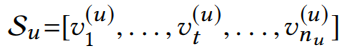

任务，建模用户在下一时刻对所有物品的点击可能性：

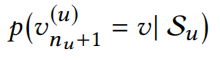

#### 3.2 模型架构

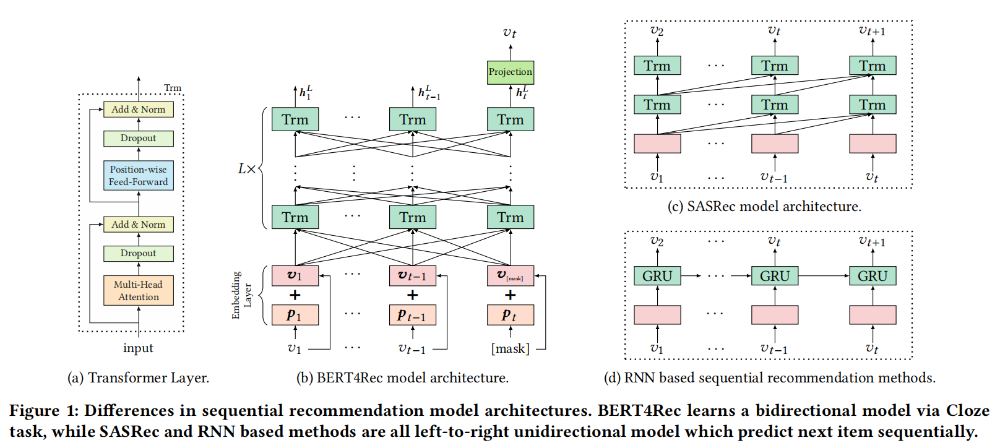

不同于RNN和SASRec的单向建模，本文的模型是双向建模

#### 3.3 Transformer 层

**多头自注意力**

d维的表示，**线性投影**到h个子空间中，每个子空间中纬度 d/h；每层的投影矩阵有3个，并且不同层之间的投影矩阵不共享

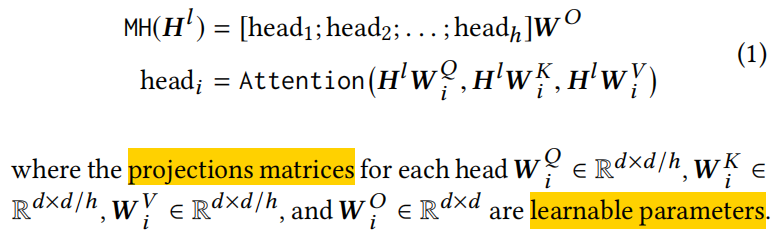

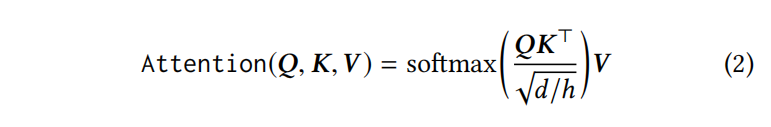

**按位置的前馈神经网络**

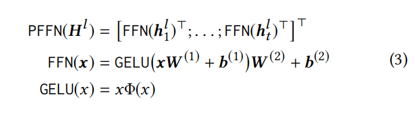

W、b这些参数在不同的层与层之间是不同的

**堆叠Transformer层**

堆叠更多的Transformer层来学习更复杂的item转移模式；由于多层训练困难，增加了残差连接+dropout+LN：

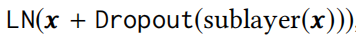

总结：

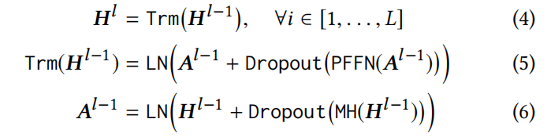

#### 3.4 嵌入层

在多层Trim的最底部加上位置嵌入p

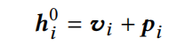

#### 3.5 输出层

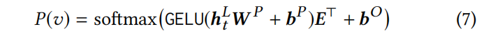

其中E是物品的嵌入表，在输入和输出使用共享的物品嵌入表来缓解过拟合和减少参数

*（Q：共享item嵌入表指的是，h的输入就是E吗？）*

#### 3.6 模型学习

传统的单向序列推荐，预测输入序列的下一个物品；即输入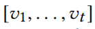,traget是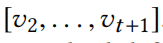

本文训练目标使用*Cloze* task （Masked Language Model），在每个train step，随机mask掉输入序列 ρ比例的items，使用其左右来预测它：

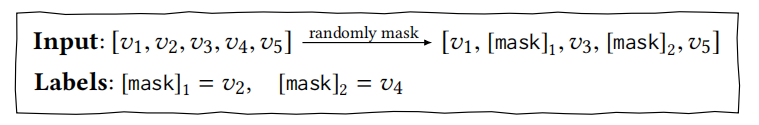

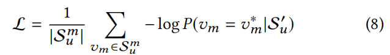

这种task是预测随机mask处，为了适合序列推荐，在用户历史序列最后加入了一个特殊的token [mask]，基于最终token的表示来预测next item；因此训练的时候也mask掉每个输入序列的最后一个item。

*（Q：这为啥类似于 fine-tuning ？）*

#### 3.7 讨论

