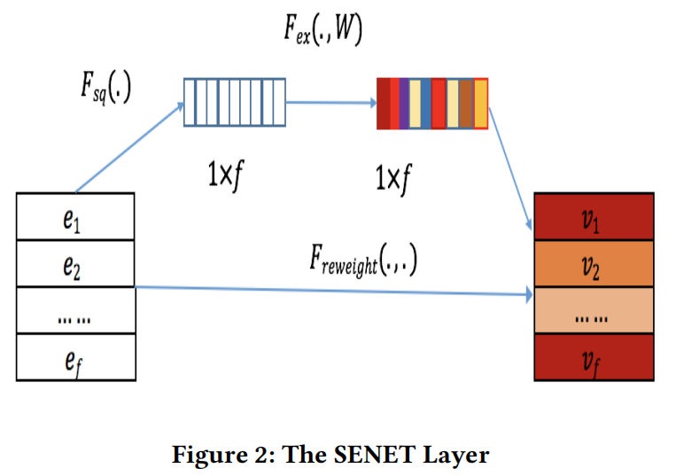

## 2016-RecSys-Field-aware Factorization Machines for CTR Prediction

- 理解一（个人之前的理解）：城市是field，北京、上海、广州是这个field的特征取值；数量是field，1，2，3是这个field的特征取值
- 理解二（真实的理解，更灵活的交叉）：可以把多个同类别的field划分到一个更大的field去，比如性别、城市、年龄、收入都划分到user这个高级field中，这样可以减少ffm的参数；然后让user、item、context这种高级的field进行交叉
- 个人之前的理解里的field可以称为特征组、然后高级的field才是真正的field

参考：[推荐系统FM & FFM算法解读与实践_baymax_007的博客-CSDN博客](https://blog.csdn.net/baymax_007/article/details/83931698)

## 2017-AdKDD-Deep & Cross Network for Ad Click Predictions

提出DCN，引入了交叉网络，能够有效地学习到确定的有界度的特征交互。

### DCN

1. 嵌入拼接
   - spare特征嵌入+dense值 的cancat 形成 $x_0$
   - 
2. 交叉网络
   - 输入:[d,1]，输出:[d,1]
   - 
   - 维度分别为 [d,1]=**[d,1]**\[1,d] **[d,1]**+**[d,1]**+[d,1]
   - 
3. 深度网络
   - MLPs
4. 结合层
   - concat+MLP+sigmoid

个人感觉DCN主要要理解其如何做到的特征之间的High-degree Interaction，虽然理论分析没有看得很清楚，但是个人的理解是这样的：

- 一层交叉网络相当于：
  - 对输入 $x_{input}$ 的每个维度一起做交互，【所有维度的交互】都要和 【$x_0$ 的每个维度做交互】
  - 原结果上再加上原 $x_input$
- 多层交叉网络相当于:
  - $x_1$：$x_0$每个维度交互，所有维度的交互都和$x_0$每个维度交互，+ $x_0$；所以 $x_1=[x_0先全交互][对x_0交互]+x_0$
  - $x_2$：$x_1$每个维度交互，所有维度的交互都和$x_0$每个维度交互，+ $x_0$；所以 $x_2=[x_1先全交互][对x_0交互]+x_1=[[[x_0先全交互][对x_0交互]+x_0]先全交]互][对x_0交互]+[[x_0先全交互][对x_0交互]+x_0]$

## 2019-CIKM-AutoInt: Automatic Feature Interaction Learning via Self-Attentive Neural Networks
#### AutoInt

- 模型架构：concat所有field特征嵌入；【多头自注意力机制+残差】×层；输出
- 嵌入层
  - 分类特征和数值特征的嵌入维度一致，经过嵌入做concat（或者说形成序列的格式）
  - 将所有field的特征映射到相同的低维空间中

- 相互作用层
  - 建模高阶组合特征
  - 对于每一个head，对于每一个特征 $m$ 来说；**得到特征 $m$ 在这个head子空间的特征组合**（即用所有特征进行加权、转化）
  - 所以每个特征 $m$ 嵌入经过相互作用层，得到不同的head下的 对于$m$来说的 特征组合 拼接；最终得到高阶特征组合的特征
  - 
  - 
- 输出层
  - 就是把所有特征得到的高阶特征组合 concat+MLP+sigmoid
  - 

## 2019-RecSys-FiBiNET: Combining Feature Importance and Bilinear feature Interaction for Click-Through Rate Prediction
动机：

- 当前的工作用简单的方式（Hadamard product、内积）来计算特征交互
- 很少关注于特征的重要性

本文提出FiBiNET，动态学习特征的重要性和细粒度的特征交互。

### FiBiNET

核心就在于这个SENET Layer，让模型自适应地学习出特征的重要性：

- 输入是所有field的嵌入  [f,k] ，输出是re-weight之后的嵌入 [f,k]
- 挤压(Squeeze)：对于每一个filed的嵌入，将k维压缩至1维（sum、mean、max pool），这个1维的标量代表着这个emb的全局信息；因此得到统计向量 z [1,f]
- 提取(Excitation)：基于统计向量z学习到每个field emb的重要性 [1,f]；具体方式是经过两个全连接层，先降维再升维
  - 
  - 
- Re-Weight：使用重要性向量对原始嵌入做re-weight

双线性交互层，提出三种，其实就是field i和field j交互时的参数矩阵[k,k]分别是 1个、f个、f(f-1)/2个；输出维度是[f(f-1)/2,k]

- 
- 
- 

接下来把原始嵌入和SENET得到的嵌入分别送入交互层，结果concat+MLPs

## 2021-WWW-DCN V2: Improved Deep & Cross Network and Practical Lessons for Web-scale Learning to Rank Systems
学习高效的特征交互是CTR中的关键之一，现有的一些模型还依赖于传统的MLP来低效地学习特征交互。本文的亮点是DCN-V2和DCN-Mix

### 相关工作

现有关于特征交互的研究的关键点是利用显式和隐式的特征交叉。为了构造显式的特征交叉，很多研究设计 $f(x_1,x2)$ 来显式得建模两两 $x_1 \ x_2$ 特征间的交叉。按照如何结合结合显式组件和隐式组件分为两类。

- 并行结构：联合训练两个平行的结构
  - WDL（为wide侧挑选交叉特征又返回到手动特征工程）、DeepFM、DCN、 xDeepFM、AutoInt（Q：这个为啥是并行结构呢？？ A：因为倒数最后一层是concat原始field+交互后的field）
- 堆叠结构：引入交互层，在emb layer和DNN layer之间创造特征交叉
  - IPNN、OPNN、NFM把内积拓展成Hadamard product、DLRM、AFN

### DCN-V2

**Cross Network**

- 核心在于Cross Network中的方式，相当于把DCN v1中的对 $x_0$ 进行标量缩放的方式改成了 进行vector 对应元素乘积缩放...
- 输入 [d,1]
- 输出 [d,1] = [d,1] ⚪ [d,d] [d,1]+[d,1] ＋[d,1] -> [d,1]+[d,1]

**低秩分解W 来节约计算成本**

- 低秩技术广泛用于减少计算成本，将 [d,d]的矩阵分解成两个[d,r] [r,d] 的低维矩阵，但是只有当原矩阵 **显示出奇异值的大间隙或快速的光谱衰减 **才更适用。本文发现DCN V2中学到的W可以适用低秩分解：
- 
- 两种解释：
  - 在一个子空间学习特征交叉*（注：为啥呢？？ 是不是 VX 就相当于特征交叉了）*
  - 把x投影到维度为r的空间，然后再投影回d维空间
- 启发一：应用MoE的思路
  - 使用多个专家在不同的子空间学习特征交互
  - 相当于每个专家都是一个子网络，进行特征交叉；然后用K个专家网络的结果加权；其中E是专家网络，K个E；G是gate网络，根据input自适应调整在K个专家上的权重，一共K个Gate
  - 
- 启发二：利用投影空间的低纬，在投影空间内进行特征交互
  - 

