**Controllable Multi-Interest Framework for Recommendation**

**2020-KDD** 阿里 多兴趣 召回

序列推荐，近期工作大多从用户的行为序列中提取出一个统一的嵌入，它不能反映用户在一段时间内的多兴趣。本文提出ComiRec，核心有两个模块：

- 多兴趣提取：使用胶囊网络或自注意力从用户的行为序列中为用户提取出K个兴趣向量
- 兴趣聚合：从K个兴趣向量检索出的K×topN个物品中选出最终的K个物品，引入可控制的参数来平衡推荐的准确性和多样性

### 2 RELATED WORK

- CF：MF、FM
- 神经网络RS：NCF、NFM、DeepFM、xDeepFM、DMF、DCN、CMN （一些深度CF和CTR模型）
- 序列推荐：FPMC、HRM、GRU4Rec、DREAM、TransRec、RUM、SASRec、DIN、SDM（早期的马尔科夫、GRU、RNN、u转移向量/翻译距离、自注意力、his_item和target_item注意力动态user表示）
- 多样性：本文关注于对于每个独立的用户，推荐结果的多样性
- 注意力：
- 胶囊网络：MIND（从历史行为中提取多样化的兴趣）、CARP（评论、解释like dilike）

### 3 METHODOLOGY

#### 3.1 问题定义

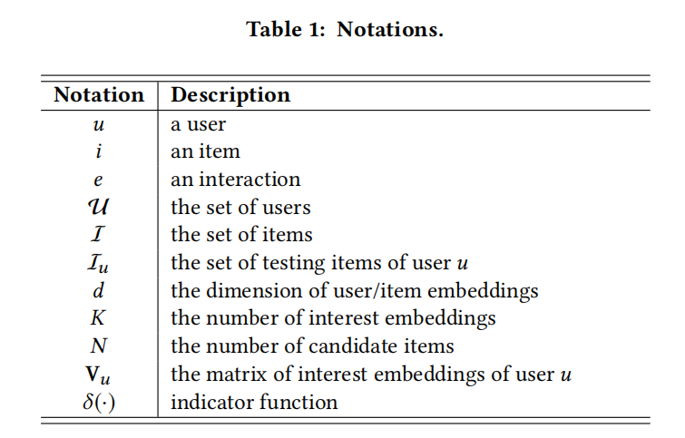

#### 3.2 多兴趣框架

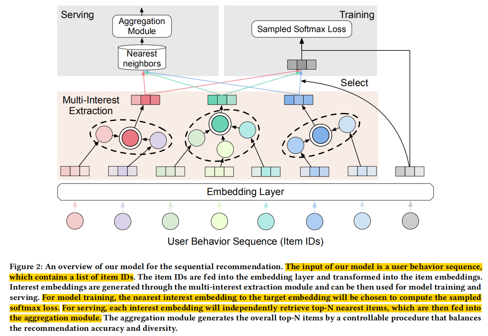

不同的多兴趣提取模块

- 使用动态路由：ComiRec-DR
- 使用自注意力：ComiRec-SA

**动态路由**

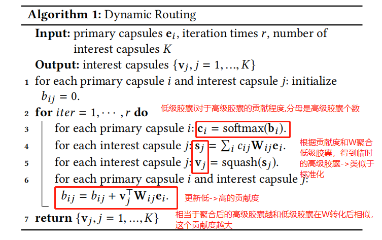

- 高级胶囊$v_j$由低级胶囊$e_i$聚合而来 （不是直接对$e_i$聚合，而是有一个变换矩阵$W_{ij}$对$e_i$转化之后再聚合）
- 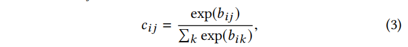

**自注意力**

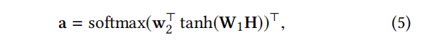

- 序列是H，[d,n]维度为d，一共n个item
- $w_2$  $W_1$ 维度分别是 $[d_a,]$  $[d_a,d]$，是可训练的参数；相当于 $w_2$ 是初始化的query，$W_1H$ 是key（物品嵌入经过转化矩阵做key）
- 最终a是score，[n,]，对应每个item的注意力得分
- 根据a和H做聚合，得到用户的向量表示（这个表示是基于$w_2$这个query得到的）

将 $w_2$ 扩展成K个，得到$[d_a,K]$ 的 $W_2$，相当于有K个query，就可以得到K个用户表示：

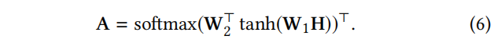

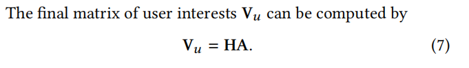

**模型训练**

对于target item，选内积最大的那个兴趣向量来进行训练：

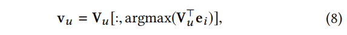

*（Q：argmax不会导致梯度无法回传吗？？不可微）*

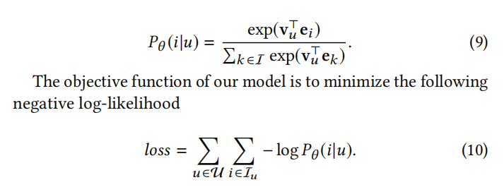

使用 sampled softmax 

**在线服务**

用户的每个兴趣向量都检索top-N个物品

#### 3.3 聚合模块

整合来源于K个兴趣，每个兴趣下的top-N个物品。通过引入可控参数来调整推荐准确性和多样性：

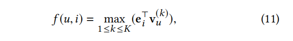

按照兴趣计算的内积倒叙排列取N个是理论上最准确的*（虽然个人认为这得和用户t+1时刻展现出什么兴趣相关，但是在召回阶段，我觉得做内积就ok了，也不用考虑t+1时刻的兴趣）*

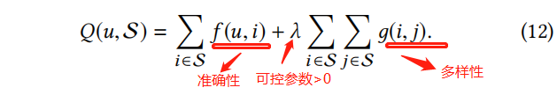

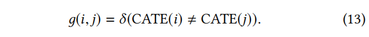

#### 3.4 和现有模型的关系

- MIMN，使用记忆网络从序列数据中捕获用户兴趣，而ComiRec使用更简单的多兴趣提取模块
- MIND，使用的是Behavior-to-Interest路由设计，本文使用原始的胶囊网络

#### 4 EXPERIMENTS

记录一下关于多样性的计算方法：

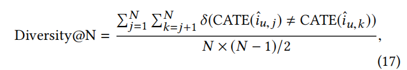

Case Study

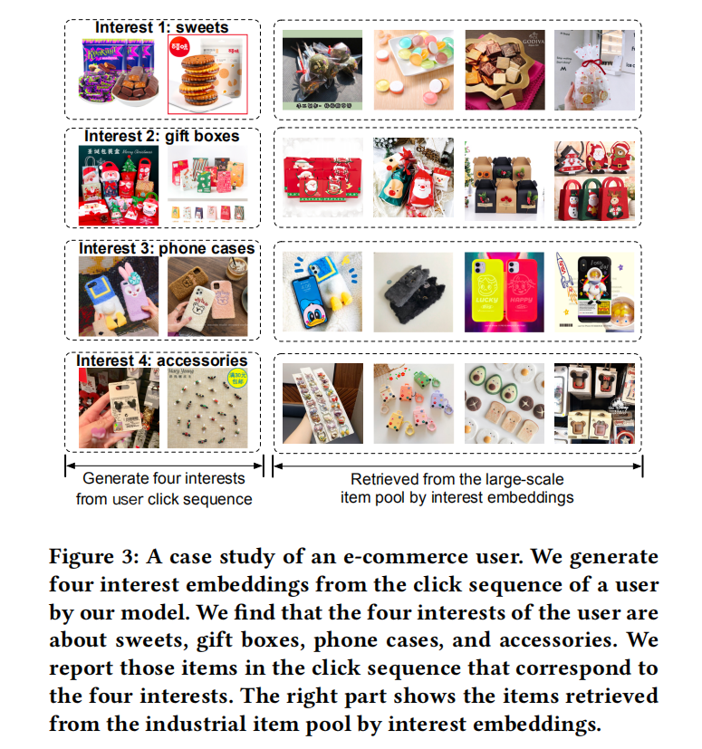