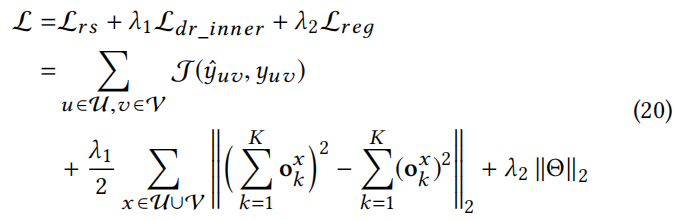

**Decomposed Collaborative Filtering: Modeling Explicit and Implicit Factors For Recommender Systems**
**2021 WSDM**

CF的主题是表示学习。学习到的表示应该反映出：

- 由外在属性所显示的，比如book的作者、类型
- 由隐式因子所显示的，协同信号

### 3 问题描述

协作关系感知图，交互图+物品知识图谱

- 显示关系 $R^+$ 就是物品KG中的关系
- 隐式关系 $R^-=\{k_1,k_2,k_3,k_4\}$  就是将交互拆解成了几种细粒度的交互，最重要的 $k_i$ 因素决定了用户采用了特定物品的原因

### 4 模型

#### 4.1 用户-物品隐式关系建模

广泛使用的基于关系感知的聚合操作[31 Relation-Aware Graph Convolutional Networks for Agent-Initiated Social ECommerce Recommendation-CIKM-2019]，是一种学习HIN节点表示的方法。

其中W是转移参数、$\alpha$ 是平均

本文提出 DGCN（Decomposed Graph Convolutional Network）

##### 1 隐式因素分解

使用投影矩阵将初始嵌入映射到K个关系空间中*（这就是自己现在的想法啊。。和RecSys 2020那篇CF一样，和AAAI 2020那篇CF也一样。。）* $W_k \ \ \ b_k$对于用户和物品是共享的。

##### 2 Factor级注意力网络

对于每一个已交互物品，计算一个关系分布向量，$p_i^u$

其中$p^u_{i,k}$ 表示(u,i)这条交互是因为k意图的可能性

对用户表示进行聚合，$o^u_k$ 表示用户u第k个隐因素上聚合之后的表示：

##### 3 注意力 隐式关系-wise 聚合

对 $o^u_k$ 进行注意力聚合，得到更新后的用户表示

##### 4 解耦正则化

11到12 是降低复杂度

#### 4.2 显式关系建模

只对显式关系进行，加权头实体的[关系、尾实体]；

结合4.1 和4.2：

注：所有的邻居集合都是采样得到的

#### 4.3 高阶连通性建模

堆叠多层：*(这个公式17还能再仔细看看 有点懵)*

Q：那么交互还是不是一条关系呢？？物品表示更新时，需要聚合用户信息吗？？

#### 4.4 模型学习

推荐的loss 使用交叉熵

### 5 实验

#### 5.1 实验设置

数据集：

- MovieLens-20M、Book-Crossing、Last.FM
- 按照参考文献[22]方式 将评分转化为 1/0 数据
- 负采样数量和每位用户的正样本数量相同
- filter 低频用户和物品
- Microsoft Satori 构造每个数据集的KG，将item的名字匹配到sub-KG中的尾实体

评价指标：

- Top-N:Recall NDCG {5，10，20}
- CTR：AUC
- train:valid:test=6:2:2 
- 取5次实验的平均值

超参数：

- tanh
- 交叉熵loss、Adam、Xavier
- 30 epoch，提前终止策略
- 对于自己的模型DCF，网格搜索 学习率、解耦项系数、正则化系数
- 其他模型其他超参数与paper/code设置相同，（有没有网格搜索呢？？）

#### RQ1：模型表现

#### RQ2：超参数对模型的影响

**显式关系邻居采样数量、隐式关系邻居采样数量**

**隐关系 细粒度的数量**

**高阶连通性 L层数**

#### RQ3：设计组件对模型的影响 （消融实验）

个人看法：取消解耦正则项变体后效果竟然是三个变体中最好的，就是说解耦正则项反而是三种组件中起作用最少的。。

#### RQ4：可解释Case Study

- 用户交互的物品中，由于相同隐因素导致交互的items会更接近。

- 隐式因素 注意力分布
- 显式关系，KG中的关系

