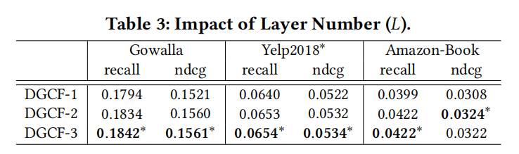

DGCF

### Abstract

CF演化，从单一的用户-物品交互演化到使用整个交互图来学习表示。这些方法都是uniform方法，忽略了用户采取物品时意图的多样性。本文提出DGCF，分离意图因素，产生解耦表示。

### 1  INTRODUCTION

DGCF，在用户意图上解耦用户和物品的表示。

- 首先将每一个用户/物品的嵌入划分成块，将每个块和每种隐含的意图耦合。
- 然后采用图解耦模块，带有邻居路由和嵌入传播
- 同时，独立建模模块，使得不同意图尽量独立

### 2 PRELIMINARY AND RELATED WORK

#### 2.2 任务定义

##### 2.2.1 探索用户—物品关系

学习分布 $A(u,i)=(A_1(u,i),...,A_K(u,i))$

$A_K(u,i)$ 表示用户u采取物品i，在第K个意图上的置信度。

##### 2.2.2 生成解耦表示

每个用户的表示为：

$e_u=(e_{1u},e_{2u},...,e_{Ku})$

$e_{ku}$是用户u在第k个意图的表示

### 3 METHODOLOGY

#### 3.1 图解耦模块

##### 3.1.1 意图感知的嵌入 初始化

把每个用户的嵌入分为k块，每一块代表一种意图，每一块也是有维度的（不是固定的1维），随机初始化，使得不同块的嵌入初始不同。

##### 3.1.2 意图感知图 初始化

先前工作不足，只采用一个用户-物品交互图或者一个同质的评分图来表现用户和物品的关系。

定义了K个分数矩阵，$S(u,i)=[ S_1(u,i),S_2(u,i),...,S_K(u,i) ]$，初始化都为1。$S_k(u,i)$ 定义用户u和物品i在意图k上之间的交互。初始化都为1，假设建模开始时意图的相同贡献相同。

相当于把之前单个的邻接矩阵A，分成了K个意图分数矩阵S。

##### 3.1.3 图解耦层

g(·)是神经网络层，$e_{ku}^{(1)}$ 从**u的1阶邻居集中收集和意图k相关的信息**。

- 迭代更新规则：①使用传播机制更新意图感知的嵌入；②反过来使用更新后的嵌入来细化图并且输出在意图上的分布。*（？？）* 迭代的更新邻接矩阵（S）和嵌入(u)。一共迭代T次。*（不知道为啥要迭代T次）*

- ①交叉意图 嵌入传播：对于每个目标交互(u,i)，我们有评分向量 $S_k(u,i)$，通过softmax标准化，这个分数表明哪个意图更能解释(u,i)这条交互。

  

  然后在单独的图（相当于在每个意图k图）上运用传播机制：

  

  

  

  个人理解：在每个意图交互图上运用图卷积，u-i边表示在此意图下用户u对i的分数，那么权重就是[当前交互分数/(根号u所有分数和*根号i所有分数和)]，与之前的研究不同，之前研究一般使用u和i的度作为分母。

- ②意图感知图更新：由相同意图驱使的历史物品会有相似的分块表示，迭代地更新 $S_k^t(u,i)$，（即边的权重/得分）：

  

  公式11中后一项考虑的是用户u和物品i在意图k上的亲和力，两者越接近，则对应边的权重越大。

##### 3.1.4 层组合

stack多个图解耦层，来从高阶邻居中收集有用的信号。u1——i2——u3，表明u1和u3在采取物品i2时的意图是相似的。

$e_{ku}^{(l)}$  是用户u在第k个意图上经过l层传播后的嵌入，l表示聚合了(l-1)阶邻居的信息。并且每一个解耦表示和加权邻接矩阵 $A_k^{(l)}$ 相连，A能够展示什么信息构造了解缠的表示。在L层之后，最终的表示为：

#### 3.2 独立建模模块

目的使得用户不同意图上的表示尽量不同/独立，动态路由机制可以实现，但是有不合理的地方：因子感知的嵌入间可能是冗余的。*（还不能理解这句话？？）*

因此本文使用统计度量（比如交互信息和距离相关性）作为正则化，鼓励不同因子间的表示能够独立。距离相关性能够描述两个向量间的独立性，完全独立时为0。( independence loss)

**Q：公式14是计算K个嵌入表两两距离相关性之和吗？？**

分子是两个矩阵的距离协方差，分母是每个矩阵的距离方差。

#### 3.3 模型优化

使用内积预测得分，使用BPR loss:

在训练过程中，alternatively优化独立性损失和BPR损失。*（也就是交替训练？？）*

#### 3.4 模型分析

- mdel size：和MF参数量相同，也就是K个嵌入表，但是K个嵌入total和MF相同。
- LightGCN：LightGCN相当于只有1种意图、并且没有独立建模的DGCF；这两种模型在准确率上相似，但DGCF能提供可解释性。
- 胶囊网络：可以将分块表示看作胶囊，将迭代更新规则看作动态路由；胶囊网络能够在不同层之间传递信息，DGCF还能在相同层之间传递信息（邻居）。
- 多头注意力网络：意识感知图可以看作多头注意力机制中的channels，但是作用不同。
- DisenGCN：也是用于图表示的解耦，使用GCN。

### 4 EXPERIMENTS

三个问题，常见格式

#### 4.1 实验设置

参数设置：64、Adam、Xarvier、迭代2次、网格搜索{学习率、L2正则化系数}

#### 4.2 模型表现

#### 4.3 消融实验

##### 图解耦层数

图解耦层是DGCF的核心，可以解耦用户的意图，并且收集与单独意图相关的信息，将其传入到意图感知的表示中。

##### 意图数量

总维度为64，

- 意图1，最差，表明统一的（uniform）的关系不合适；
- 当意图1-4时，表现越来越好，表明解耦化对于推荐有益；
- 意图16时，较差，可能是因为粒度太细，每个意图维度4，表达能力有限。

##### 独立建模

#### 4.4 意图解耦、可解释性

##### 意图的解耦化

解耦：当其他因素的变化时，此因素相对不变

具体实验：

- 设置温度系数
- u,i交互找出最小 $A_k(u,i)$ 的k，重新赋值，缩放至之前的 [1/温度系数]倍
- 记录推荐指标

- 意图充当着表示的维生素角色，系数从0-100时，推荐评级指标基本没有下降，说明了意图间的独立性；（将影响最小的意图逐渐缩小）
- 但这个意图接近0时，结果下降迅速，证明一个意图不能由其他意图推断出

##### 表示的可解释性

使用Yelp2018中的用户评论

选取两个用户，在交互历史item中，在每个意识图上，选出得分最大的。对应显示评论

我们总结了这四个意图的语义（高级概念），分别将K1、K2、K3和K4作为兴趣匹配、服务、价格和促销以及传递时间。