**Disentangling User Interest and Conformity for Recommendation with Causal Embedding**

**2021-WWW**

消除流行度偏差

### 3 DICE

#### 3.1 因果嵌入

结构性因果模型

认为一个点击来源于两个原因：

- u对i特点的兴趣
- u对于i流行度的一致性

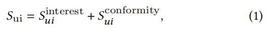

注：本文使用的是加法模型，也有文献使用乘法模型*

**SCM和点击、兴趣、一致性的因果图**

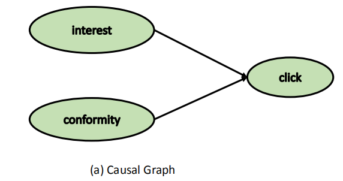

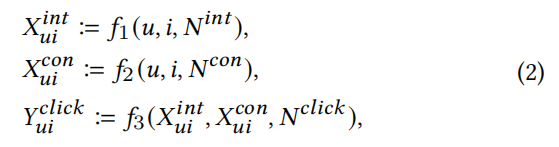

**针对兴趣和一致性的单独嵌入**

不同的用户对于同一个item的流行度一致性是不同的，同一个用户对于不同物品的流行度一致性也是不同的。所以 $f_1,f_2$ 应该对u i进行建模。

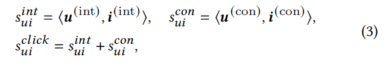

#### 3.2 解耦表示学习

使用不同原因的数据训练不同的嵌入，将问题分解为4个任务：一致性建模、兴趣建模、预测点击、额外的差异性任务。

点击是兴趣和一致性的 *collider*，兴趣和一致性是独立的变量。如果我们在 collider 上训练，两个原因会彼此相关，称之为*colliding effect*。

因此，在我们分离兴趣和一致性的任务中，碰撞效应可以用来获得主要由一个原因引起的样本。

- Case 1：*The negative item is less popular than the positive item*

  we can also safely conclude：

  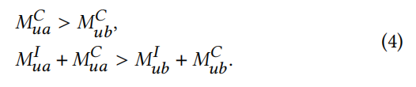

- Case 2: *The negative item is more popular than the positive item*

  the colliding effect can bring more information：

  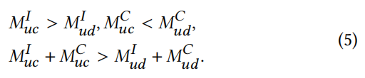

把所有的训练样本$O$分成两组：$O1,O2$ ，对应Case1和Case2。

通过将一个等式推广到多个不等式，我们将问题从学习绝对值转化为学习相对关系，这使得分离兴趣和一致性的任务可以得到解决。

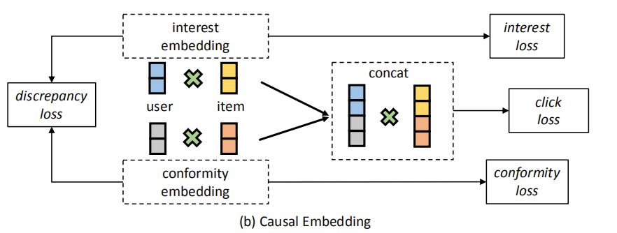

**因果学习模型**，分成四个子任务

- 一致性建模

  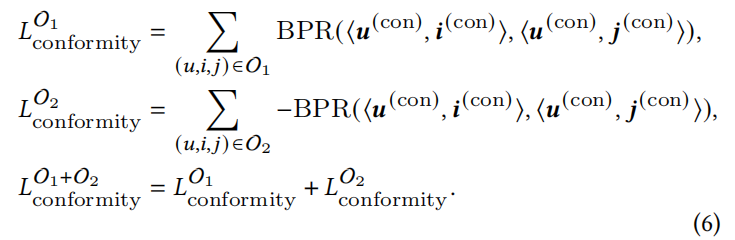

- 兴趣建模

  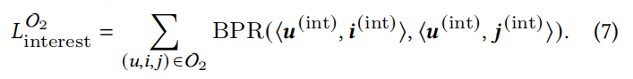

- 预估点击

  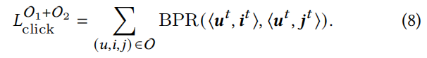

  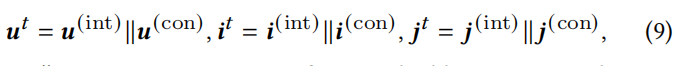

  兴趣建模和一致性建模通过在cause-specfic数据上训练不同cause的嵌入实现了解耦，而点击任务作为一个条件加强了解耦。

- 差异性任务

  对嵌入分布进行直接监督，来加强解耦。提出三种可选的Loss：

  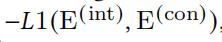

  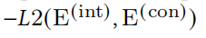

  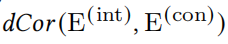

#### 3.3 多任务学习

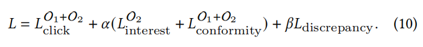

*注意：$\beta$ 越大，会负向影响兴趣和一致性建模？？*

采用 **P**opularity based **N**egative **S**ampling with **M**argin (PNSM) 负采样方法，