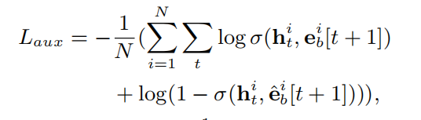
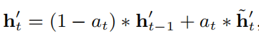
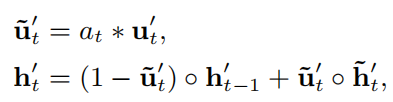

DIEN

考虑到外部环境和内部认知的变化，用户兴趣随时间动态变化。提出的背景

- 现有的方法大多直接将行为的表征作为兴趣，缺乏对具体行为背后潜在兴趣的专门建模
- 很少的工作考虑到兴趣的变化趋势。

### Introduction

先验知识：

互联网广告投放链条和用户行为来看，广告展示—用户点击—用户进一步行为

CPM-CPC-CPA就是贯穿这个链条的几种不同的投放计价方式

CPM(Cost Per Mille) 每千人成本；CPC(Cost Per Click) 每点击成本；CPA(Cost Per Action) 每行动成本

**eCPM：（effective cost per mile）**，千次展示收益，是媒体衡量自己广告投产效率的指标，它是指每千次广告的曝光，能够给媒体带来多少的广告收入。这个值对媒体越大越好。eCPM=CPC×CTR×1000

DIEN两个关键模块

- 从显式用户行为中提取潜在的暂时兴趣
- 对兴趣演化过程建模

把这些具有额外监督的隐藏状态称为兴趣状态。带有注意力update gate的GRU

DIEN贡献

- 提出了一种新的网络结构来建模兴趣演化过程
- 兴趣提取层，针对GRU的隐藏状态对兴趣表示的针对性较低的问题，提出了一种辅助损失
- AUGRU 克服了兴趣漂移的影响

### Related Work

大多模型 Embedding+MLP 关注特征间的交互

一些关注于序列的方法，RNN attention 这些模型只能获得一个固定的兴趣演化轨迹，但是多个兴趣的演化轨迹是不同的，所以受到兴趣漂移的影响

为了有效地推动序列结构的隐态来代表潜在的兴趣，对隐态进行额外的监督。

借鉴AGRU，注意力，改进，AUGRU

### DIEN

大多deepctr的基本结构：

- Embedding 每个特征的field对应于一个嵌入矩阵 

- MLP 所有pooling向量 concatenated 传入到后面的MLP中

DIEN的流程：

- 所有特征经过嵌入层从one-hot变为嵌入向量
- 捕获兴趣演化：
  - 兴趣提取层：基于行为序列提取兴趣序列
  - 兴趣演化层：对和target item (ad/待推荐物品)相关的兴趣演化过程进行建模
- 最终兴趣表示、ad嵌入、用户特征嵌入、情景嵌入 拼接，送到后续的MLP

#### 1 兴趣提取层

输入用户点击物品序列，t个点击物品的嵌入；输出用户的兴趣序列，t个GRU的隐藏状态。

创新点是加入了auxiliary loss ，加入的原因是不加的L只能监督最后的兴趣预测h_last，不能监督整个t时刻每个时刻的兴趣h_t

pairwise，p(正)>p(负)  希望p(正)大，p(负)小，相当于希望p(正) 大，1-p(负)大，相当于希望p(正)*[1-p(负)]大

但是不知道为啥不用p(正)-p(负)

#### 2 兴趣演化层

输入是上部分得到的兴趣序列 t个h_t，输出是最后的隐藏状态（不是上一层的最终隐藏状态 是这一层的最终隐藏状态，相当于兴趣状态背后隐藏状态的最后一个）

使用注意力机制，计算ad和h_i的score，得到每个兴趣状态和待推荐ad的相关性，更侧重与ad相关的兴趣状态。

使用AUGRU，没有使用AGRU：

- AGRU 
- AUGRU 

AGRU使用注意力分数替换多维的update gate，其中a是标量；AUGRU是先对多维的update gate乘一个标量，这样后面还是多维。这样保持update gate的原始维度信息，which决定了每个维度的重要性。

AUGRU，克服了兴趣漂移问题

### 实验

数据集 亚马逊books和electronics ；工业数据集

工业数据集如何构建的

对比的模型 Wide Deep PNN DIN 两层注意力GRU

Results on Public Datasets 显示关注于 捕捉兴趣的模型 能提升CTR

#### 实验的一部分**Application Study**

实验展示 AUGRU 和 附加loss 的影响

##### AUGRU

*Two layer GRU Attention* 好于basemodel，但是缺少对兴趣演化的建模限制了它的能力。所有带有 attention 的GRU相比，AUGRU效果最好，反映了它理想地融合了注意力机制和顺序学习，有效地捕捉了相对兴趣的演变过程。

##### 附加 loss

公共数据集中的负样本，随机选没有交互的；工业数据集中的负样本，从展示的ads中选出没有点击的。结果显示whole loss和aux loss 保持相似的下降趋势，表明CTR预测的全局损失和兴趣表示的辅助损失都产生了影响。工业数据集上附加loss带来的提升不如公共数据集上明显。

##### 兴趣演化的可视化

将兴趣演化层的隐藏状态PCA成两维，不同的曲线显示相同的历史行为被不同的候选物品激活。和target item相关的兴趣 注意力得分高 

这篇对DIEN的解读不错

https://blog.csdn.net/Blank_spaces/article/details/107194648

对部分代码进行解读

https://www.jianshu.com/p/6742d10b89a8

代码

https://github.com/mouna99/dien

model是模型结构