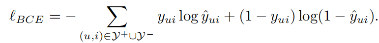
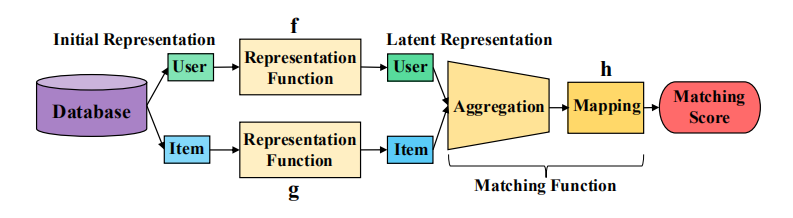
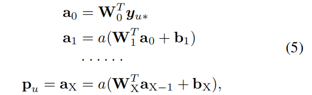
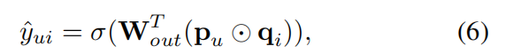
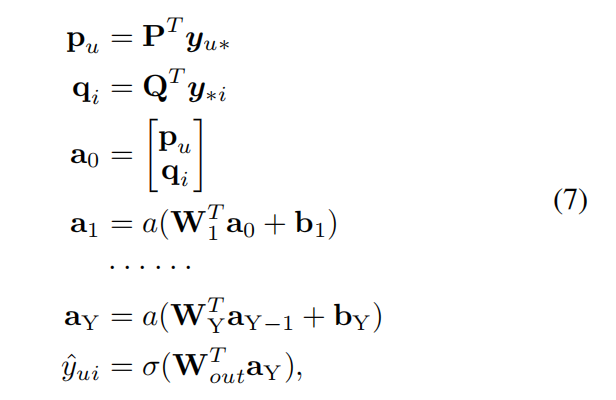
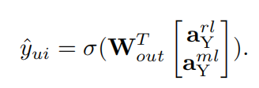
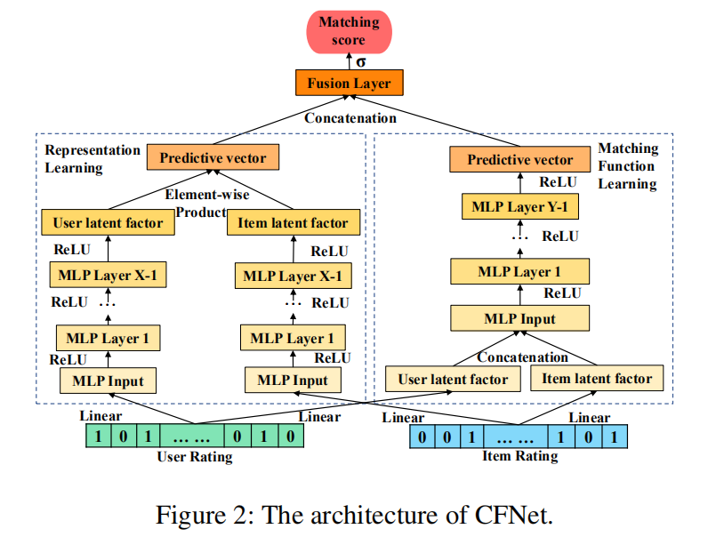

DeepCF

- 基于表示学习的CF方法，把用户和物品映射到一个共同表示空间中。缺陷：内积的局限性
- 基于匹配函数学习的CF方法，学习匹配函数，给入user-item pair，给出匹配分。缺陷：捕获low-rank的关系能力弱(MLP)

### **Related Work**

#### (1)    使用隐式交互数据的CF

- ALS SVD++

#### (2)    基于表示学习的CF

- Funk-SVD
- 然后发展 引入时间 社交信息 文本描述 位置等

- AutoRec CDAE DMF 

可以灵活的整合附加信息，但是仍然依靠内积或余弦相似度来预测匹配分

#### （3）   基于匹配函数学习的CF

- NeuMF NNCF 使用邻居集合作为输入 ConvNCF外积
- 利用附加数据 Wide&Deep DeepFM NFM

### **Preliminaries**

 One-Class Collaborative Filtering problem (OCCF) 

没有真实负反馈 两种解决方法：所有未观测数据都是负样本，取样负样本

### The Proposed Framework

通用的框架

#### （1）  表示学习 CF ——**CFNet-rl**

关注于表示学习函数 f g，matching function一般是非参数的，内积、余弦相似度。模型应该学会将用户和物品映射到一个公共空间中，他们可以直接比较。

本文提出的框架**CFNet-rl**，只关于隐式交互数据，不加附加信息。用户和物品分别用交互矩阵的行和列作为输入（和DMF一样，和MF的随机初始化不同？不知道和MF是不是不同，需要看下怎么把MF用到隐式行为中），使用多层MLP得到用户和物品的最终表示，预测得分没有使用简单的内积或余弦相似度，而是对应元素相乘+神经网络。

- MLP学表示

  

  

- 预测层 用户和物品表示的对应元素相乘 然后相当于**加权求和**

  

  

#### (2）  匹配函数学习 CF——**CFNet-ml**

 **CFNet-ml**

- 使用线性嵌入层学习用户和物品的隐表示
- 拼接表示+MLP

（问题：啥是线性嵌入层？？）

#### (3)     聚合——CFNET

  **CFNet-rl**对应元素相乘结果是预测向量，**CFNet-ml** 最后一层是预测向量，在这两种情况下，预测向量都可以看作是相应的用户—物品对（pair）的表示。

拼接预测向量+全连接层

 

- eALS SOTA MF
- DMF SOTA RLMF
- NeuMF SOTA MLMF

../images/
