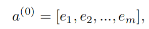

### DeepFM

DeepFM，用神经网络结合了用于推荐的FM和特征学习的深度学习技术。能够端到端的学习所有orders的特征交互，不需要特征工程。

### 1 Introduction

对于CTR预测来说，学习用户点击行为背后的隐式特征交互是非常重要的。同时考虑特征的低阶交互和高阶交互。高阶交互例子：

- （2阶交互）应用程序类别和时间戳之间的交互，午餐时间外卖软件下载量大；
- （3阶交互）应用类型、年龄、性别交互，男性年轻人更喜欢射击游戏。

结合FM和深度学习：

- 为了自动学到交叉特征，所以引入FM，避免了特征工程和先验不足
- 深度学习技术能更学习到更复杂的特征交互

 可以看出现有模型偏向于低阶或高阶特征交互，或者依赖于特征工程。

关键的挑战是有效地建模特征交互。

基于CNN的模型偏向于相邻特征之间的交互，而基于RNN的模型更适合于具有顺序依赖的单击数据

### 2 模型

X有m个fields 每个field代表一类特征（性别、年龄。。。） 

- 每个分类字段表示为独热编码的向量
- 每个连续字段表示为值本身，或离散化后的独热编码向量。

#### 2.1 DeepFM

FM和Deep共享相同的特征嵌入：

- 它从原始特征中同时学习低阶和高阶特征交互
- 不需要输入的专业特征工程

每一个feature i有：

- w，衡量一阶重要性
- V，隐向量，衡量和其他特征交互的重要性

V：

- 在FM中，就是二阶交互
- 在Deep中，**V 就是每个特征的嵌入？**，就是高阶交互
- 
- ***ei* 是第i个field的嵌入，一共有m个field，那么某个filed多值离散怎么转化为 *ei* 呢？**

关键是如何实现的FM和Deep的嵌入共享？

#### 2.2 和其他模型的关系

- **FNN**：预训练FM，将得到的V作为DNN的输。缺点：预训练；只有特征高阶交互，没有一阶。
- **PNN**：在嵌入层和第一隐藏层之间施加一个product层。(可以选择product的形式)。缺点：只有特征高阶交互。 Different from PNN, the output of the product layer in DeepFM only connects to the fifinal output layer (one neuron)
- **Wide & Deep**：在Wide部分(LR)需要特征工程

### FM

特征组合对于推荐排序是非常非常重要的，FM用于二阶特征交互，DNN用于更复杂的特征交互，而MLP结构是种低效率地捕获特征组合的结构，所以即使是深度模型，目前一样还离不开类似FM这个能够直白地直接去组合特征的部分。

FM中的二阶交互，本质上是在对特征进行embedding化表征，和目前非常常见的各种实体embedding本质思想是一脉相承的。

在计算FM二次项时，时间复杂度只需要O(k*n)是线性级别的。并且大规模推荐中特征往往是极为稀疏的，也就是说大量特征取值为0，因此FM计算效率可以进一步提高。这也是FM模型得以广泛地替代LR模型的一个关键所在。

