**DisenHAN: Disentangled Heterogeneous Graph Attention Network for Recommendation**

**2020-CIKM**

个人认为这篇论文的模型写得有点难懂，对比的baseline不是很强；但是图片很好看，实验也还不错。

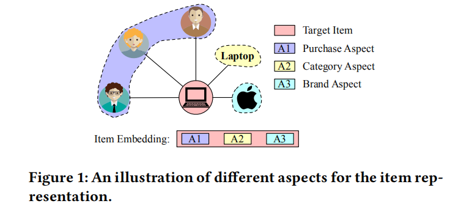

### 4 THE PROPOSED MODEL

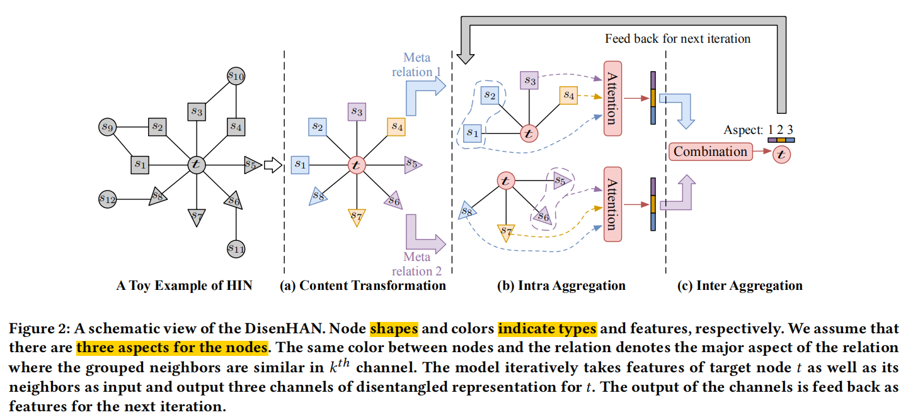

个人理解：

1. **【同一个分组内的所有节点聚合】按照关系类型将一阶邻居分成组**
   - 对于每一个组中的邻居，在K个层次上都进行以下操作
   - 权重：得到每个邻居节点的权重（softmax分母是同一个组）
   - 聚合：把某一个组在某一个层次上的节点嵌入进行加权聚合
   - 输出：每一个组在K个层次上的聚合表示 $z^e_k$
2. **【不同分组的聚合表示 做最终聚合】**
   - 对于每一个分组的K个表示进行以下操作
   - 权重：得到每个组对于节点t在K个层次下的权重（softmax分母是K个层次
     - *（注：这里有疑问，每种关系算注意力时的q怎么来的）*
     - *另外注意不是直接用$z_k^e$算，是用$Wz^e_k$算权重）*
   - 聚合：更新节点t，通过权重聚合 $Wz^e_k$
   - 输出：节点t在K个层次上的聚合表示 

#### Disentangled Content Transformation

- target node $t$
- 一阶邻居 $s\in N(t)$，将一阶邻居按照元关系进行分组
- 对于某一组，应用一种特有的转化函数将target node和source nodes进行转化
- （注：之前的KGAT是每个关系直接一个转化矩阵，现在是K个不同的转化矩阵，将node投影到K个不同的子空间中）维度由[1,R_in] 变成 [1,R_out/K]

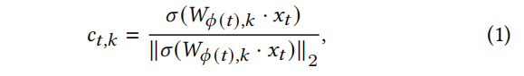

- 对于target node进行 L 层图网络，每一层都要投影到K个空间上，还要保证一阶邻居影响>二阶邻居影响>三阶邻居影响>...L

#### Disentangled Propagation Layer

##### 关系内整合 （整合来自某个边类型的邻居）

<s,e,t> 

邻居节点s在k层次上对于t的重要性为：取决于【边e的类型】【s在k上的嵌入】【t在k上的嵌入】

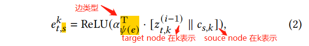

节点s的整体重要性为k个层次上的重要性之和：

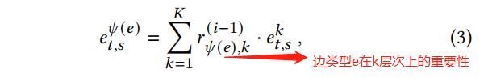

边类型在K个层次上的重要性初始都为1/K，这个权重在关系内整合中可以通过迭代的方式学习到：

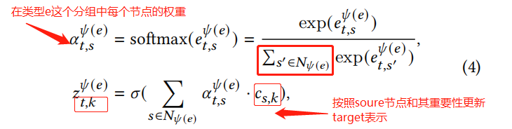

##### 关系间整合（整合不同的分组邻居）

确定每一组邻居（就是每种边类型邻居）对于t node在K个层次上的重要性：*（Q:这个$q$ 是初始的还是某些变量计算得来的？？）*

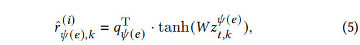

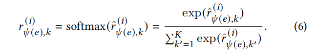

node t 的更新公式：

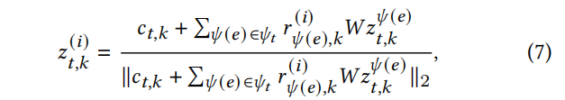

#### Analysis of DisenHAN

收敛分析这里没看懂，但是很值得看

整个过程相当于EM，ELBO+KL，不断增大ELBO

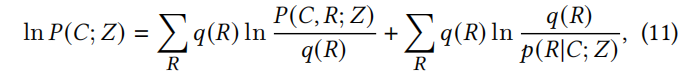

### 5 **EXPERIMENTS**

#### Case Study and Visualization(RQ3)

不同关系（边）在每一层对于target node在K个层次上的score是不同的：

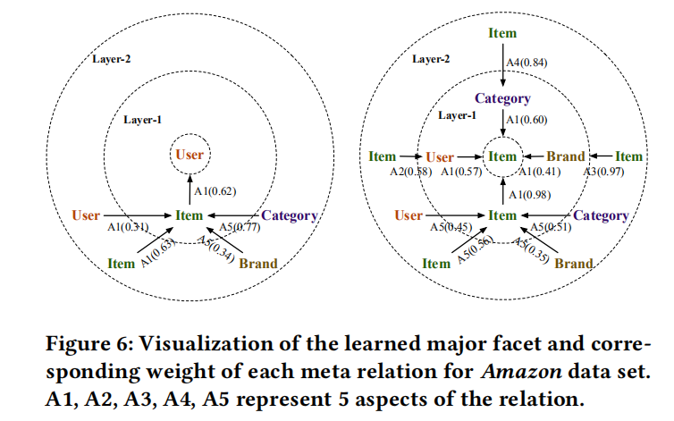

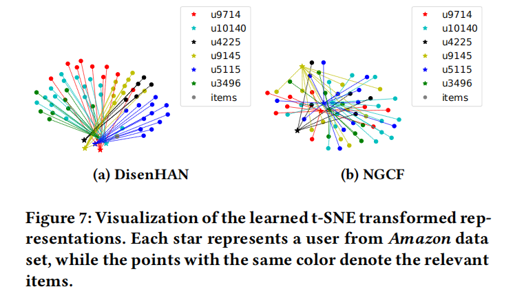