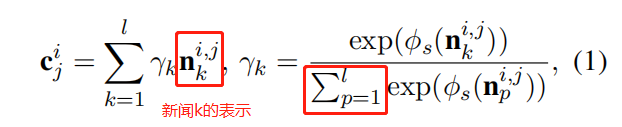

**HieRec: Hierarchical User Interest Modeling for Personalized News Recommendation**

**2021-ACL**

### 3  HieRec

#### 3.1 问题定义

新闻n的组成：

- title
  - 文本序列 T ，w表示单词 
  - 实体序列 E ，e表示实体
- topic t
- subtopic s

用户的行为序列：

- M个点击的新闻
- 点击主题集合 $\{{t_1,t_2,..,t_m}\}$，一个用户点击过m个主题
- 对于m个主题中的每个主题$t_i$，都有一个点击子主题集合  $\{{s^i_j}\}$ ，表示点击了第i个主题的第j个子主题（d个子主题）
- 点击的组 $N_j^i=\{n_1^{i,j},n_2^{i,j},...,n_l^{i,j}\}$ ，同一个主题和同一个子主题的新闻划分到一个组，组中新闻的数量为 $l$

#### 3.2 分层用户兴趣建模

提出分层用户兴趣建模框架，学一个异质兴趣树来捕获多样化和多粒度的用户兴趣。

1. **subtopic-level 兴趣表示 ：【$l$ 个新闻表示聚合+子主题类别嵌入】得到【子主题组的表示】**

   - 这一个子兴趣组的表示（加权所有该子兴趣组下的新闻）

     

   - 子主题级别用户表示为 【子兴趣组表示聚合】+【该子主题嵌入】

     

2. **topic-level 兴趣表示：【同一个主题的 $d$ 个子主题组的表示】得到【主题组的表示】**
   
   - 对于主题 i ，用户兴趣表示为
   
     
   
   - 注意算权重的时候，输入包括【子主题组表示】和【子主体组中新闻数量】
   
   - 主题组用户表示为【主题组表示】+【该主题嵌入】
   
     
   
3. user-level 兴趣表示：【整体的用户兴趣】

   - 整体的用户兴趣为各个主题组表示的聚合，其中权重取决于【主题组表示】和【点击该主题下新闻数量】

     

#### 3.3 分层用户兴趣匹配

本文提出了一个分层用户兴趣匹配框架，该框架对不同兴趣粒度对候选新闻的兴趣建模。（也就是按照target item分层算匹配分，得到三个层级的预测匹配分再相加）从上到下，三个分数为：

- user-level

  

- topic-level

  

- subtopic-level

  

- 最终

  

#### 3.4 新闻表示

### 4 Experiment

#### 4.5 召回率和多样性表现

#### 4.7 案例分析

展示本文模型的推荐结果更加多样化

