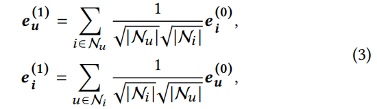

**Interest-aware Message-Passing GCN for Recommendation**

**2021 WWW**

GCN运用到RS中，虽然探索了来自高阶邻居的协同信号，但是有过平滑问题。因此，多层图卷积将使具有不同兴趣的用户具有相似的嵌入方式。本文提出基于兴趣感知的消息传递GCN，设计了一个无监督的子图生成模块，通过利用用户特征和图形结构来识别具有共同兴趣的用户。

### 2  METHODOLOGY

#### 2.1 概要

LightGCN

从公式2来看，在迭代的从高阶邻居整合特征之后，节点将无法保留自身特征，节点间的嵌入越来越相似，导致了过平滑问题。

层数越多，每个节点涉及到的节点数越多。（注意图中纵坐标是比例。）

#### 2.2  IMP-GCN MODEL

##### 2.2.1 基于兴趣感知的消息传递

- 一个用户属于一个子图
- 一个物品可以连接多个子图

$G_{s}$是子图，$S=1,2,...,N_s$

- 一阶图卷积，还是和LightGCN一样

  

- 高阶图卷积，user和item不一样

  

  - 用户还是连接所有的物品 卷积操作不变
  - **物品的一阶邻居（users）在不同的子图里，对于子图s，物品的高阶卷积只考虑当前子图s中的邻居users即可。**
  - $e_{is}^{(k+1)}$ 表示物品i，在子图s中，进行了k层卷积之后的嵌入。因此$e_{is}^{(·)}$可以看作是从相似兴趣（子图s中）用户中学习到的特征。
  - 物品的k层最终表示：

  

##### 2.2.2 层结合和预测

和LightGCN一样，最终表示平均所有k+1层的嵌入；内积预测得分。

##### 2.2.3 矩阵形式

##### 2.2.4 优化

#### 2.3 子图生成模块

用户分组看作分类任务

每个用户表示为一个特征向量：

以用户特征向量为输入，加NN，得预测向量：

得到 $U_0$ 预测向量，一个无监督得分类方法，不需要ground truth，$U_0$ 中最大的元素idx即为用户对应的子图。对于每个子图，将L矩阵中不存在的用户行列过滤掉即可。

*（Q：这分组不会太随机了吗，没有标签，为啥不用聚类呢？？）*