**Learning Intents behind Interactions with Knowledge Graph for Recommendation**

**2021 WWW**

### ABSTRACT

将KG运用到RS中，现存的GNN方法在关系建模中是粗粒度的，不能在细粒度的意图粒度上识别user-item关系，也不能利用关系依赖关系来保留远程连接的语义。*（后半句怎么理解？）*

本文提出KGIN，将每个意图建模成KG关系的注意力结合，鼓励不同意图间的独立性；设计了新的消息聚合机制，递归的整合长距离连通性的关系序列。这些设计能够提取关于用户意图的有用信息，将其编码进用户和物品的表示中。

### 1 INTRODUCTION

KG运用到RS：KG学习嵌入—路径—GNN

缺点：

- 用户意图：一个用户有多种意图来驱使user消费不同的物品*（理解：将user-item交互分解到多个意图上，每个意图是不同关系[这个关系还包括高阶连通性？不是简单的非A即B关系]的组合）*

- 关系路径：目前的大多方法聚合机制是基于节点的，也就是从邻居节点收集信息，没有区分这些节点来自于哪些路径*（目前加的注意力机制和关系相关不能区分吗？）*；现存的方法不能保留**由路径承载的关系依赖性和序列**（**举了个例子，还是有些疑问**）

  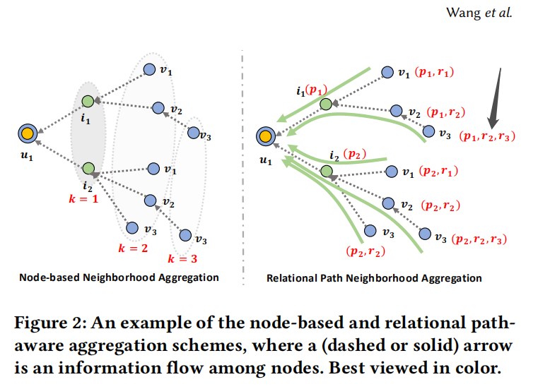

  - *文中指的不能保留(p1,r2,r3)的依赖性，如果在节点聚合时不考虑关系（计算出注意力得分）的话，的确p1,r2,r3不能保留长期path；但是如果考虑了关系，那么 $v_3$对于$u_1$ 不也考虑了长期关系吗？？即 u1—i1—v2—v3，$v_2$整合$v_3$时考虑了关系r3；i1整合v2时考虑了r2；u1整合u1时考虑了p1；这不相当于考虑了三者吗？？但是这样的话p1 r2 r3和p1 r3 r2是相同含义了，是因为这点吗？？*

因此本文的创新点，针对于GNN加了用户意图建模和关系路径感知聚合。其中关系聚合中，对于user-intent-item和KG实体采取不同的聚合策略。

### 3 METHODOLOGY

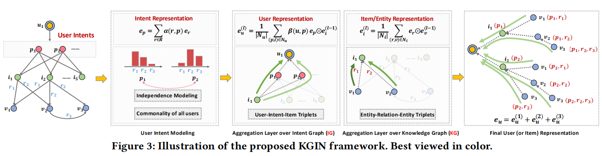

#### 3.1 用户意图建模

不同的意图抽象出用户不同的行为模式，这可以是对CF叠加了更细粒度的假设。

##### 3.1.1 意图的表示学习

KTUP将每个意图和一条KG关系相连，但是没有考虑关系的交互和结合。本文对于每个意图p，给出一个KG关系的分布。

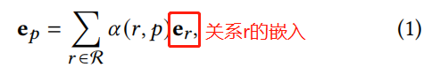

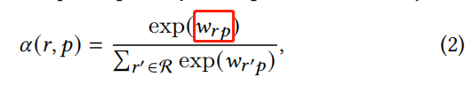

看公式1，每个意图就是所有关系的加权组合；看公式2，$w_{rp}$ 是需要训练的参数，每个意图p和每个关系r都有一个系数。

##### 3.1.2 意图的独立性建模

鼓励不同的意图尽量独立，能够有更好的模型容量和可解释性，如果不独立，那么存在多余的意图可以被其他意图组合出来。**可以用一个统计指标来衡量独立性，将其作为正则化，比如mutual information、Pearson correlation、distance correlation。**

- mutual information

  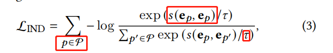

  s(·)衡量两个意图间的相关性，本文使用cos sim；*𝜏*  是超参数

- Distance correlation

  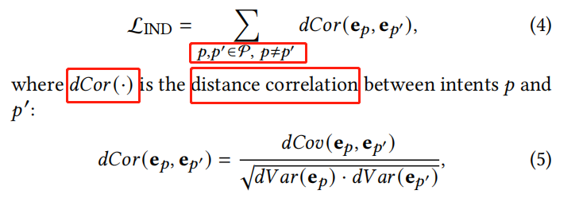

- 它同时测量了任意两个变量的线性关联和非线性关联，dCov()是两个意图间的指标，dVar()是单个意图间的指标

#### 3.2 关系路径感知的聚合

当前基于节点的聚合，两个问题：

- 关注于邻居节点，没有区分邻居节点来自于那条路径
- 通常使用注意力网络将KG关系建模成衰变因素*（不确定翻译/理解的对不对？)*，这限制了KG关系对于节点表示的贡献。通过路径(p2,r2,r3)连接的三阶邻居在聚集时，这条路径的关系依赖性没有用显式的方法进行捕获。

##### 3.2.1 意识图之上的聚合层

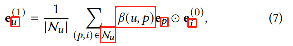

相当于每个用户节点聚合时，进行了 $p×N_u$ 次的单次聚合？？

- 可以看作每个意图上聚集所有邻居，然后再加权聚合所有意图上的表示。某用户，不同意图对于他的行为有不同的贡献，所以用$\beta(u,p)$衡量了意图p对于用户表示的重要性：

  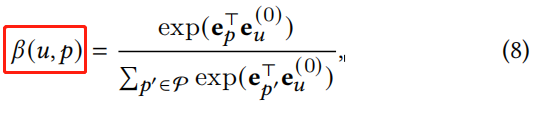

- 不像其他研究在聚合时使用衰减因子或正则化项，本文强调了聚合时意图关系的重要性。通过 $\beta \ \ e_p\otimes e_i^0$，在用户表示法中显式地表示一阶意图感知信息。

##### 3.2.2 KG之上的聚合层

3.2.1指的是通过意识聚合获得user的嵌入，3.2.2指的是通过KG中的关系聚合得到实体*（不包括user吗？）*的嵌入。

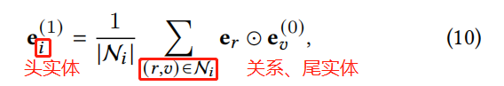

每个实体作为头实体，由其关系和尾实体来聚合更新嵌入。假如有 $(u_1,r_1,v_1)\ \ \ \ (u_1,r_2,v_1)$，之前的研究是使用注意力机制来得出 $v_1$ 对于 $u_1$的贡献，然而忽略了同一实体在不同情况下对其头实体嵌入的影响是不同的。**本文在聚合操作中对关系context进行建模。**

##### 3.2.3 捕捉关系路径

3.2.1和3.2.2对一阶连通性进行了建模，叠加多个层，收集来自多阶邻居的信息：

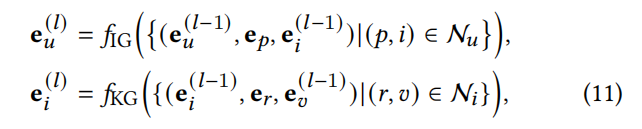

其中u、i、v 分别是用户、物品、实体。得益于关系建模，这些表示能够存储多跳路径的整体语义，并强调关系依赖。

l跳，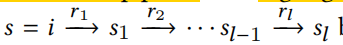，关系路径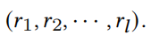，l层的表示为：

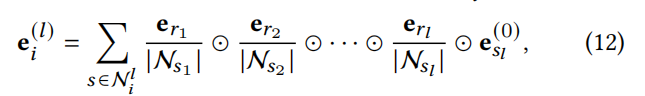

#### 3.4 模型优化

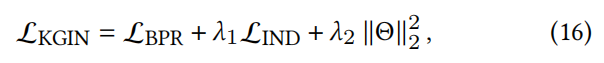

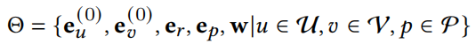

*（Q：需要将所有参数都正则化吗？？）*

### 4 EXPERIMENTS

#### 4.3 消融实验（RQ2）

##### 4.3.1 用户意图&KG关系 的影响

丢弃意图和关系；丢弃意图；和KGIN对比

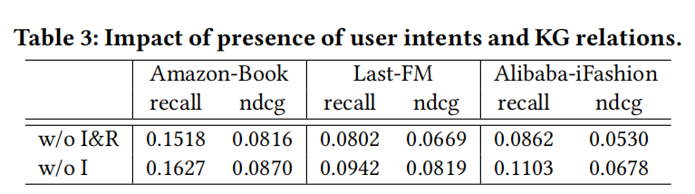

##### 4.3.2 模型深度的影响

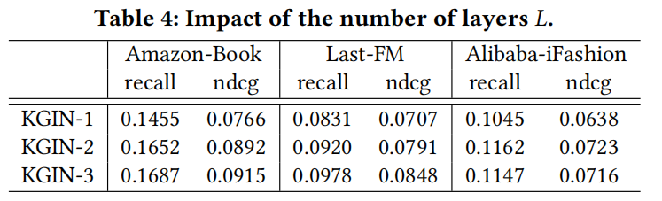

模型加深，和用户意图相关的更多信息能够来自于更长的关系路径

##### 4.3.3 意图建模的影响

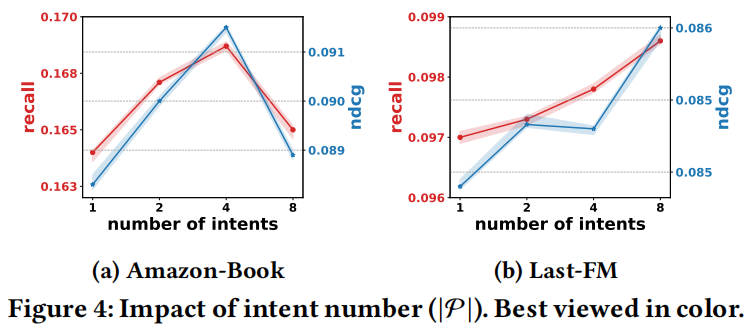

#### 4.4 KGIN的可解释性（RQ3）

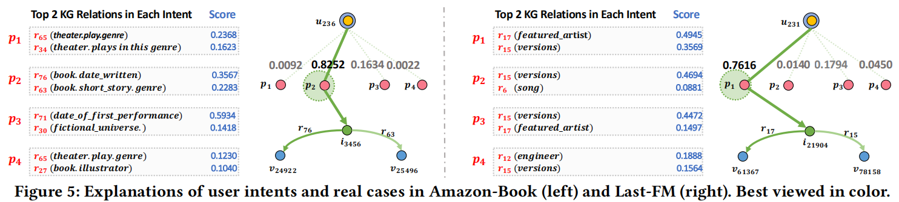

### 5 RELATED WORK

将KG运用到RS模型分为四类

- 基于嵌入的方法
  - 使用知识图谱嵌入技术来学习实体嵌入；将嵌入使用到RS模块
  - 缺点，只关于一阶连通性（交互对、KG三元组），忽略了高阶连通性

- 基于路径的方法
  - 通过提取路径来考虑长距离连通性（通过KG连接traget user和node节点的路径），使用这些路径来预测用户偏好，比如RNN和记忆网络
  - 缺点，路径的设置，所有的路径耗时；人工设置路径需要专家知识
- 基于策略的方法
  - 强化学习，设计RL代理来学习路径查找策略，（强化学习是会话推荐系统的主要模型）
  - 缺点，稀疏的奖励信号、巨大的行动空间、基于策略的优化
- 基于GNN的方法
  - 信息聚合机制，整合一阶邻居的信息更新自我节点表示；多层、来自于多阶邻居节点的信息可以编码进其表示中
  - **缺点，设想user和item间只有一种关系，没有探究隐藏的意图；不能保存路径中的关系依赖性。**（本文模型的动机）