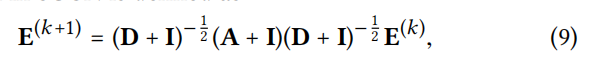
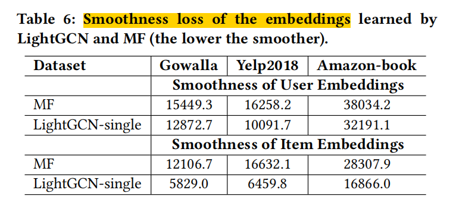

LightGCN

当前RS中的GCN工作没有进行彻底的消融实验，本文实验发现GCN的两项设计**[特征转化]和[非线性激活函数]**不适用于协调过滤。提出了LightGCN，只使用了GCN的邻居聚合，线性传播信息，然后加权每一层的嵌入得到最终的表示。

### 1 引言

CF的通用范式：①学习到用户和物品的隐含特征（嵌入/表示）；②基于嵌入向量进行预测。

- MF，直接将single id作为嵌入
- SVD++，将历史交互物品id来表示user（一阶邻居）
- 交互图，多阶邻居

NGCF中借鉴GCN的特征转化、非线性函数；但是原始GCN使用的节点是带有丰富特征的，而在user-item交互图中，只有id节点，没有丰富的特征，这些特征转化反而会有损模型。所以提出LightGCN.

### 2 先验

#### 2.1 NGCF

$\sigma$ 是非线性激活函数

$W_1、W_2$ 起特征转化的作用

#### 2.2 NGCF 经验性探究

对NGCF采取消融实验，探究非线性激活函数和特征转化的影响。将NGCF的最后组合方式改变，由concat改为sum，因为这样嵌入都是相同维度了。

- NGCF-f，移去W1 W2
- NGCF-n，移去激活函数
- NGCF-fn，都移去

本文给出结论：NGCF的恶化源于训练困难，而不是过拟合。虽然理论上NGCF比NGCF-f的表达能力更强，但实际上NGCF获得了更高的train loss和更差的泛化能力。

### 3 模型

#### 3.1 LightGCN

GCN的基本思想：通过在图上平滑特征来学习节点的表示

AGG是聚合操作，不同GNN中聚合操作不同

##### 3.1.1  Light Graph Convolution

##### 3.1.2  Layer Combination and Model Prediction

K次卷积，能计算出用户/物品在第K层的嵌入，$\alpha_k$ 可以是①超参数手工设置；② 自动优化的参数（即注意力网络的输出）；本文中 $\alpha_k$ 设为 1/(K+1)。本文采用多层平均的三方面原因：

- 层深导致过度平滑，所以不用最后一层
- 不同层的嵌入捕获不同的语义
- 相当于使用了 self-connect

使用内积预测得分

##### 3.1.3 矩阵形式

R交互矩阵，M个user，N个item

交互图邻接矩阵A，嵌入表E，嵌入维度T，度矩阵D

#### 3.2 模型分析

##### 3.2.1 和SGCN关系

SGCN：省略 (D+I)，只起缩放作用；最后一层作为预测任务的输入；

结论：增加**self-connection，本质上等价于加权sum每一层LGC**

##### 3.2.2 和APPNP关系

APPNP，使用PageRank的思想：最后一次作为预测任务的输入；

##### 3.2.3 二阶嵌入平滑

LightGCN光滑嵌入，以二层为例，以用户侧为例：

用户v和target user u有共同交互item时，光滑强度为：

根据这个光滑系数，可以进行解释，这个系数很好地满足了CF在测量用户相似性方面的假设。

- 共同交互项越多，系数越大
- 物品越流行，系数越小
- 用户v越不活跃，对u系数越大

#### 3.3 模型训练

BPR loss，不使用drop out

*(Q：训练时某用户有8个正样本，那么是每个样本对应一组负样本，还是每个正样本和所有负样本进行比较；个人理解是前者，看公式是后者，应该多看code细节)*

### 4 实验

#### 4.4 消融实验

##### 4.4.1 层组合方式

- LightGCN随着层数量增加，基本不会退化
- layer num=2，基本是所有情况的最佳，表明使用一阶和二阶邻居平滑节点的嵌入对于CF是非常有用的
- single在 Book上表现好，是 $\alpha_K=1$ 的特例，表明层权重调整会有更大潜力

##### 4.4.2 对称根号归一化

使用了target 归一化、negbor归一化、L1归一化作为对比

##### 4.4.3 平滑嵌入的分析

**本文推测平滑嵌入式GCN起作用的关键点。**

定义了用户嵌入的平滑性：（相当于先用L2统一尺度、再计算用户和其他用户的距离）

结果表明，使用 light gcn，能让嵌入表更加平滑，更适合用于推荐。

*（相当于让嵌入更集中？指的是让 多阶co的用户/物品更加接近 !!*

*那多意图、多性格是让嵌入更分散？指的是让每个用户的 多个意图尽量分散 !!）*

### 6 结论和未来工作

LightGCN的优点：更容易训练、更好的泛化能力、更有效

近期趋势是利用辅助信息，而GCN在这些side info中建立了新的SOTA。

未来方向，个性化图层组合权重，对于不同用户，不同层结合权重不同，比如稀疏的用户可能需要来自高阶邻居的更多信号，而主动的用户需要的信号更少。

