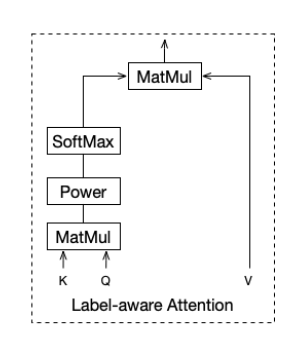

**Multi-Interest Network with Dynamic Routing for Recommendation at Tmall**

**2019 CIKM**

RS分为两阶段：matching和ranking。matching阶段检索出和用户兴趣相关的候选集；ranking阶段根据用户兴趣对候选集排序。因此在每个阶段表示用户的兴趣都很重要，但是目前大多方法都用一个向量来表示用户，不能很好的捕获用户多兴趣的表示。本文提出MIND，使用编码用户不同兴趣的多个向量来表示用户。

### 1 引言

matching和ranking。现有的推荐算法以不同的方式建模和表示用户的兴趣。

- CF-based用历史交互items或隐因子来表示用户
- DL-based 用低维向量来表示用户兴趣：Youtube DNN用固定向量表示用户；DIN使用注意力机制使得面对不同的target item 得到用户不同的表示，但是其不适用于召回，计算复杂度。

本文关注于matching阶段对用户多兴趣的建模。提出了MIND，其中设计了新奇的一层——多兴趣提取层，采用动态路由自适应地整合用户历史行为的信息得到兴趣表示。动态路由可以看作soft-聚类，把用户的历史items划分成了不同的组，每一组表示一种兴趣。因此可得到用户的多种兴趣表示。

### 3 方法

#### 3.1 问题描述

每个实例可以表示为 $(I_u, P_u,F_i)$：

- $I_u$ 是用户交互过的物品集合 （也叫用户行为） 
- $P_u$ 是用户的基本属性
- $F_i$ 是 target item 的特征

MIND的核心任务：学一个函数，将原始的特征映射到用户表示中：

每个用户嵌入有 K 个，而物品的嵌入有1个；维度都是d。匹配得分如式3，注意是用户的每个嵌入对target i 嵌入内积求和；相当于K个嵌入相加，得用户最终嵌入。

#### 3.2 嵌入 & 池化层

- 用户的各类特征嵌入concat
- 物品的各类特征嵌入 平均池化

#### 3.3 多兴趣提取层

为了学到多个表示向量，采用聚类将用户的行为划分成几个组。来自于一簇的物品，希望能更加接近并且这一簇能共同表示用户兴趣的一个特定层面。

##### 3.3.1 回顾动态路由

两层胶囊，第一层和第二层的胶囊分别是低级胶囊和高级胶囊。动态路由的目的是，给定低级胶囊的值，以迭代的方式计算高级胶囊的值。

- 低级胶囊：m个，维度是 $N_l$ 

- 高级胶囊：n个，维度是 $N_h$ 

- 路由logit $b_{ij}$ ：其中 $S_{ij}$ ，维度 $[N_h,N_l]$ 是低级胶囊 i 和高级胶囊 j 对应的双线性映射矩阵

  

- 每个高级胶囊，是所有低级胶囊的加权线性组合：$b_{ij}$ 越大，低级胶囊 i 对高级胶囊 j 的贡献越大

  

  

- 非线性的挤压函数 (squash)

  

$b_{ij}$ 初始化为0，路由过程通常重复三次到达收敛，当完成路由之后，高级胶囊的值 fixed，可以作为后面层的输入。

*（个人感觉，重复多少次，都是类似EM的思路：①用低级和高级胶囊更新对应的权重分；②根据权重分再更新高级胶囊 。注: 3次迭代中，低级胶囊的值不会更新；而需要更新的是权重和高级胶囊；另外S投影矩阵应该也不会更新！！）*

##### 3.3.2 B2I动态路由

简而言之，胶囊是一种新的神经元，它用一个向量而不是一个标量来表示。我们期望基于向量的胶囊能够代表一个实体的不同属性，其中一个胶囊的方向代表一个属性，胶囊的长度用于表示该属性存在的概率。*（长度为啥表示概率呢？？？）*

**相应地，多兴趣提取器层的目标是学习表示用户兴趣属性的表示，以及是否有相应的兴趣存在。**将行为胶囊视为低级胶囊，兴趣胶囊视为高级胶囊。（注，胶囊也即表示）

Behavior-to-Interest (B2I) 动态路由，与胶囊网络动态路由不同的地方：

- 共享双线性映射矩阵 ：之前每个低级胶囊和高级胶囊都有一个S，现在共享一个S，因为：

  - 用户行为长度不同
  - 共享的S可以把兴趣胶囊投影在相同的向量空间

- 随机初始路由logit：高斯分布初始化b，类似于K-Means

- 动态兴趣数量：每个用户的兴趣数量K不同，自适应调整，启发式规则

  

#### 3.4 基于标签感知的注意力层

通过多兴趣提取层，一些兴趣胶囊从用户行为嵌入中生成。不同的兴趣胶囊代表用户不同兴趣下的表示。

注意力层：对于target item，计算用户u的兴趣胶囊的线性组合，作为u的表示。

- query是target item，key和value是兴趣胶囊
- 根据target item和兴趣胶囊内积（的p指数），进行softmax，得到每个兴趣胶囊的权重
  - 当p=0，就是取平均
  - p趋近于无穷，相当于hard attention，会有更快的收敛
- 加权组合，得到u针对于target的表示

感觉就是内积+指数来计算注意力得分，和RecSys2020那篇多角色CF差不多的思路。

#### 3.5 训练 & 上线

采样softmax技术，不然分母计算量太大了。

- MIND训练之后，获得用户表示映射函数 $f$；（没有注意力层）
- 线上服务时，将用户行为序列和用户画像 fed into $f$，为每个用户生成多个兴趣表示；然后使用这些表示+快速最近邻检索top N个物品作为候选集

#### 3.6 和现存模型的关系

- YouTube DNN，MIND中K=1时，退化成YouTube DNN
- DIN，MIND用于召回，使用动态路由生成兴趣胶囊并且在兴趣level上考虑多样性；DIN用于排序，在item级别上使用注意力机制

### 4 实验

#### 4.1 离线评估

1 数据集和实验设置

- 两个电商数据集， Amazon Books和TmallData

- 看作下一个物品预测问题，因为这个RS召回阶段的核心任务（为啥呢？？）

- 对于每个用户，train:test=19:1

- 每个用户的行为中随机选一个item作为target

- Hit rate作为指标：

  

- 超参数是 在每个数据集同分布采样的小数据集上 实验得出的

2 对比：WALS、YouTube DNN、MaxMF

3 实验结果

- 多兴趣表示能够提升RS效果
- 动态路由比平均池化效果更好

#### 4.2 超参数分析

- 路由logits的初始化：和K-Means类似，结果和初始化有很大的关系，但是MIND有鲁棒性，初始化的分布对结果影响不大
- 注意力中的指数：越大表现越好，当趋近正无穷时，相等于hard atten；还能加快速度

#### 4.4 案例分析

1 耦合系数

行为胶囊和兴趣胶囊之间的耦合系数量化了行为对兴趣的隶属度等级（应该就是那个权重b或者w）

随机选了两个user，可视化其历史行为和耦合系数

2 物品分布

用户的每个兴趣表示 召回的物品趋近于一类

### 6 结论和展望

后续工作两个方向：整合更多关于用户行为序列的信息；优化动态路由的初始化方法。

