**Learning Disentangled Representations for Recommendation**

**NeurIPS 2019**

### Abstract

推荐系统中的用户行为数据是由用户决策过程背后的许多潜在因素的复杂相互作用所驱动的。这些因素是高度纠缠的。本文提出 MacridVAE，实现了宏观的解耦和微观的解耦。

### 1 Introduction

基于用户行为，学习能够折射用户偏好的表示，一直是RS中的研究主题。但是当前的研究忽略了隐含因素间的解耦，学习到的表示倾向于保留着这些因素的混淆。目前关于解耦表示学习的研究主要来自于cv。

基于行为数据学习（离散数据）学习解耦表示是存在挑战的：

- 宏观和微观因素，需要保留意图和意图偏好间的层次关系
- u-i交互数据是离散的，表示是连续的

### 2 Method

#### 2.1 问题形式化

N个用户，M个物品，$x_{ui}=0/1$，用$x_u=[x_{ui}]$ 表示一个用户，即其所有的history items，目的学习每个用户的 $z_u$，也就是K个d维嵌入

宏观解耦：

- 对于每个用户u，学习他的分离表示，$z_u=[\ z_u^1,z_u^2,...,z_u^k \ ]$ ，这是K个高级别的概念；相当于为用户学习K个嵌入，每个嵌入维度d，总表示维度为Kd。
- 将物品分成K个大类，每个物品有一个one-hot向量 $c_i=[\ c_{i,1}, c_{i,1},...,c_{i,K}  \ ]$，一个物品只能属于一类

微观解耦：

- K大类相当于意图或者类别（电子产品、衣服）；而微观解耦是更细粒度，$z_u^k$ 的每个维度表示的含义不同，不同的维度表示颜色、尺寸等。

注：个人理解：

- 宏观解耦相当于多兴趣解耦
- 微观解耦相当于VAE进行不同维度间的解耦

#### 2.2 模型

$z_u$ 和 $C$ 是独立的，其中 

- $C$ 是物品在宏观类别上的分布，是离散的；
-  $z_u$ 是用户u的隐表示，d维，每一维服从高斯分布，每一维是连续的

主要看公式1即可，也就是 $x_{u,i}$ 取决于 $z_u,c_i$ ；可以理解为通过K次Encoder（对于第k类，需要用物品所属k的概率对输入 $x_u$ 进行mask），为用户u生成了k个隐表示（实际是隐表示的参数，然后采样得），这k个隐表示对应于物品的类别；预测 $x_{u,i}$ 时需要先看item的 $c_i$ ，确定item属于哪个类，再用对应的user 隐表示生成user final emb，和物品emb做内积预测即可（实际是想要hard select，即希望item只属于某一个类，实现的方式是gumbel+softmax）。

Q：**为啥一定要gumbel，这就相当于从 $c_i$ 的概率分布中采一个类出来；为啥不直接用加入系数的softmax，这样直接默认为最大概率的类；**后者与前者相比，含义不一样，后者直接取最大概率的类别，前者是增加了一些噪声（随机性），然后再采样，但两者的效果应该差不多，因为前者极大概率采出来的还是最大概率的类别。

A：可以理解这是一种hard attention机制

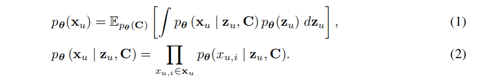

变分推断

遵从VAE范式：

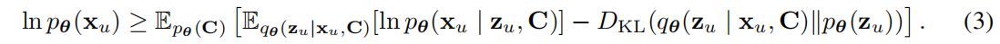

Q：其实没有C的化，就是VAE，可以理解的；加了C，不取log之前也能理解；但是加了log之后，为啥C不用加log呢，为啥还是 $p(C)$ 不是 $log p(C)$

A：在附录里找到了证明，核心是让 $q(c|x_u) = p(c)$ ，虽然个人看公式有点难理解，但是按照个人理解，就是 $C$ 是离散型的分布，分母好算，所以直接让 $q(c|x_u) = p(c)$，对应的KL=0；但是 $z_u$ 每一维度是连续的，无法算分母，所以无法 $q(z_u|x_u,c) = p(z_u)$，对应的KL散度无法消除。

最终KL散度前加了 $\beta$ ：

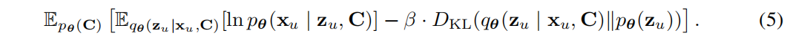

预测 $score_{ui}=c_i·z_u·h_i$

$p_(x_{ui}=1)=\cfrac {exp(score_{ui})}{\sum\limits_{j=1}^{M}exp(score_{uj})}$
$$
\begin{align}
logp_(x_{u})&=log\prod\limits_{i=1}^{S_u}p(x_{ui})\\
&=\sum\limits_{i=1}^{S_u}logp(x_{ui})\\
&=\sum\limits_{i=1}^{S_u}[score_{ui}-log(\sum\limits_{j=1}^{M}exp(score_{uj}))]
\end{align}
$$

#### 2.3 实施

**基于原型的概念分配**

最直观的方法是直接初始化 $C$ ，即 M×(K-1) 个参数直接初始化所有的概率分布参数，但是会导致过参数，本文提出基于原型的实施。

设想 $c_i$ 是来自于以下分布的one-hot向量（是不是相当于采样出来呢？）：

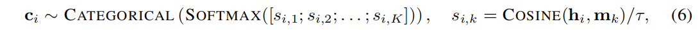

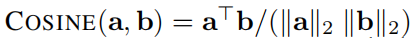

使用余弦相似度不使用内积的原因是：防止模型坍塌，因为内积可能出现一个原型的L2范数特别大，这种情况下，即使items能够在欧式空间形成K个簇，所有item都会分配到这个类中。

**Decoder**

设想 $x_{u,i}$ 服从一个在M items上的分类分布

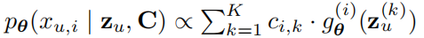

- Decoder

Q：不知道为啥要用分类分布，个人更倾向于多分类分布，即二元交叉熵；区别就是前者的比较能力更大，要在分母上计算负样本

**Encoder**

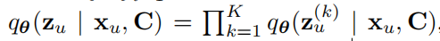

$f_{nn}$ 在K个原型下是共享的

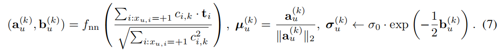

- Encoder的架构是1个，输入是用户的物品集合 $x_u$ 和表示第k类的k，那么先使用物品在k上的分布对 $x_u$ 进行一个类似于mask的操作，使得从 [1,0,1,1,0,1,0,1,1] 中挑选出第k类的物品（因为物品在c上的分布类似于one-hot，并且训练时sample，所以将一个物品分配到一个k类，如果是soft的话，就相当于把一个物品soft分配至每个k类），使用k类上的物品集合来编码出用户 $u$ 在第k类上的表示

### 3  Empirical Results

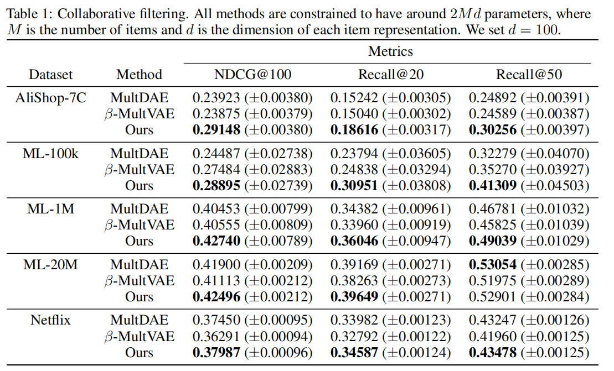

**宏观解耦**

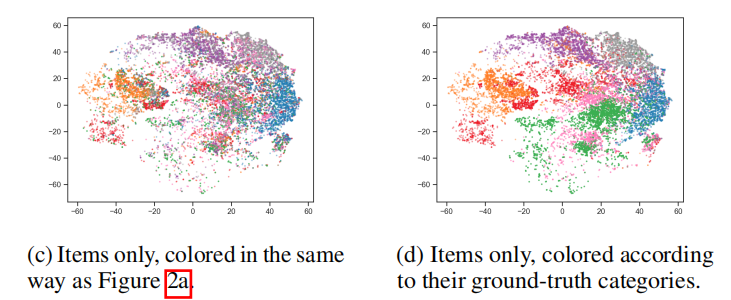

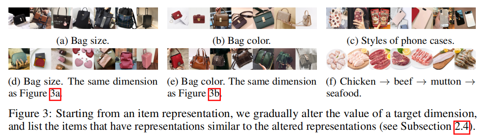

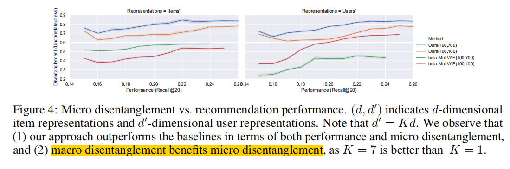

## VAE理解

实际上还是极大似然估计，最大化 $p(X|\theta)$ ，但是出现了隐变量z；

相当于把 $\theta$ 到 $X$ 的一条链路，拆成了z数量条独立的链路，$\sum p(z|\theta)p(X|z,\theta)=\sum p(X,z|\theta)$ 

*Q：为啥是 $p(z|\theta)$ 不是$p(z)$ ??? 个人认为，如果加上$\theta$ ，就说明不仅仅有模型参数，还有 $z$ 服从分布的参数* 

*A：$\theta$  是 x和z服从分布的参数组合。。终于知道了，它不是指模型参数，是指分布的参数，只不过很多情况下 $\theta$ 是关于输入的函数，所以最终的更新还是更新到了模型的参数上去*

通过推导 $p(X|\theta)=ELBO+KL$ ，这种情况下，还是遵从EM的思路

Encoder 对应E-step:

- 希望 $q(z|\phi)=p(z|X,\theta)$ ，因为这样KL散度=0，最大化ELBO（Q函数+常数），并且相当于最大化Q函数。但是因为  $p(z|X,\theta)=\frac{p(z|\theta)p(X|\theta,z)}{\sum p(z|\theta) p(X|\theta,z)}$，这个分子很难算（当z是连续型变量时，分子没法算，如果是离散型，比如GMM，就可以算了）
- 所以引入变分分布 $q(z|\phi,X)$ 希望变分分布接近于正太分布（直接假设真实的分布为正太分布）
- 目标是最小化KL，转化为寻找 $\phi$ 来最大化ELBO

Decoder 对应M-step:

- 目的是寻求 $\theta$ 最大化 ELBO

最终两者合一，目标都是最大化ELBO，相当于最大化 $p(X|\theta) - KL=\int q(z|X,\phi)logp(X|z,\theta)-KL[q(z|X,\phi)|p(z|\theta,X)]$：

- 第一项即为重构误差;
  - 第一项是求期望，理论上要算所有可能的 z；采样近似计算，对于每个样本 $x$ 采样 $M$ 个z，求平均代替期望（期望的无偏估计）；但是采样得到的 $M$ 个 $z^m$，送到后续，梯度传不到 $\phi$ ；因此使用再参数化，在 encoder上得到的 $z$ + noise；将不确定的 $z^m$ 转化为 确定的 $z+不确定的noise$
- 第二项即为独立性约束，可以引入系数 $\beta$，令其>1，即可实现更强的解耦

训练，$N$ 个样本，每个样本 $M$ 个采样，总损失函数为:

sum(求M个期望-KL)×N

-----

Q：$KL(p(x)|q(x))=\int p(x)log\frac {p(x)} {q(x)}dx=\int p(x)logp(x)dx-\int p(x)logq(x)dx$

假设多分类问题有K=3个类，N个样本

- 每个样本都有一个在3个类上的分布，一个真实样本$x1=[1,0,0]$，预测样本 $\hat x1=[0.7,0.2,0.1]$，那么$KL(q(x1)|p(\hat x1))=-(1×log0.7+0×log0.2+0×log0.1)$

但是如果计算N个样本的KL散度，怎么用公式来表达呢？

- $KL(p(X)|q(X))=?$ 因为这里的 $X$ 不只是一个样本 $x1$ 了...

----

**2019-ICML-Disentangled graph convolutional networks**

假设4个因素，每个节点有4个表示

- E：基于4个【解耦表示】推断每条边形成的原因【概率分布】 
- M：在4个因素表示上基于推断的【概率】，使用邻居节点的线性组合来更新中心节点的【表示】
- 所以EM是依次固定【解耦表示】和【概率分布】来更新彼此的
- *（注：具体的哪个变量服从什么分布，这个没看懂，但是就是正好对应上述的EM）*

每个epoch：

- 要迭代T次上述的EM步骤（这T次称为动态路由机制）
- 迭代T次的过程只是为了得到当前状态下较为稳定的表示，EM这个过程不参与反向传播
- 通过最后M步得到的表示来参与正向传播和反向传播，一个epoch只会通过loss作用于最后得到的表示

