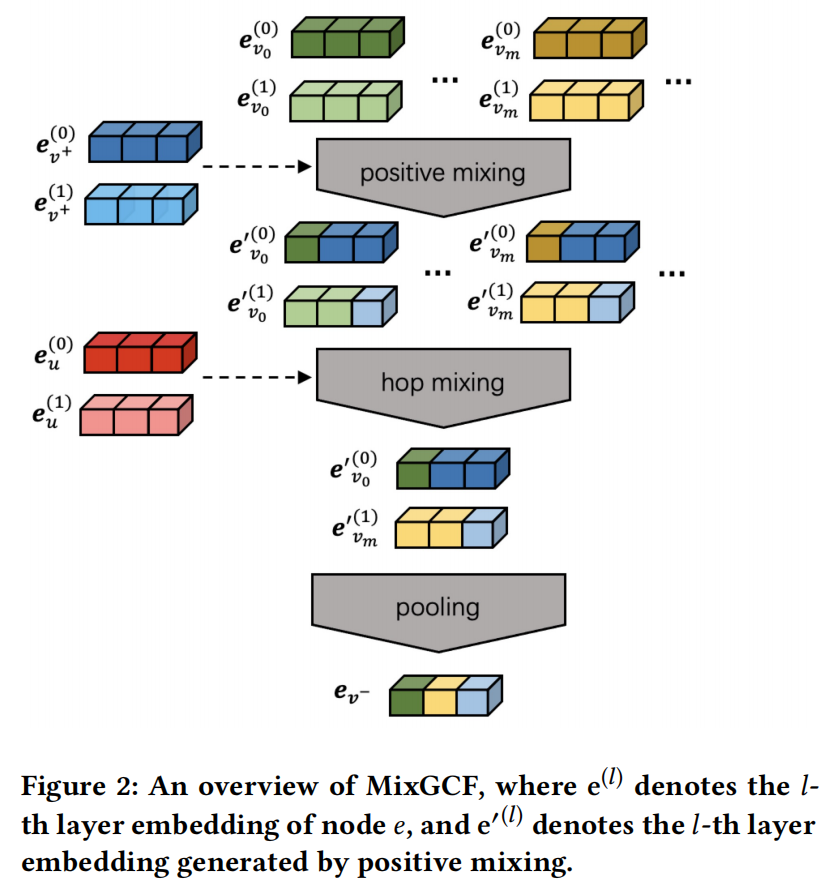
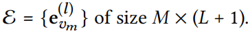
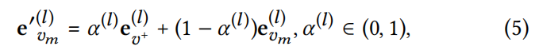
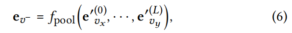
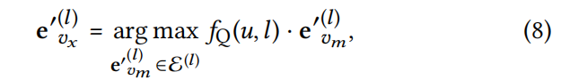
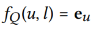
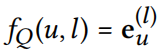
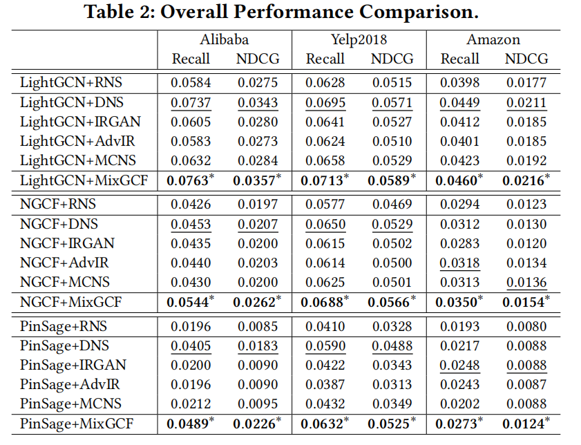

**MixGCF: An Improved Training Method for Graph Neural
Network-based Recommender Systems**

**2021-KDD** 清华唐杰老师

利用u-i图结构和GNN的聚合过程来研究GNN-CF中的负采样。提出了MixGCF，设计了hop mix技术来合成hard负样本。

### 3 THE MIXGCF METHOD

- positive mixing：插值混合法，将正样本中的信息注入到负样本，make hard 负样本
- hop mixing：使用hard负样本策略提取 unique information 从每一个生成的负样本，然后pooling

#### 3.1  Positive Mixing

- L层图卷积，对于每个正样本，用M个负样本形成候选集 $M$
- 
- 对于候选集中的每个嵌入，进行正样本插值操作：
- 
- $\alpha^l$ 是混合系数，是从(0,1) 里面均匀采出来的

总结：

- 插值，是生成hard负样本
- 混合系数是为了增加随机性

#### 3.2  Hop Mixing

- 对于每一层，采样出来一些负样本的嵌入
- 然后通过pool操作得到一个负样本：
- 
- hard negative select strategy——挑选和user emb具有最大内积的负样本；第 $l$ 层的负样本为：
- 
-  $f_Q(u,l)$ 是一个query映射，返回关于 user 在 $l$ 层的一个emb，具体与GNN的聚合方式有关
  - sum-pooling in GNN，
  - concat in GNN，

#### 3.4 讨论

- 通用插件：即插即用
- 数据增强：可以看作增强，因为负样本是基于现有实例生成的
- 多个负样本近似：度量学习中指出在每次更新的损失函数中使用多个负实例，可以加快底层模型的收敛速度，并提供更好的性能；MixGCF通过hop-mixing提供多个负样本的近似

### 4 Experimental Settings

### 5 RELATED WORK

#### 5.1 基于GNN的推荐

- PinSage、GC-MC、NGCF、LightGCN
- 利用side info：社交网络、知识图谱 ......

#### 5.2 推荐中的负采样 🎈

解决RS中的one-class问题（只有正样本），负采样大致分为四类：

- Static Sampler 从一个固定的分布中进行负采样
  - 均匀分布、流行度 指数 3/4
- GAN-based Sampler 基于生成对抗网络进行负采样
  - IRGAN、KBGAN、AdvIR
- Hard Negative Sampler 为当前的用户自适应地选择 hardest 负样本
  - DNS
- Graph-based Sampler 根据图信息进行负采样
  - MCNS、KGPolicy、PinSage（基于Personalized PageRank）

