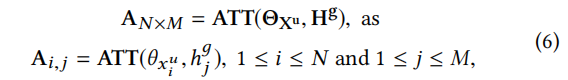

**Octopus: Comprehensive and Elastic User Representation for the Generation of Recommendation Candidates**

**2020-SIGIR**

候选集生成阶段（召回）两个问题：

- 要求全面的包含用户感兴趣的items
- 召回需要准确和高效

### 2 RELATED WORK

#### 2.1 深度RS

深度学习技术在两个方面影响RS：

- 从原始数据中可以自动学习到紧凑和有区别的特征，如文本表示、由 GNN 或图嵌入提取的关系型特征
- 通过复杂的网络结构，用户复杂的行为模式可以以更高的精度建模

#### 2.2 个性化召回

主流的算法将召回问题转化为相似度搜索问题。解决方法：倒叙索引、KNN搜索、MIPS最大内积搜索、二值化表示

### 3 PROBLEM FORMULATION

### 4 THE OCTOPUS

#### 4.1 弹性存档网络

channel:$H^g:[M,d]$ 表示M个兴趣

生成多样化的用户表示的流程为：

- **通道激活**：个人理解，相当于使用history中的每个item和M个channel计算注意力score（就是简单的内积，分母是M个channel）：

  

  - 相当于M种兴趣
  - 对于历史行为中的每个item，都选择其score最大的兴趣作为这个item属于的类别

- **分组注意力聚合**：

  - 把兴趣类别相同的item分成一个组（也就是把history按照item兴趣类别划分成组）
  - 对于每个组计算出这个兴趣组的用户表示（加权组合item嵌入，只不过权重重新使用兴趣的channel和item嵌入进行注意力得分计算）

- **训练过程**：

  - 没有必要让user的多个嵌入和target item都接近
  - 只选择和target item最近的用户嵌入作为“most relevant user representation”，让这个user嵌入和target item尽量接近

#### 4.2 候选集整合

每个兴趣可以检索TopK，如何生成最终的K个

- **竞争整合**：直接按照距离排序，缺点是不同兴趣间的距离没有可比性（相当于多路召回的score无法直接相比）
- **分配整合**：看成多分类问题，希望真正离target item最近的兴趣嵌入的输出接近于1

