**Path-based Deep Network for Candidate Item Matching in Recommenders**

**2021-SIGIR-阿里、蚂蚁**

介绍了工业界主流的两种召回方式及对应的特点，提出PDN整合两种召回方式。

### 1  INTRODUCTION

- a matching stage is expected to retrieve a small fraction of relevant items in low latency and computational cost
- a ranking stage aims to refine the ranking of these relevant items in terms of the user’s interest with more complex models

本文关注于召回阶段

-  item-based CF（item-to-item based collaborative filtering），基于物品的共现模式估计两个Item的相关性。
  - 缺点：传统的反序索引很难满足个性化的需要；只考虑Item共现关系，没有使用附加信息，遭受稀疏性问题
- EBR（embedding-based retrieval），通常使用双塔模型。通过分别嵌入u i的特征来表示用户和物品，将问题转化为在嵌入空间中找最近邻。
  - 缺点：双塔模型很难显式整合物品间的共现关系；一个用户总是表示成一个嵌入向量，不合适编码用户的多样化兴趣
- 为了同时捕获用户的多样化和个性化兴趣，通常使用多种策略（各种不同网络结构的协同过滤倒序索引和EBR策略）*（即多路召回？？）*。这些模型并行实施，候选集的score是在不同的尺度下计算得来的，很难直接融合这些分数。

### 3 PRELIMINARIES

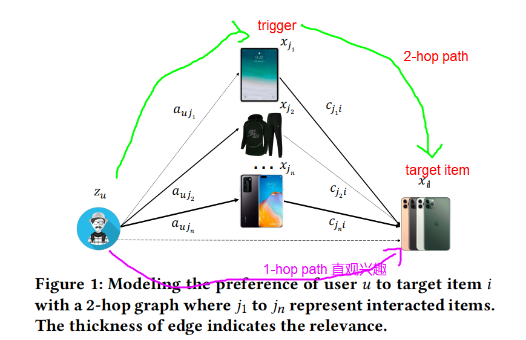

物品召回阶段可以表示为：

- f为推荐算法，输入分别为：
  - 用户u的信息（特征）；target item的信息（特征）；用户u交互过的历史物品特征；用户u对于交互物品的行为信息（停留时间、购买次数等）；历史物品和target item的相关性（由item-CF计算出的统计指标）

很多item-based CF和EBR可以看作上式的特殊形式：

- item-based CF

  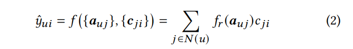

- MF，n+1条paths（注：不考虑history item,就只有u-i一条路径；考虑history item，有n+1条path）

  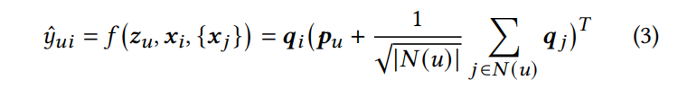

- YoutubeDNN

  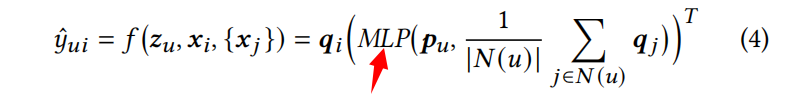

- DIN

  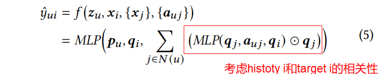

### 4 METHOD

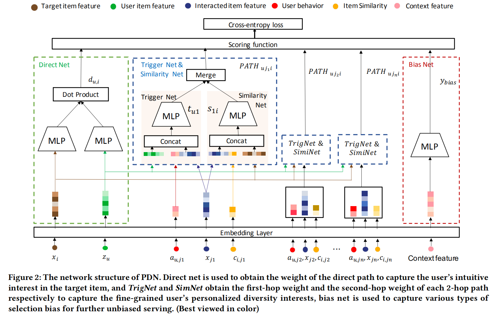

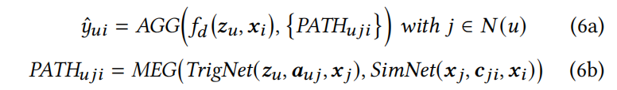

u和target item的match score由以下组成：

- 直接的u-i
- n条2-hop-path的得分（u-history item-target item）
  - TrigNet,history item对于u的权重
  - SimNet,history item对于target item的相关性

#### 特征组成&嵌入层

- 四个特征域：用户域、用户行为域、物品共现域、物品域
- user id, item id, age id, brand id, monthly sales, stay time, the statistical correlation between items...
- 将所有的dense特征离散化转化成one-hot型特征

#### 触发器网络&相似性网络

- 触发器网络，通过计算**用户对每个触发器的偏好**来捕获用户的多样化兴趣：

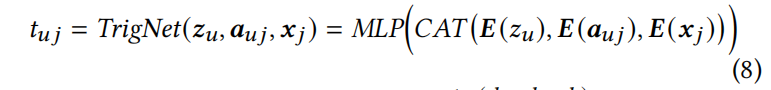

- 相似性网络，基于物品特征和物品共现来计算每个交互物品（触发器）和target item的相关性：

  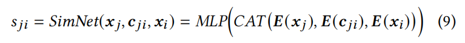

- merge操作：

  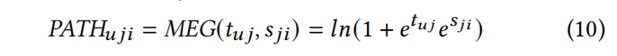

#### 直接网络

user-target item 一跳路径 表示用户对待推荐物品的直接相关性（就相当于双塔）

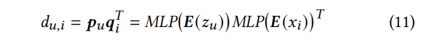

#### 偏差网络

关于选择偏差特征（位置特征，小时特征）的一个浅层网络（训练时加，在线不加）

#### Loss

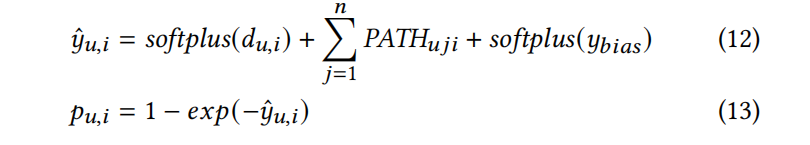

### 5 STSTEM

在线检索：

- 索引生成——离线，基于SimNet检索出每个Item的相似k个Item，并存储其相关性得分

  - 对于每个item，要从N个物品中选出k个最相似的，计算量太大，缩小候选集数量（比k大一个数量级，远远小于N）
  - 基于共现，基于内容特征，选出候选集
  - 使用SimNet计算score
  - 检索出k个最相似，存储到db

- 触发器提取——使用TrigNet以user和history items为输入，输出对应得分，选出top-m个触发器

- Top-K检索——m个触发器，检索出m×k个物品，计算最终得分排序：

  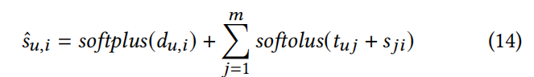

### 6 EXPERIEMENTS

离线实验，使用两种召回方式：个性化（就是双塔），i2i（使用history-items-2-target item）

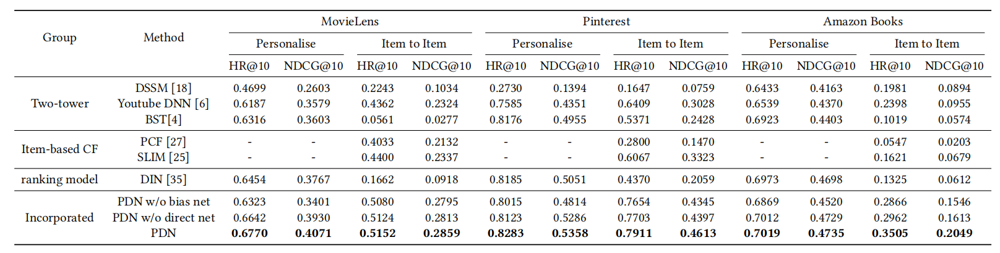

在线指标：

- page click-through rate (PCTR), user click-through rate (UCTR), clicks per user (ClkPU), average session duration (avgSD), diversity

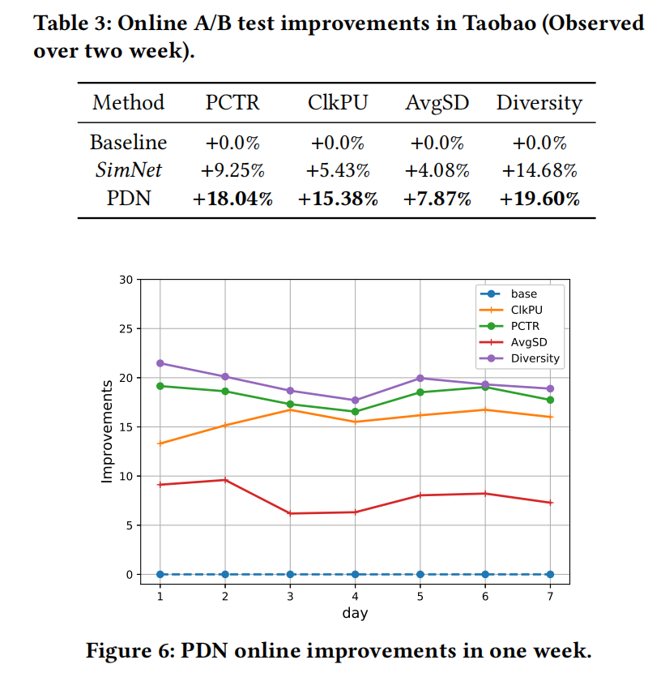

Case：验证多样性

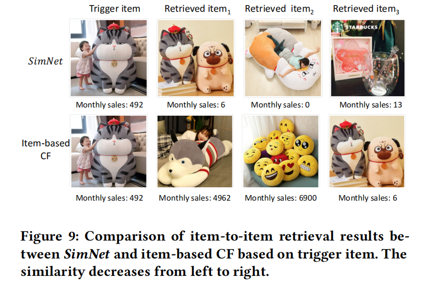

