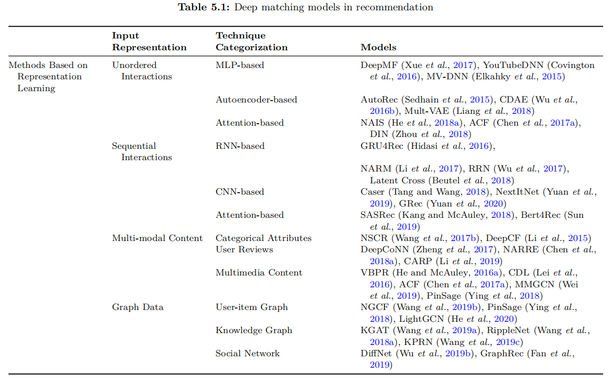

**RS中深度学习的两类方法：表示学习和匹配函数学习**

在搜索中，query和document由相同的术语组成，对他们的术语直接进行匹配至少是有意义的。在推荐中，用户和项来自不同语义的空间，不能直接匹配。CF的方法有：矩阵分解、基于神经网络的、基于图的。

为了使用更多的side info，许多模型提了出来。这些模型可以用到re-ranking阶段，比如用到CTR预估上。

用于RS的基于深度学习匹配方法分为两类：

- 表示学习，神经网络用于生成用户和物品的表示。
- 匹配函数学习，神经网络用于对用户和物品（或者content）产生交互作用，生成匹配信号，聚合这些信号为最终的一个匹配得分。

## 1 基于表示学习

两个表示函数，分别将用户空间和物品空间映射到一个新的空间。

根据输入数据的类型分为四类：

- 无序交互
- 序列交互
- 多模态内容
- 链路图

### 1.1 无序交互

一个one-hot向量只能表示一个ID的信息，可以用用户交互过的物品来表示此用户。那么用户就可以用交互过的物品向量来表示，[0,0,0,1,1,0,1,0]，即用多个one-hot物品来表示此用户。相当于用交互矩阵R的每一行来表示用户，每一列来表示物品。

#### MLP

DeepMF，采用 DSSM 双塔结构。以multi-hot向量为输入，相当于把[交互id集合]看作特征，用来表示用户和物品。

- 用户的layer1结果为交互过的物品的嵌入求和，那么用户侧layer1的参数 $W$ 就相当于物品的嵌入，第一层的作用相当于从multi-hot中选出该用户交互的物品，进行lookup操作，求sum。
- 物品侧layer1的参数 $W$ 就相当于用户的嵌入，第一层的作用相当于从multi-hot中选出交互过此物品的用户，进行lookup操作，求sum。

由于用户和物品的空间不同，DeepMF使用两个MLPs来得到用户和物品的表示。但是也不是强制使用双塔，可以只对用户使用MLP，对物品使用id嵌入lookup操作。

#### 自动编码器AE

AE可以将输入数据转化为隐藏表示。

 item-based AutoRec：以用户历史记录向量（对每个物品的评分）为输入，重构向量为预测结果，重构向量是一个 $N$ 维向量，它表示用户 $u$ 对所有物品的预测匹配分。

也可以使用交叉熵、hinge loss，pair-loss等。

可以将AutoRec看作（1）在交互历史上使用MLP学习用户的表示；（2）使用嵌入查表来获取物品表示。

主要是 $W$  $V$ $y_u$  $\hat y_{u}$  的理解：

- $y_u：N×1$ 是multi-hot向量（如果是0/1行为的话，如果是评分，就是评分向量），代表用户 $u$ 的交互历史物品，交互过的物品index位置的元素不为0.（假设为1，即0/1行为)
- $V：d×N$ 相当于一个物品交互嵌入（不是物品id嵌入），那么 $Vy_u$ 就相当于将用户 $u$ 交互过的物品[交互嵌入] 查表求sum，然后经过MLP得到用户表示
- $W：N×d$  相当于物品id嵌入表，预测用户 $u$ 对物品 $i$ 的得分时，查表取出 $i$ 的id嵌入，与用户表示内积。

*（个人理解：之前一直以为MLP第一层的参数就是物品id的嵌入，实际上可以理解为物品有两个嵌入，①一个嵌入是交互嵌入，用来学习用户表示；②还有一个id嵌入用来表示物品，做预测时使用。SVD++应该就相当于只用了一个物品嵌入吧？？）*

#### 注意力机制

在学习用户表示时的一个观察是，历史物品可能会有不同水平的用户偏好贡献。虽然MLP能够捕获复杂的关系，但是这个过程是隐式的，很难保证生成理想的结果。

NAIS是FISM的拓展，在用户的每个交互物品上使用可学习的权重。

每个物品有两个嵌入向量， $p$ 表示作为target物品的嵌入， $q$ 表示作为历史交互物品的嵌入。

$g()$ 函数以 $p$ 和 $q$ 的 [concat或element-wise product]为输入，输出得分。由于注意力得分，从历史交互得到的用户表示也有一定的可解释性。用户的表示由交互物品的[交互嵌入]来表示，待推荐物品不同，那么这些交互物品的权重不同，所以用户的表示也不同。这个设计解决了缺陷[与不同物品交互时的静态用户表示]。（那就是用户表示随待推荐物品而变化，不能直接得到用户的表示）

DIN采用相同的动态（目标物品感知 target item-aware）用户表示方式。

### 1.2 序列交互

*（这一部分有些看不懂了。。）*

如果考虑交互时间，那么交互历史可以看作一组物品id的序列。

#### RNN

 GRU4Rec，一个session中的一段点击序列 $x$：

在x中的每一个位置i，输入时session的状态（当前位置i物品的one-hot表示，或者是目前所有物品[0,1,2,...,i]表示的加权和）。每一时刻的输出是一个N维向量，代表下一时刻点击物品的概率。使用pair-wise loss， $N_s$ 是负采样个数：

- BPR loss：

-  TOP1 loss: 正确排序对的比例？？+正则化

  

RNN-based方法一个问题是：只考虑了用户在当前session的序列行为（短期兴趣），没有强调用户的长期兴趣。后续NARM被提出，使用结合注意力机制的RNN解决这个问题。

encoder-decoder框架，假设序列x一共包含t个点击行为，采用两个GRU：

- gloabl encoder，使用最后时刻的隐藏状态作为用户序列行为的表示（短期兴趣）
- local encoder，使用到目前为止所有的隐藏状态加权作为长期兴趣表示

序列表示 $c_t$ 用上述的两个表示concat表示，预测候选物品得分时使用双线性函数：

*（序列的local表示没看懂，注意力得分是用  $h^g_t$  和 $h^l_t$ 来计算？以及是用了两个不同GRU吗？？）*

#### CNN

Caser，将嵌入空间中的交互物品视为image，使用卷积。t个物品，嵌入维度k。

-  horizontal filter
  - 由于不同用户的交互物品数t不同，所以在使用不同尺寸的卷积核之后，进行最大池化操作，所以每个卷积核得到维度为1的feature map。
  - 在嵌入空间的宽度方面，E可能没有像真实图像那样的空间关系。（和CNN处理词嵌入一样）所以卷积核的宽度要和嵌入维度相同。
-  vertical filter size为t，得到1×k 的feature map，和上述的feature map concat

由于最大池化操作，Caser对于大范围序列和重复序列不适用，进行数据增强，每一个输入序列还附带长度为 [滑动窗口长度] 的子序列。

NextItNet

*（Caser和这个NextItNet着实看不懂。。）*

#### 注意力机制

SASRec，

BERT4Rec，

### 1.3 多模态内容

除了用户-物品交互之外，用户和物品通常与[描述性特征]相关联。比如分类属性（年龄、性别、产品类别）、文本（产品描述、用户评论）。用于多模态的RS，比如图片、视频、音乐，这些多模态的描述性特征也可以利用。使用这些side info对于表示的学习有帮助，并且特别对于稀疏的用户和物品有帮助（缓解冷启动）。

其中 $p_u$ 和  $q_i$ 是通过历史交互学习到的用户和物品的id嵌入；$f()$ 和$g()$ 是通过side info 学到的用户和物品的表示；分别进行结合。本文分为三类（可以参考2019那篇side info综述，分的更细）。

*（个人认为也不一定是形式化成5.13的形式，可以用side info 来辅助id嵌入的学习，而不一定要学习side info的嵌入，比如尽量让同类物品的嵌入接近，社交朋友的嵌入加正则化等）*

#### 分类属性

类别特征用嵌入表示，id也用嵌入表示，（类似FM的思路），用户的最终表示就是[id嵌入和所有特征嵌入]对应元素相乘+[特征嵌入两两之间]对应元素相乘，物品的最终表示类似。双向交互池化操作，考虑用户ID嵌入和属性嵌入之间的所有成对交互。

基于正则化的方法。（1）使用两个AE（自编码器）分别从用户和物品特征中学到用户和物品的表示，（2）基于用户和物品表示给出预测分。AE的loss就可以看作为推荐任务的正则化。

#### 用户评论

其他用户的评论往往会显著影响推荐系统中用户的在线购买决策，利用评论一方面可能提升精度，一方面加强可解释性。

DeepCoNN，用户发过的所有评论，物品收到的所有评论分为为输入，两个CNN提取表示。（文中提到是一维CNN，其实就是CNN运用在文本上时，一个size必须等于词嵌入维度，相当于skim）

NARRE，对于评论赋予权重。物品由 $m$ 个评论构成，那么由 $m$ 个feature map构成，每个评论的feature map的权重由[此feature map、写这个评论的用户的嵌入]计算得出。

*（基于评论的基本都是用于评分预测，自己看过的有：DeepCoNN、Trans-Net、D-attn、MPCN，[如果CTR-CDL-ConvMF也算的话]，个人认为评分预测很难提升效果，基本的MF就很强了，这些比较新的研究都是基于文本，两个并行的CNN，都是加各种注意力机制，基本注意力机制，全局+局部，多头hard-attention，但是效果提升不多，可以看那篇很短的批判性的文章，看完就放弃这条研究 Line了。。）*

#### 多媒体内容

VBPR，考虑物品的图像特征。从图像中使用CNN提取图像特征，线性转化；和物品id的嵌入concat来表示物品；使用BPR-loss训练。*（个人认为和ConvMF，还有一篇国内引入文本的LFM基本一个套路）* VBPR中使用的CNN很多层，很复杂，参数时预训练好的，在用于RS训练时不会更新。局限就是预训练的参数可能不适合RS，后续的研究：

- CDL（*Comparative Deep Learning* ），更新 Deep-CNN的参数。近期研究，对抗性训练学习CNN和推荐的参数。
- 图像推荐PinSage，微视频推荐MMGCN，共同思想——（1）提取的图像表示作为物品节点的初始嵌入，（2）在交互图上信息传播，更新节点嵌入。这样使得学习到的视觉特征更适合RS。
- Attentive Collaborative Filtering (ACF)，把一个image切割成49块区域，分别使用Deep CNN提取视觉特征，注意力加权。基本假设是不同的用户对于image的不同区域感兴趣程度是不同的。此方法也用于视频推荐（视频片段？）。

### 1.4 链路图

上述的方法分别从用户信息和物品信息中学习表示，这就忽略了用户和物品之间的关系。图结构连接用户和物品，有可能利用它们之间的高阶关系，捕获有意义的pattern，提高它们的表示。

- 两阶段方法，先提取关系（三元组or路径），然后用关系学习节点表示
- 端到端方法，直接学习节点的表示，信息的传播是在节点之间进行的

####  端到端：NGCF

用户的交互物品给出了用户偏好的证据，而物品的交互用户可以被视为物品的特征。NGCF在用户物品（二部图）交互图上执行嵌入传播。

GNN的图卷积层分为：

- 消息构造，定义从邻居节点传播来的消息
- 消息传播，整合{邻居节点集合}传播来的消息，更新当前节点的表示

MF相当于没有交互的NGCF，SVD++相当于只有一阶交互（只有物品传消息给用户）的NGCF。图卷积层可以使用不同的方法，SpectralCF使用光谱卷积来执行信息传播，GC-MC结合MLP和节点更新公式。

LightGCN对NGCF进行了改进，认为只用了id嵌入，没必要在两个id嵌入上进行多层的非线性转化。LightGCN在图卷积层中只保留邻居聚合操作，移去了非线性特征转化和自连接层（为啥要去自连接层呢？）。多层的sum聚合操作，包含了自连接。

#### 端到端：KGAT

考虑KG上物品间的连接。异质有向图，指出从头实体h有关系r指向尾实体t。使用KG，可以加强物品表示的学习和用户-物品关系的建模：（1）实体直接相关的三元组概述了此实体的特征；（2）实体间的连接，多跳路径表示复杂的关系，捕获复杂的关联模式，多跳路径还能帮助推荐的可解释性。

邻居节点 $t$ 对当前节点 $h$ 传播的消息的衰减因子（重要性、权重） $\alpha_{h,t}$ ，在NGCF中是固定的，在KGAT中还要考虑两者的关系 $r$ ，使用关系注意力机制。（这一点比较好）那么得到的分值表明了传递了多少信息，表明邻居节点在关系 $r$ 下对于当前节点的重要性。

  

#### 两阶段：KPRN

引入原路径直接细化用户和物品间的相似性。这些模型（1）首先要么定义元路径（先验知识制定？）要么提取出合格的路径；（2）将路径输入到一个监督模型中，输出预测分。

相当于用户 $u$ ，待推荐物品 $i$ ，可以找到很多条合法的（预先定义的？合理的？）path 从 $u$ 到达 $i$。通过池化层将这多条路径表示结合成一个single向量。然后传入MLP输出预测得分。其中一条路径（实体u，关系1，实体1，关系2，实体2，......，关系r，实体i）表示学习过程为：

## 2 基于匹配函数学习

基于匹配函数的输入分为两类：

- 双向匹配，只有用户信息和物品信息。开发更复杂和表达能力的匹配函数，分为：
  - 相似性学习
  - 度量学习
- 多路匹配，还有side info。根据如何对特征交互进行建模分为：
  - 隐式交互建模
  - 显式交互建模
  - 隐式和显式交互建模 结合

### 2.1 双向匹配

#### 相似性学习

NCF框架，以用户和物品嵌入为输入，输出匹配分。

- MLP，concat嵌入+MLPs，虽然MLP理论上能拟合所有连续函数。但是MLP很难学到乘法操作，乘法操作对于CF中交互作用是很重要的。因此在匹配网络中**显式的表达乘法操作或相似的影响**是很重要的。

- GMF，用户嵌入和物品嵌入element-wise product，然后接一个MLP输出预测得分，相当于为不同维度上的交互作用赋予不同权重，理论上表现比MF更好。后续有研究stack多个MLP，取得不错的效果。

- NeuMF，集成了MLP和GMF，为MLP和GMF使用单独的嵌入表，使用MLP和GMF的预训练参数，否则数据稀疏时很难训练。后续有研究，采用共享嵌入，减少参数。

  

- ConvNCF，为了显式地构造嵌入不同维度间的交互作用，对用户嵌入和物品嵌入采用外积操作。在交互映射上堆叠多个CNN，能够捕获更高阶的交互作用，并且减少参数。

#### 度量学习

学习和利用距离度量，定量衡量数据实例之间的关系。度量学习需要满足一些约束，比如三角不等式。

一篇早期并且有代表性的研究是CML，指出CF中内积有缺陷因为不满足三角不等式，相似性关系不能通过内积正确的传播。

- CML，用欧式距离作为用户 -物品间的衡量指标。学习和使用度量的一个优点是可以传播实例之间的相似性。（和师姐讲过的社交正则化类似吗？？）比如u和[i和j]都相似，那么度量学习不仅会让u和[i和j]接近，还会让i和j接近。

  

  采用margin-based pairwise loss：（hinge loss function），还可以加一些额外的约束

  

- TransRec，用于序列行为，预测下一个物品。将用户看作“translation vector”，它将前一个项目转换为下一个项目

  

  预测时使用下式，其中 $\beta$ 是物品的流行度，采用bpr loss。

  

- LRML，

  

  其中 $r$ 是需要学习的隐含关系向量，$r$ 由 $t$ 个记忆单元加权求和得到，每个记忆单元都有key，用户嵌入和物品嵌入的对应元素相乘作为query，以此计算注意力得分。

  

### 2.2 多路匹配

多路匹配通常是基于特征的模型，比如FM，这类模型允许使用任何种side info和context。由于比双向匹配复杂度更高，通常用在排序阶段，比如CTR预估而不是召回。特征交互作用建模目的是捕获不同（交叉）特征间的影响，或者说捕捉来自多个特征间的信号。

一种简单的实现方法就是人工构造交叉特征，将这些特征feed进线下模型，缺点是：（1）只能记忆训练数据中看到的交叉特征，不能泛化到看不到的交叉特征；(2)随着交叉阶数增长，特征交叉项会呈多项式级别增长，所以需要领域知识挑选有用的交叉项。根据特征交互作用如何构造分为以下三类。

#### 隐式交互建模

YouTube（经典），将每个分类特征用嵌入表示，序列形的特征用平均池化，concat所有特征嵌入，送入三层MLP。期望MLP学习特征嵌入之间的交互，特征交互建模是一个隐式的过程，交互被编码在MLP的隐藏单元中，无法辨别哪些特征交互是重要的。

后续有，Wide&Deep、 Deep Crossing、 DeepFM、 xDeepFM都包含隐式特征交互建模。（不是只有）

####  显式交互建模

FM是经典的模型，可以在神经网络框架下进行扩展，来对显式交互进行建模。

NFM，双向交互池化层，用element-wise product代替FM中的内积，[对这些两两element-wise product进行sum，还是concat？]，后面stack多个MLP。

AFM，解决二阶交互平等对待的局限，每一对特征交互都有一个重要性得分 $\alpha_{ij}$  ，重点是如何计算得出的注意力得分，它可以解释二阶特征交互作用对于结果的重要性。

Deep AFM，利用NFM能捕获高阶特征交互作用，AFM能捕获二阶特征交互作用，在注意力池化层上加MLP。

HoAFM，高阶注意力FM。

CIN，用递归的方式显示的对高阶特征交互进行建模。随着CIN层数越深，特征交互的阶数越高。CIN的参数较多。

#### 显式和隐式交互建模 结合

Wide&Deep，线性回归使用人工构造的交叉特征；deep部分使用MLP。

当时个人理解DNN部分最后一定要输出一个1维的数，其实也可以这样理解：DNN最后一层假设是 $d$ 维，在给其赋予权重求和，得到DNN的输出。

DeepFM，结合FM和MLP，FM用来显示对二阶特征交互作用建模，MLP用来隐式对高阶特征交互作用建模。

xDeepFM集成DeepFM和CIN，显式的对高阶特征交互进行建模。

