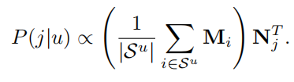

**Self-Attentive Sequential Recommendation**

**2018-ICDM**

序列动态，基于用户近期的行为，寻求捕获用户活动的上下文。两种方法：MC，认为next item和近几个item相关，适用于稀疏数据集；RNN，能捕获长距离的关系，适用于更密集的数据集。本文提出SASRec，能够捕获长距离语义，又能使用注意力机制让其预测基于相关的少量行为。

### 2 RELATED WORK

1. 常规（通用）的推荐*（不知道咋翻译合适）*

	- MF
	- ISM，不学习用户的嵌入，只学习i2i相似度矩阵，衡量target item和user history items的相似度
	- DL，（1）使用nn提取item特征；（2）替代MF中的内积，如NCF、AutoRec
2. 时间的推荐
   - 显式对用户活动的时间戳进行建模，TimeSVD++，适用于展现出时间漂移的数据集
   - 注：时间的推荐和序列推荐(next item rs)是不同的，序列推荐只考虑行为的序关系，对序列模式（是独立于时间之外的）建模
3. 序列推荐
   - i2i转移矩阵，FPMC（一阶MC）、Caser（高阶MCs）
   - RNN类，GRU4Rec
4. 注意力机制
   - 作为附加组件+原始模型
   - Transfomer，完全依靠自注意力机制

### 3 METHODOLOGY

输入；期望输出

#### 3.1 嵌入层

固定输入序列长度为n，不够的用pad填充，pad的嵌入为常数0向量

**位置嵌入**P，加上物品嵌入E，得初始嵌入：

#### 3.2 自注意力block

**自注意力层**：在NLP中，通常K=V（RNN encoder-decoder翻译任务，encoder隐藏层做K和V，decoder隐藏层做Q）

本文的自注意力层以 $\hat E$ 为输入，通过三个投影矩阵进行线性映射做Q K V,

(这种投影让模型更灵活，比如 $<q i, k j>$ 和$<q j, k i>$ 可以是不同的)

**因果关系**：考虑 t+1 的item时，应该只考虑前t个items，所以禁止 $j>i$的 $Q_i,K_j$

**Ponit-Wise 的FFN**：虽然自注意力能够自适应的赋予previous items的权重，但它仍然是一个线性模型。为了赋予模型非线性并且考虑不同隐维度之间的交互作用，对于所有的S添加了两层FFN

#### 3.3 堆叠自注意力层

堆叠多个自注意力层可能有助于学习更复杂的物品转移关系：

随着网络加深，带来一些问题：

1.  过拟合
2.  训练过程不稳定（梯度消失等）
3.  更多的参数加大训练时间

解决方法：

对于 1）自注意力层和 2）FFN:

**输入x——LN（x）——送入函数g()——dropout(输出)——残差add输入x**

**残差连接**：核心思想是通过残差连接将低层的特征传播到更高的层

**层归一化**：normalize the inputs across features，有助于稳定和加速神经网络的训练

**丢弃**

#### 3.4 预测层

预测某个序列 t+1 时刻的item时，我们基于 **序列 t 时刻的模型输出**和**所有target item的嵌入** 做内积

*（注：提到了FPMC需要使用不同的item嵌入，应该是说 item 做序列中的 history一项 的嵌入和 item 做 target的嵌入不同，这是为了构造不对称的转移关系；而本文的F和M共享 Items嵌入，因为模型设计的 i j 输出 和 j i输出不对称）*

**显式用户建模**，两种方式：

1.  学显式的用户嵌入来表示用户偏好
2.  考虑用户之前的history，从history items中产生一个隐式的用户嵌入

本文对于一个序列产生的 $F_n$ 就可以看作是第2种方法，即将序列的最终表示作为用户表示；也可以用第1种方法，再加一个用户嵌入表 U，把 $F_n$ 看作history 表示，U+F 联合表示用户+his序列 ；本文使用的是方法2。

#### 3.5 网络训练

给定输入序列，t时刻的期望输出为：

注意输入和输出长度相同都为n，因为输入 s1,s2,...sn；label是s2,s3,...,sn+1。

*（这才知道序列推荐是seq2seq，不知道是不是全是这样，还是可以只考虑预测 n+1时刻）*

每个epoch，要为 st 随机采样负样本

#### 3.7 讨论

可以看成这些模型的扩展版：

- *Factorized Markov Chains*—FMC

  

- *Factorized Personalized Markov Chains*—FPMC

  

- *Factorized Item Similarity Models*—FISM；移去FFN，自注意力层设为平均权重

  

### 4 实验

#### 4.1 数据集

数据集划分成三部分，每个用户的行为序列中：

- 最后一个item做test
- 倒数第二个item做valid
- 0-倒数第三个 做train
- 注意：test的时候，train+valid做train

#### 4.2 对比模型

#### 4.3 实验细节

2层自注意层

#### 4.4 评价指标

Hit Rate@10、NDCG@10

#### 4.5 推荐表现

#### 4.6 消融实验

#### 4.8 注意力权重可视化

在不同time上，近15个item位置上的平均注意力得分

item之间的注意力得分，能够证明注意力机制能够识别出相似的（同一类）items，即attention score更高：

