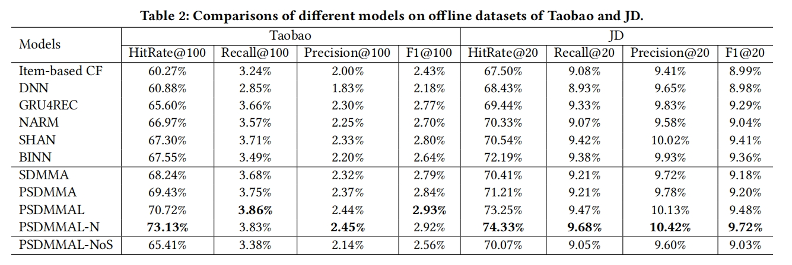

**SDM: Sequential Deep Matching Model for Online Large-scale Recommender System**

**2019-CIKM** 阿里团队

item CF 不能建模用户动态和演化的偏好。本文提出SDM，解决两个问题：

- 一个session中可能有多种兴趣趋势
- 长期偏好可能无法与当前session的兴趣有效融合

个人认为本文的亮点有：

- **user emb做query，对于序列LSTM之后的隐藏h序列（多头自注意力之后）做atten**；对于长期序列不同feat分别做atten
- gate融合长期表示和短期表示，并且可视化case study解释

### 2 RELATED WORK

- 工业界：MF、YoutubeDNN、TDM、EGES、PinSage 这些模型不能很好地考虑用户动态演化的兴趣
- 序列推荐：序列推荐旨在以一种顺序的方式建模用户的偏好和预测用户未来的行动，如下一次点击。FPMC、HRM、GRU、CNN、记忆网络...

### 3 THE PROPOSED APPROACH

#### 3.1 问题定义

- 短期session $S^u$ 长度为m
- 长期行为 $L^u$ 发生在$S^u$ 前七天内的items

session生成规则：

- 相同session id
- 邻接交互小于10min 合并到一个session
- session的最大长度50

$s^u_t$ 、$p^u$ 分别是短期表示和长期表示，聚合成最终表示 $o_t^u$。 

#### 3.2 训练和线上服务

为每个正样本进行一定数量的负采样：

*（注意：这里的sampled-softmax将负样本也算到了loss中，有一些文章是只算正样本）*

#### 3.3 具有side info的输入嵌入

user和item的嵌入表示都使用concat(所有side info)的形式。

#### 3.4 RNN层

短期session序列使用LSTM：

- 把短期交互序列encode成隐藏输出向量 $h_t^u$ 
- $c_t^u$ 是单元状态向量，携带着来自 $h_{t-1}^{u}$ 的信息，并且在单元间flow

#### 3.5 注意力机制 -> 得 $s^u_t$

**作用在LSTM影藏层序列上的多头自注意力**

使用自注意力网络来减少不相关行为（交替点击一些不相关的items）的影响。对隐藏层的输出向量序列 $X^u=[h^u_1,h^u_2,...,h^u_t]$ 使用多头自注意力机制：

**这里使用多头注意力的解释很好，mark一下：**用户可能有多个感兴趣的点。例如，当你浏览一条裙子时，颜色和新颖的风格都将是做出决定的关键因素。单一的注意力网络自然不足以捕获多个方面的表示。多头注意力允许模型共同关注来自不同位置的不同表示子空间的信息，并可以从多个感兴趣的视图建模用户偏好 $\hat h^u_t$。

**用户做query的注意力**

用户嵌入 $e_u$ 做query 对于 $\hat X^u$ 做聚合，得到session序列的用户表示：

#### 3.6 长期行为融合 -> 得 $p^u$

1 首先对长期序列中的item不同side info特征序列分别进行attention：

- user emb做query，item_feat_1做k v、item_feat_2做k v ......

2 然后feat1 feat2 feat3 ...... 拼接+MLP：

3 使用gate网络聚合长期表示和短期表示：

gate vector决定了时间t，短期表示和长期表示对最终表示贡献的百分比。

### 4 EXPERIMENT SETUP

### 5  EMPIRICAL ANALYSIS

线上实验

多头注意力的影响

可视化atten score，用LSTM最后的隐藏层 $h_t^u$ 做query，计算和 $[h^u_1,h^u_2,...,h^u_t]$ 的score，可以发现不同的head关注不同的部分：

gate的影响

