**Self-supervised Graph Learning for Recommendation**

**2021-SIGIR**

LightGCN这类将GCN用在RS上的方法两点局限性：

- 高度的节点对表示学习影响较大，恶化低度（长尾）item的推荐
- 表示容易受到噪声交互的影响，因为邻域聚合方案进一步扩大了观察到的边的影响

本文研究user-item图上的自监督学习，来提升GCN in RS的准确性和鲁棒性。

### 1 INTRODUCTION

MF-history-graph，仍然存在局限：

- 稀疏的监督信号，交互占比稀疏
- 有偏的数据分布，长尾效应
- 交互中的噪声

本文使用自监督学习解决上述问题，其想法是设置一个辅助任务，从输入数据本身中提取额外的信号，特别是通过利用未标记的数据空间。SSL能够通过对输入数据做改变来探究未标记的数据空间。

### 2 PRELIMINARIES

GCN，核心是在图上应用邻居聚合方案：

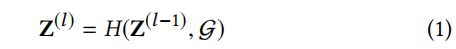

Z是节点表示，H是邻居聚合的函数：

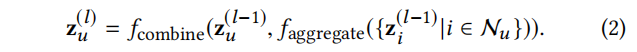

L层之后，获得最终表示：

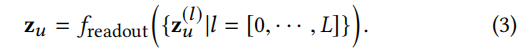

- aggregate、combine、readout

监督学习，监督信号来自于观测到的交互，即图中的边。

### 3 METHODOLOGY

Self-supervised Graph Learning（SGL）范式，自监督图学习

#### 3.1 图结构上的数据增强

- 用户的一阶邻居(item)可以看做user已经存在的特征
- 用户的二阶邻居(user)可以看做和其行为相似的用户
- u--i高阶路径，反映u可能对i感兴趣

使用三种图增强方法

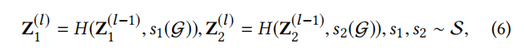

在第$l$层时，使用两个随机操作 $s_1$  $s_2$ 对图G做操作，然后这一层会得到两个相关的视图 $Z_1^l$ $Z_2^l$

- **节点丢弃 ND**
  - 按照概率对所有节点进行drop，同时其连接的边也要drop
  - 每次引入mask_vector M
  - 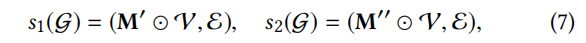
  - **该操作希望识别出有影响力的节点**
- **边丢弃 ED**
  - 按照概率对所有的边进行drop
  - 每次引入mask_vector M
  - 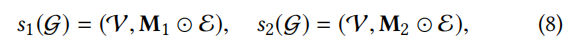
  - **该操作希望捕获节点的局部结构中的有用模式，让表示对噪声交互具有更强的鲁棒性**
- **随机游走 RW**
  - 上述两个操作生成的子图，在后续的每一层卷积时都在使用这个子图
  - 而随机游走是每一层图卷积时，子图不同；比如在每一层进行了边丢弃（上述只丢弃一次，一直用）
  - 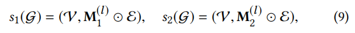
  - **这一操作可以看做是为每一个节点通过随机游走构造子图**

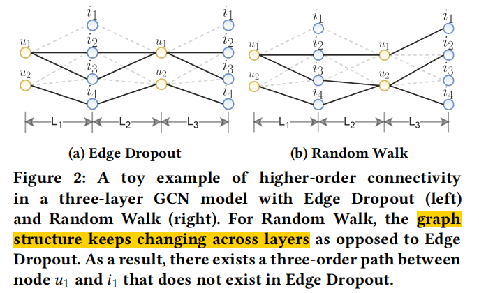

具体实现：

- 每次epoch开始前，为每个节点生成两种视图
- 对于RW，两种视图在每一层卷积前生成*（那就是每个epoch进行L次生成？依次进行？）*

#### 3.2 对比学习

- 不同view下的同一个节点形成正样本pair $z_u^1,z_u^2$

- 不同view下的其他节点形成负样本pair $z_u^1,z_v^2$

- 鼓励同一个节点在不同视图下的一致性；强制不同节点间的不同

- InfoNCE损失：

  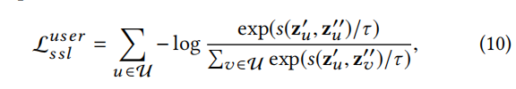

*Q：为什么负样本pair中的 u 和 v 是来自不同视图呢？？为啥不是来自同一视图呢？*

#### 3.3 多任务训练

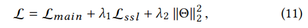

还可以pretrain SSL，然后在main上微调。

#### 3.4 SGL的理论分析

TODO

### 4 Experimental Settings

- 10 core
- train:val:test=7:1:2
- baseline中注意DNN+SGL也是一种SSL用在RS的工作；注意提到Mult-VAE中额外的重构损失也是一种特殊的SSL；

#### RQ1: 性能比较

**和LightGCN比较**

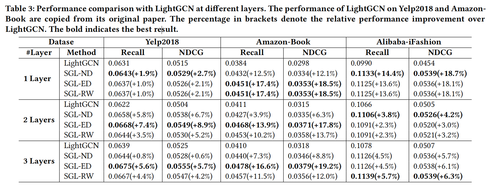

- 大部分情况下ED最佳
- ND有可能会将重要的节点drop，影响图结构，当稀疏的时候更为明显

**和SOTA比较**

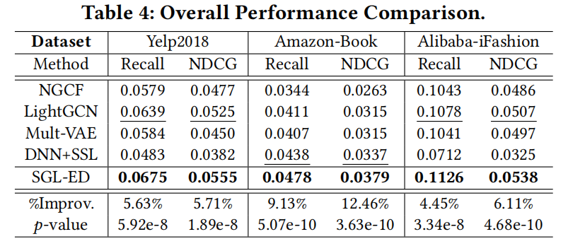

#### RQ2: SGL的好处

==**长尾推荐**==

将物品按照流行度分成10组，保证每组的u-i交互数相同：

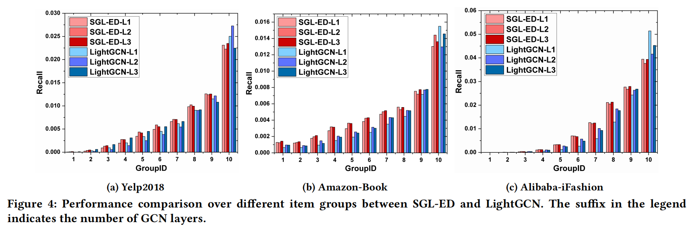

- LightGCN更倾向于推荐热门物品，对冷门物品的曝光较少。认为LightGCN由于冷门物品的稀疏交互很难学习到长尾物品高质量的表示，三个数据集上最热门的物品(group id=10)，分别占比0.83%，0.83%，0.22%，贡献了recall中的 39%、39%、51%；SGL中的贡献降为36%、29%、35%。
- SGL带来的改进主要来自于准确推荐具有稀疏交互作用的items

**训练效率**

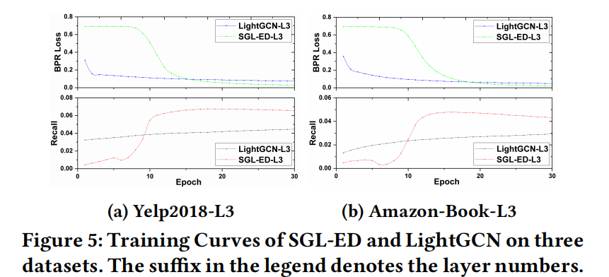

- SGL的加速源于两方面：
  - InfoNCE能让模型从多个负样本学习到表示，BPR只能用一个负样本；*（这和阿里的EBR中提到的召回阶段的一部分意思差不多）*
  - SGL理论分析表明从hard负样本挖掘中获益
- BPR loss的快速下降比Recall的快速上升稍微滞后，表明BPR loss和rank task之间存在gap

**对噪声的鲁棒性**

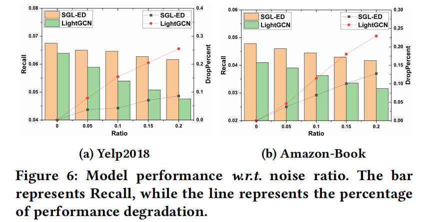

- 在train中增加一定比例的边（noise）

#### RQ3: 不同设计的影响

**温度系数的影响**

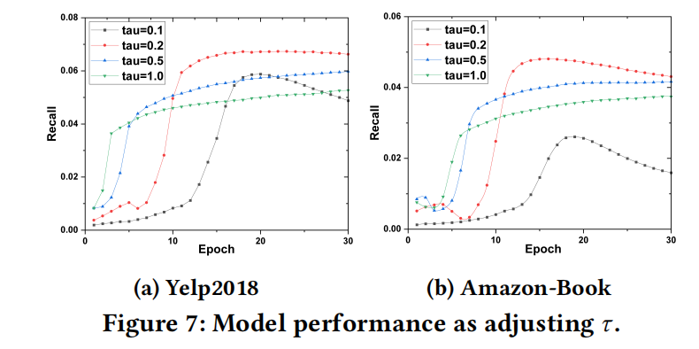

**预训练的影响**

- 本文的main loss和ssl loss联合训练
- 尝试使用ssl loss来pretrain嵌入，然后作为LightGCN的初始化，用main loss来fine-tune
- 结果：联合训练>>pretrain+fine-tune>>普通LightGCN

**负样本的影响**

- 同batch 其他item对于当前（user，item）中的user为负样本>>同batch 其他user、item对于当前（user,item）中的user为负样本；即要区分节点类型
- batch负采样相当于整体负采样，即把整个空间中的u i看作负样本
