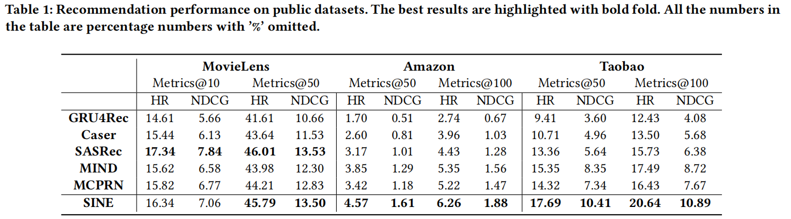

**Sparse-Interest Network for Sequential Recommendation**

**2021-WSDM** 阿里团队 召回

发现用户的行为序列通常包含多个概念上不同的物品，而统一的嵌入向量主要受到最近频繁行为的影响。本文提出**S**parse **I**nterest **NE**twork，核心是稀疏兴趣模块和兴趣聚合模块：

- 稀疏兴趣模块，自适应地从大型概念池中推断出每个用户的一组稀疏概念，并输出对应的多个嵌入
- 兴趣聚合模块，主动预测用户的当前意图，然后使用它显式地对next item预测进行建模

### 1  INTRODUCTION

- 传统的推荐方法——协同过滤
- 基于深度神经网络的推荐——NCF、PinSage；忽略了序列结构
- 序列推荐——输入user的点击序列，使用RNN/CNN/Transformer得到user的一个嵌入
- 电子商务平台中的用户随着时间变化，会交互不同概念级别的物品；而从行为序列中学习到的整体用户嵌入向量主要受到最近最频繁的items的影响；大意就是如果和next item属于相似类别的item出现在用户的序列中了，那么预测next item还算准确，但是如果没有出现过的话，预测效果会变差；——从用户序列中学习多个用户嵌入，每个表示用户在某方面的兴趣

从用户历史序列中提取多个嵌入向量的挑战有：

- items在**概念**上聚类的效果并不好（这里经常使用类别信息作为概念）
- 要从巨大的**概念池(concept pool)**中自适应地推断出用户少量稀疏的感兴趣的**概念**集合，推理过程包括一个选择操作，这是一个离散的优化问题，很难端到端训练
- 给定多个兴趣嵌入向量，在预测下一个items时我们需要确定哪些兴趣可能会被激活

### 3 METHODOLOGY

#### 3.1 符号定义和问题描述

- N用户，M物品
- 用户的物品点击序列 $x^u=[x^u_1,x^u_2,...,x^u_n]$
- 模型用于召回阶段

#### 3.2 稀疏兴趣框架

在召回阶段的深度序列模型通常有一个序列编码器 $\phi$ 和物品的嵌入表，编码器$\phi$ 以用户历史点击序列 $x^u$ 为输入，输出序列的表示，这可以看作用户意图的表示。然后用户的意图嵌入作为query来生成其top K个候选物品。大部分模型的序列编码器输出一个单个的意图嵌入，也有模型输出K个（潜在类别下的）意图嵌入，本文关注于后者，希望准确地捕获出用户的多样化兴趣。

多意图序列编码器分为两类：

- 使用强大的序列模型隐式地提取用户的意图，比如多头注意力机制
- 使用潜在的原型(prototype)来显式地用户地多意图

总共L个**概念原型**，其嵌入矩阵为 $C\in R^{L×D}$，而对于用户u，本文的模型能够自适应地激活K个**概念原型**，得到激活的**概念原型**矩阵 $C^u \in R^{K×D}$。

**概念激活**

用户u有n个点击行为，先使用自注意力模型计算n个行为每个item的权重a：

a的维度为[n,1]=[n,D]\ [D,D]\ [D,1]

> **个人认为得理解本文中多次出现的自注意力结构，单看公式，个人理解是:**
>
> - 要聚合n个d维嵌入，随机初始化一个d维的query（$W_2$）
> - 把n个d维嵌入通过 投影矩阵+tanh 转化到另一个d维空间中
> - 然后用每个转化后的嵌入和query做softmax(内积) 得到每个嵌入的权重
> - 最后聚合原始的嵌入
> - ==所以query是随机初始化的d维向量；value是x；key是 $tanh(xW_1)$==
> - ==或者query是随机初始化的d维向量；value是x；key是 x；打分函数是 $tanh(keyW_1)query $==
> - 注：快速看了下出处的一篇文章，更正两点：
>   - query的嵌入维度可以随意，因为$W_1$ 投影矩阵可以转化原维度；
>   - query本文用了1个，出处的query可以用多个，即矩阵，这样提取出来的[x]序列的表示就是一个矩阵，每一行可以看作关注于不同方面的[x]序列表示，同时还希望提取出来的结果矩阵能够尽量多样化

获取一个虚拟的概念向量 $z_u=(a^TX^u)^T$ ，其维度是 [D,1]=[1,n]\[n,D]->[1,D]->[D,1]；然后来激活概念原型：

最终或得$C^u$ 就是这个用户的概念原型矩阵

*（Q：为什么公式2是一种topK选择技巧，能够使得选择操作可微分呢？？是不是类似于重参数技巧呢？？）*

*(A：是不是 $s^u$  -> idx 这一步是不可以反向传播的，之前的 z->s无法被反向传播，因为 idx<-s被切断了；现在可以通过 z -> s -> s_idx -> $c^u$) 这条路进行反向传播呢？？相当于把rank出来的idx作为常量再次使用到了s的后续路径上？？* 

**意图分配**

预测用户点击序列中点击每个item时的用户意图：

注：这里的LN方式是cos

**注意力加权**

预测t时刻的物品对于预测用户下一时刻意图的重要性：

注：这里的item还要加上位置嵌入

**兴趣嵌入生成**

可以得到K个兴趣表示：

#### 3.3 兴趣聚合模块

在得到K种兴趣表示之后，需要得到用户在t时刻的表示（用以预测t+1时刻），MIND使用t+1时刻的item来挑选t时刻的兴趣，但是在推断的时候没有target label。

本文解决方法：提出自适应兴趣聚合模块，根据 $P_{k|t}$ 得到意图分布矩阵 $P^u$ [n,K]，然后可以得到每个t位置item对应的意图嵌入【通过t时刻的意图分布对$C^u$进行加权聚合】。得到每个时刻的意图嵌入之后，**再次使用自注意力层来预测t+1时刻的意图嵌入（避免了使用target label）**。

- $C^u_{apt}$ 是预测的用户u在下一时刻的意图表示
- 根据 $C^i_{apt}$ 和当前时刻的K个兴趣表示 计算相关性权重（softmax+内积+温度系数），然后根据K个兴趣表示和权重聚合出u预测t+1时刻时的最终表示

#### 3.4 模型优化

理论上的rs损失：

- 为了计算效率进行sampled softxmax

- 新增协方差正则化项，使原型嵌入尽量正交：

  

  

- 结合两项损失得最终损失函数

#### 3.5 与现有模型的关系

### 4 EXPERIMENTS

- 训练：train-val
- 测试：train+val-test

**意图数量和概念原型数量**

采用原型的嵌入选出top8个cos最近的item，一个概念中的物品来源于不同的语义近叶类别（比如化妆品中有不同类别的化妆品），说明比起传统的叶类别划分，本文概念原型更和用户的高级意图相关。

为了进一步说明↑，将学习到的概念和专家层次标签不同级别计算NMI，结果表明概念原型和二级标签最接近，说明学习到的概念粒度既不是太粗也不是太细。

