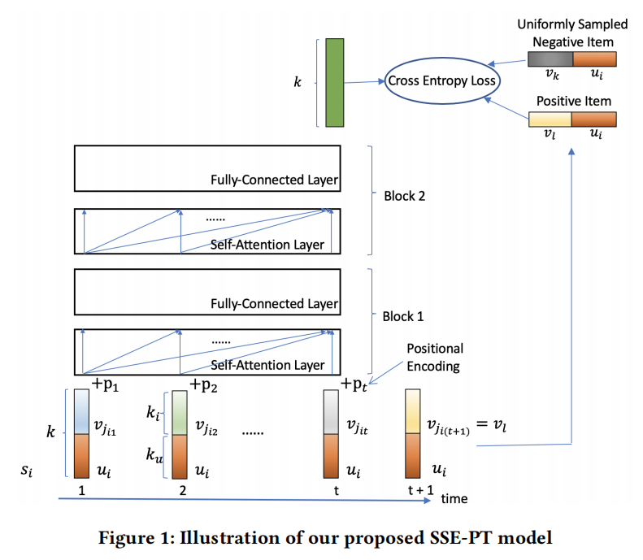

**SSE-PT: Sequential Recommendation Via Personalized Transformer**

**2020-RecSys**

个人认为本文的思想很好，要将个性化引入到Transformer中*（NLP的各种技术在我看来其目的是明确的，一句话是什么意思就是什么意思，所以只考虑这一句话中的word即可，但是对于RS来说，同样item id的序列对于不同的user id也是不一样的，不能单纯的以 item id序列来表示一个user）*；本文主要的点有：

- 序列中 user emb和item emb进行拼接的表示
- 如何使用SSE

### 1 INTRODUCTION

 SASRec使用标准的Transformer，本质上是一个非个性化的模型。SASRec指出增加了user emb之后效果会下降，本文认为是其已经使用了user的history items，user emb只会导致过拟合。本文提出了个性化Transformer，SSE-PT，将个性化引入了自注意网络。

### 3 METHODOLOGY

#### 3.1 序列推荐

- 一共 n 个用户，m 个物品

- 用户 i 的序列 $s_i$ ，长度为 T ，即 T 个items

#### 3.2 个性化Transformer架构

##### 嵌入层

- 用户嵌入维度 $d_u$，物品嵌入维度 $d_i$，位置嵌入维度 $d=d_u+d_i$
- 每个序列中的物品嵌入为 concat[u,i] + pos_emb
- 引入了user emb，使得模型具有个性化

##### Transformer Encoder

和原始的一样，mask i>j的位置

##### 预测层

用户 i ，物品 l：

本文把（2）和（4）中的两种嵌入称为输入嵌入和输出嵌入，注意target item只需要和user emb concat即可，不需要加位置emb。

##### 随机共享嵌入

SSE的主要思想是在SGD过程中，使用另一个嵌入以预定的概率随机代替嵌入，这项技术能够对嵌入层起到正则化的作用。对于user embs，需要额外 O($n d_u$) 个参数。

*错误的想法：（这个参数应该是概率，但是按照个人理解，以为是多n个参数，就是一个user emb要么全代替，要么就不换；但是看这个参数量，意思是一个user emb中的每个维度要么代替，要么不换）*

*正解：（这个参数不是概率，只是another embs的参数。。。）*

- input / output user embeddings    $p_u$
- input item embeddings     $p_i$
- output item embeddings     $p_y$

本文实验发现：

- 对于user embs 和 out item embs进行SSE一直有效
- 当平均序列长度足够大时 对于in item embs进行SSE才有所帮助

本文还提到了一些其他的正则化技术：

- LN、BN、残差连接、权重衰减、dropout

#### 3.3 处理长序列：SSE-PT++

 1-2-....-T-....-t

SSE-PT处理序列的最大长度是T，当t>T时，需要从 [1,t]中采样一条长度为T的序列。引入超参数采样概率 $p_s$：

- start idx 以$p_s$ 的概率从 [1,t-T] 中选择
- 以 $1-p_s$ 的概率使用最近的T个item 序列

### 4  EXPERIMENTS

**注意力机制可视化**

一个用户早期看各种类型；随后只看戏剧和恐怖片；最近常看戏剧

- SASRec推荐出来的种类更多，倾向于所有的item
- SSE-PT推荐出来的更倾向于最近的item