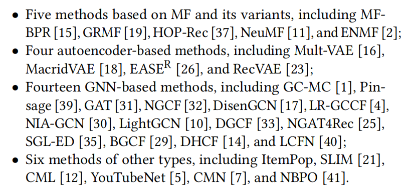
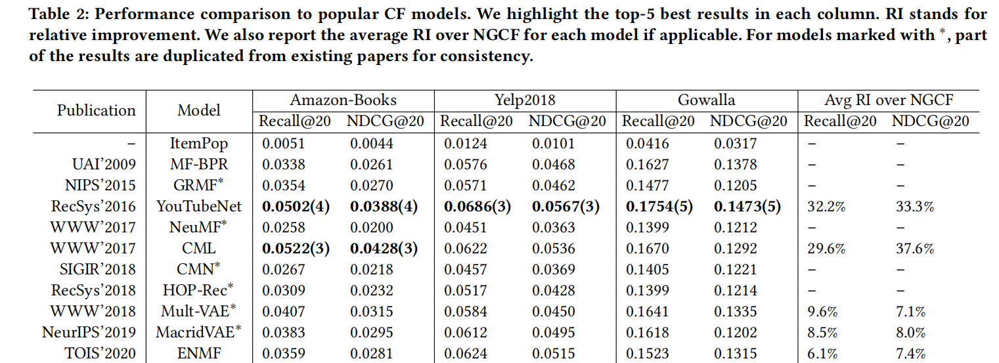

**SimpleX: A Simple and Strong Baseline for Collaborative Filtering**

**2021-CIKM**

- CF三大块：交互Encoder、损失函数、负采样

- 本文提出余弦对比损失，整合到一个简单的统一的CF模型—SimpleX

个人认为亮点在损失函数上，模型大道至简，表现很好；但是拿CCL和BPR比 相当于对于每个正样本pair，使用了更多（采样数量）并且权重不等（margin）的负样本，类似于阿里的EBR（21kdd）中提到softmax优于pairwise 

### 2 BACKGROUND AND RELATED WORK

#### 2.1 CF 定义

- 交互Encoder，目的是学习到用户和物品的嵌入*（这篇文章的Encoder默认是基于表示的CF中的Encoder，不是说基于u-i匹配函数中的交互函数）*
- 损失函数
- 负采样

#### 2.2 代表性CF工作总结

- 基于矩阵分解
- 基于自编码器
  - *Q：为啥说这类模型适合inductive recommendation呢？从一组用户中学习模型，在另一组用户上进行推荐*
- 基于图
- 其他

### 3 SIMPLEX

#### 3.1 余弦对比损失

- BPR loss、binary cross-entropy、softmax cross-entropy 、pairwise hinge loss

本文提出CCL，一个正样本pair(u,i)，$|N|$ 个负采样，最小化：

- $\hat y _{ui}$ 是 (u,i) 的余弦相似度，前一项希望正样本中的 (u,i) 尽量接近，后者希望负样本中的(u,i)间的余弦相似度尽量小于m
- $w$ 控制正样本损失和负样本损失的相对权重
- 使用余弦相似度（内积前L2-norm）而不使用内积，因为u、i的表示的大小受其流行度的影响
  - *（注：这个和自己想的一样，内积有个缺点，就是流行度热门的item，其表示要和很多user emb接近，那么一种方法就是增大热门item的模长；*
  - *看的多的user同理，尤其是user看的item的emb特别分散时，user的emb很可能会以增大模长的方式来增大内积）*
- BPR对于每个负样本认为都是相等重要的，然而m的引入能够过滤信息量低的负样本；因为它有助于自动识别那些余弦相似度大于m的负样本
- 当 $|N|$ 特别大时，有必要引入 $w$ 来平衡loss中的比例

#### 3.2 模型

- uid和target item id在同一个空间
- uid+[history item id]聚合
- 聚合层：平均池化、自注意力、user-attention

- q 是一个可学习的供自注意力的全局query [d,1]

- *Q：明白这个q是全局的，相当于随机初始化了一个query，但是这叫自注意力吗，应该叫self-attentive吧*

- 通过聚合操作得到的 $p$ 可能和user emb不在同一个空间（由于公式4中的W，如果query、user emb直接对iid emb做内积相似度、就在一个空间了），所以聚合方式为：

  - 个人认为这个 $V$ 相当于把p又投影到user空间中了

  

  

#### 3.3 和现存模型的关系

- MF，$g=1$ 时，只使用user id
- YouTubeNet，YouTubeNN是concat(uid 平均iid)+MLP，本文聚合是加权平均
- GNN-based，user-atten相当于只对user node做GAT，self-atten 很像 NIA-GCN 中的邻居交互

### 4 EXPERIMENTS

#### 实验设置

对比方法：

- 对于CCL中的负采样，大多100，500，或1000

####  Loss Functions & 负采样比例

#### RS表现

#### 将CCL整合到其他模型

#### 超参数影响

#### 效率

