**Variational Autoencoders for Collaborative Filtering**

**2018-WWW**

将VAE拓展到隐式行为的协同过滤中。这个非线性概率模型能够超越线性因子模型（CF中的大多模型）的有限建模能力。介绍了一个多项式似然的生成模型，并使用贝叶斯推理方法进行参数估计。

### 1  INTRODUCTION

动机：目前CF中的隐因素模型大多都是线性的，限制了模型能力，引入非线性特征能够增加推荐的表现。

### 2 METHOD

#### 2.1 模型

对于用户 $u$ ，从一个标准高斯先验中采样其表示 $z_u$。然后经过非线性函数 $f_\theta()$ ，来产生一个在（所有） $I$ 物品上的概率分布，这个概率分布从$u$ 的历史点击 $x_u$ 中生成， $f_\theta ()$ 是MLP。

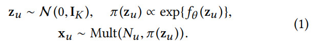

$f_\theta()$ 的输出加softmax 产生分布；假设观测到的用户历史 $x_u$ 是从一个概率分布 $\pi(z_u)$ 的多项式分布中采样出来的。

用户 $u$ 的ln似然为：

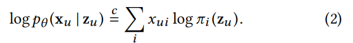

*注：原文说这个多项式似然和LDA中一样，也用于多分类的交叉熵损失函数（session-based序列推荐中）*

本文认为多项式分布非常适合建模点击数据。提出了两种似然函数的选择：高斯似然3和逻辑似然4。

*（注：个人认为就是回归和0/1分类的先验分布）*

$f_\theta()$ 的输出是：

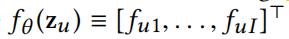

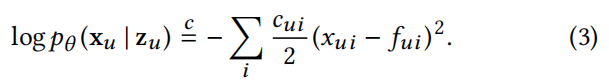

#### 2.2 变分推断

估计 $f_\theta()$ 的参数 $\theta$ 。变分推断：使用一个简单的变分分布 $q(z_u)$ 来推断真实的后验分布 $p(z_u|x_u)$ 。本文使用对角的高斯分布（完全分解）。

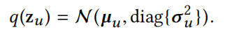

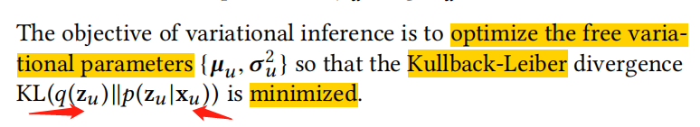

***Amortized inference and the variational autoencoder***

使用VAE的原因：随着u i数量的增大，要优化的参数增多，而VAE 使用推断模型替换掉那些单独的变分参数。

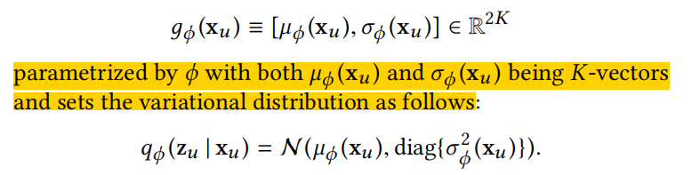

- 输入历史点击$x_u$
- 输出对应的变分分布 $q_\phi(z_u|x_u)$：的变分参数
- 推断模型 $q_\phi (z_u|x_u)$ 来拟合真实的后验分布 $p(z_u|x_u)$；生成模型 $p_\theta (x_u|z_u)$；组合两者形成VAE

VAE利用了amortized inference的思想：重复使用推论来回答相关的新问题；与CF的思想类似：利用从过去的经验中推断出的相似性模式来分析用户的偏好

学习VAE，evidence lower bound (elbo)

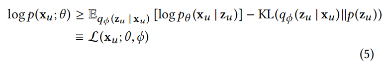

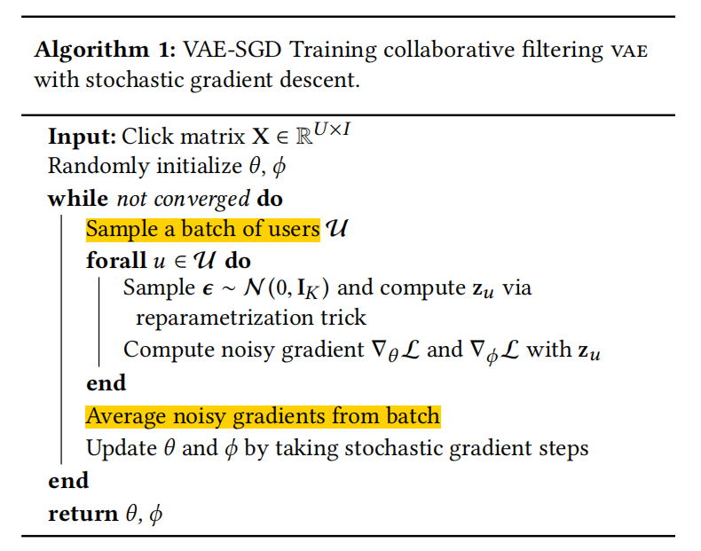

**Alternative interpretation of elbo**

看公式5，第一项是重构误差，第二项是正则化，引入正则化参数 $\beta$ 

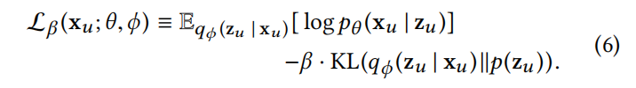

如果 $\beta < 1$，弱化了先验约束的影响：

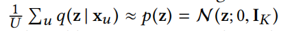

#### 2.3 AE的分类

