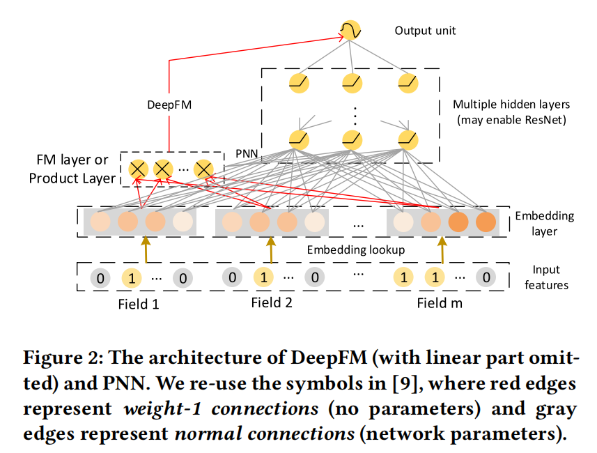
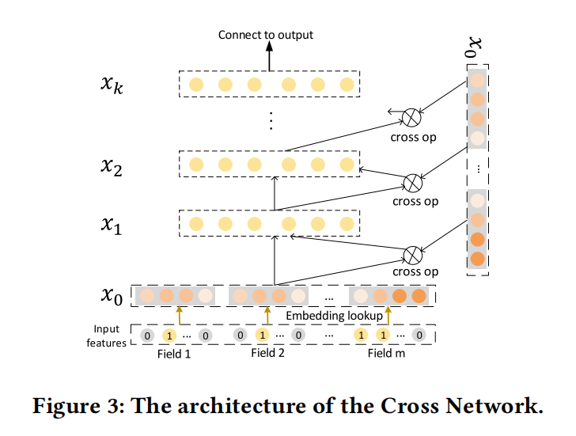
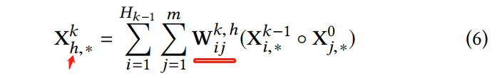
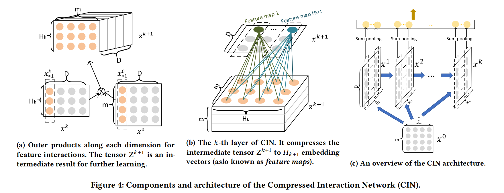
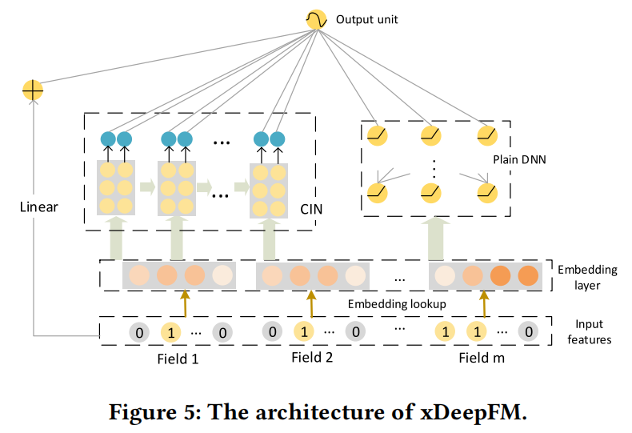
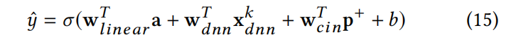

**xDeepFM: Combining Explicit and Implicit Feature Interactions for Recommender Systems**

**2018-KDD**

提出了CIN，能在vector-wise级别上以显式的形式生成特征交互。结合CIN和DNN，提出xDeepFM，即能够显式地学习特定的有界度特征交互；又能隐式地学习任意的低阶和高阶特征交互。本文的核心是CIN特征交互。

### 1 INTRODUCTION

特征转化的一种主要方式是分类型特征上的跨域交叉，称之为*cross features* or *multi-way features*。

### 2 PRELIMINARIES

#### 2.1 嵌入层

*multi-field* categorical form is widely used

如果field是多值的，则使用特征嵌入的和作为字段嵌入（即sum pooling）

#### 2.2 隐式高阶交互

图中的Deep部分

#### 2.3显式的高阶交互

CrossNet 每一层xk 维度都相同 都是[每个field的嵌入拼接而成的嵌入]

### 3 OUR PROPOSED MODEL

#### 3.1  Compressed Interaction Network

CIN

- 交互应用在vector级别，而不是bit级别
- 高阶特征交互显式探索
- 网络复杂度不会随着交互的degree而指数级增长

个人认为这里的关键有两部分：

- 每一层的输入输出维度
  - 初始就是每个field的嵌入拼起来，即m个field，emb的维度是D，$X^0 \ [m,D]$   
  - 一共有 $L$ 层CIN，输出分别为 $X^1,X^2,...,X^L$
  - 第 $k$ 层的输出 $X^k \ [H^k,D]$
- 每一层如何运算的
  - 
  - 对于第 $k$ 层，需要参数矩阵 $W  \ [H^k,H^{k-1},m]$
  - 看公式6的理解是这样：
    - 做  $H^k$ 次操作，每次用 $[H^{k-1},m]$ 的 $W$ 做操作
    - 用 $X^{k-1} \ X^0$ 做外积， $[H^{k-1},D]\ [m,D]\ -> [H^{k-1},m,D]$ ；进行类似对应元素乘积的操作$W$ ，然后对前两个维度求sum得$[H^{k-1},m] \ [H^{k-1},m,D] -> [H^{k-1},m,D]->[1,D]$
    - 最后得到 $X_k \ [H^k,D]$
- 最后CIN得输出是对所有得 X 按照D维度求sum，拼接起来，$X^1,X^2,...,X^L$ 由 $[H^{1},D],[H^{2},D],...,[H^{L},D]$ 变成 $[H^{1}+H^{2}+...+H^{L}]$

#### 3.3 xDeepFM

优点：结合了低阶特征交互（LR）和高阶特征交互（CIN、DNN）；结合了隐式特征交互（DNN）和显式特征交互（CIN）

最终的logit由三部分相加：

- Linear侧
- CIN侧
- DNN侧
