### 2020-KDD-Embedding-based Retrieval in Facebook Search

embedding-based retrieval (EBR) 

本文介绍了统一的嵌入框架用于建模个性化搜索中的语义嵌入，并在一个典型的基于反向索引的搜索系统中提供EBR。搜索引擎包括retrieval和ranking，Facebook的搜索引擎面临的问题不仅仅是文本匹配问题，搜索结果还和user、context相关。这里记录一些文中的关键点。

#### 模型

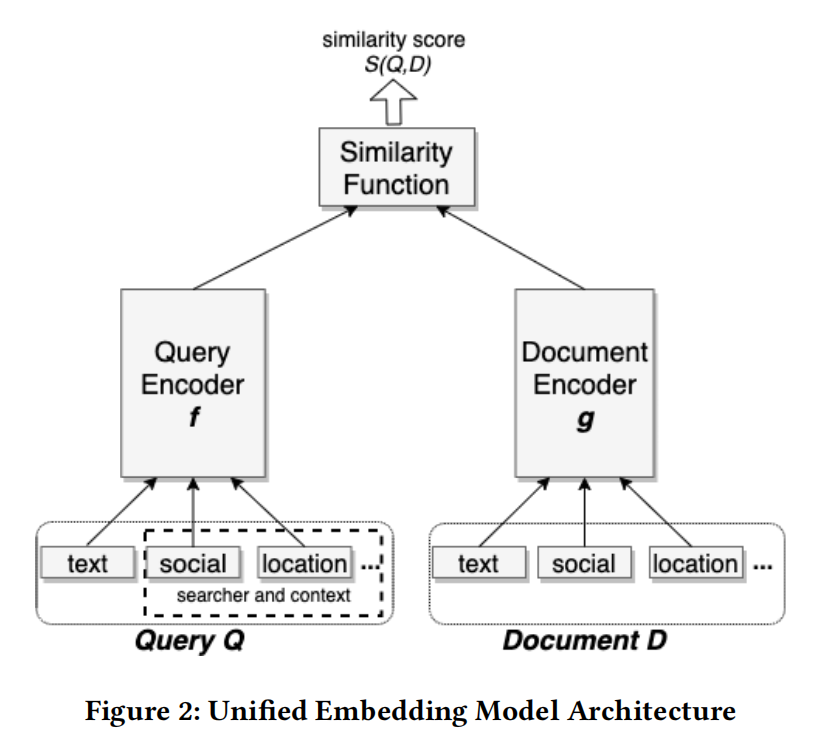

- 使用triplet loss，注：不同的margin导致5-10%的KNN方差
- 认为使用随机负采样构造pair可以近似优化召回任务，原因是：训练数据时为一个正样本采样n个负样本，那么相当于优化recall，在候选集n中选出top1；实际候选池大小为N，近似优化recall topK=N/n。
- 分类形特征，one-hot直接lookup，multi-hot进行加权组合

正负样本选择：

- 负样本：使用曝光未点击做负样本 << 随机负样本
- 正样本：使用点击做正样本 == 使用点击+曝光未点击做正样本
- 结论：点击做正样本+随机负样本

#### 线上服务

使用基于倒排索引的ANN *（Q：倒排是不是指的返回结果时按照相似度从高到低返回呢？应该不是指单词id-文档id这种倒排吧？）*

嵌入压缩的两组主要部分：

- 粗量化，通常通过K-means算法来将嵌入向量量化到簇中
- 乘积量化，进行细粒度量化，高效地计算嵌入距离

一些需要调整的参数：

- 粗量化（算法IMI、IVF）中的num_cluster
- PQ、OPQ、PCAPQ中的pq_bytes
-  nprobe，决定query要去多少个族中匹配

#### 前言主题（亮点）

Hard Mining：

- Hard negative mining (HNM)：当候选集和query都很相似时模型召回效果差，可能是因为训练过程中负样本随机得到，相比于训练的正样本too easy；因此训练的时候可以采一些和query在emb空间中相似的负样本做为hard negatives。
  - 在线hard负样本挖掘：使用所有的正doc做为docs池，对于每个query从中选最相似的作为hard负样本
  - 离线hard负样本挖掘：
    - hard负样本选择：使用最难的负样本不是最好策略，发现rank 101-500 做为hard负样本实现的recall最高。
    - 检索任务优化：混合easy/hard负样本，100:1；迁移学习，从hard model到easy model。
- Hard positive mining：一个方向是识别没有成功检索出来但是是积极的新结果。

嵌入集成：使用随机负样本更接近真实的数据分布，但是当 top K 中的K特别小的时候，模型表现不佳。使用多阶段：1关注于recall；2关注于与正样本相似的负样本。

- 加权concat两套嵌入算相似度，效果不佳
- 级联模型，model 2在model 1得到的embs上继续train

### 2021-SIGIR-Cross-Batch Negative Sampling for Training Two-Tower Recommenders

【华为+清华】在双塔训练中，提出**C**ross-**B**atch **N**egative **S**ampling (**CBNS**) 负采样策略，将【近期其他batch内的items在物品塔的emb】+【in-batch负样本】作为当前batch的候选负采样池，以较低的内存（相比于增加batch size来说）增加了负样本池的大小。

#### 动机

- 常见的in-batch采样策略：在相同的mini-batch中其他user的item作为当前user的负items，节约了用户塔和物品塔的计算效率
- 近期有工作致力于弥补local(in-batch)和global(whole data space)的数据分布偏差，并且采用一些现成的hard-mining技术
- 上述的in-batch采样受到mini-batch size的影响，size增大，有助于提升表现，但是GPU显存增加
- 发现了嵌入稳定性，即经过一段时间训练后（after warm-up stage），双塔输出的嵌入较为稳定

#### 具体采样

- 基础：大规模检索可以看作极端的分类问题，with均匀分布的sample-softmax；交叉熵做目标

  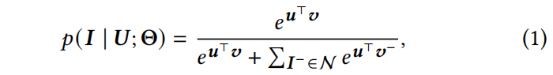

  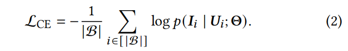

- in-batch：负采样分布 $q$ 服务基于物品流行度的unigram distribution

- 基于sampled-softmax，修改公式1为：

  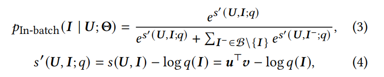

- 其中 $log\ q(I)$ 是采样偏差的惩罚项，也就是让emb u和热门的i负样本离得更远？

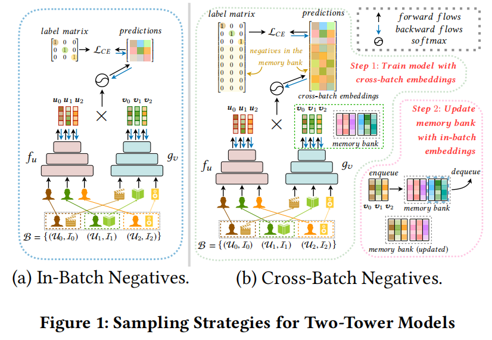

CBNS：

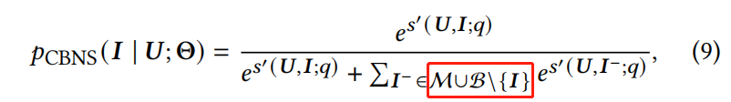

- 嵌入稳定性，双塔的嵌入会逐渐稳定
- FIFO内存队列 $M$
  - 先用in-batch来warm up训练
  - 内存队列可以存放比mini-batch size更大的负样本候选池，这时的候选池是in-batch+M
  - 当前batch迭代完，将当前batch内的item embeddings和流行度入队，队列中最早的出队

#### 实验

- 对比三种采样：均匀采样、in-batch、**混合负采样**（TODO：这个有时间了解下）

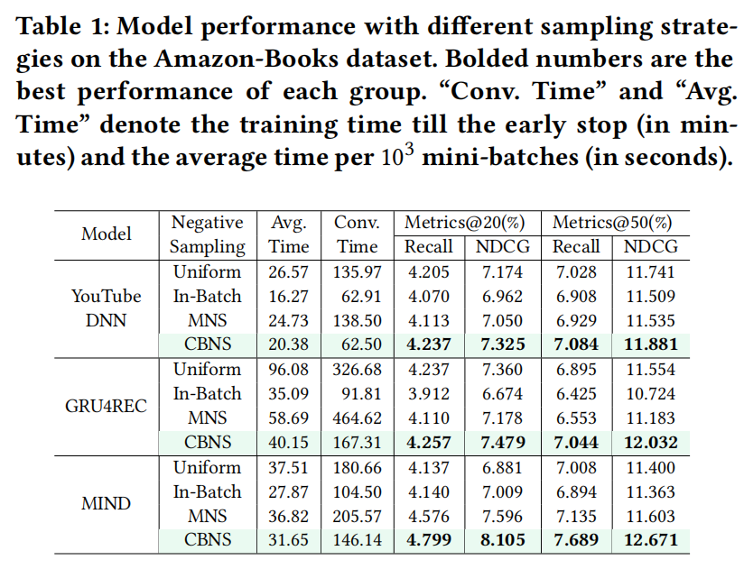

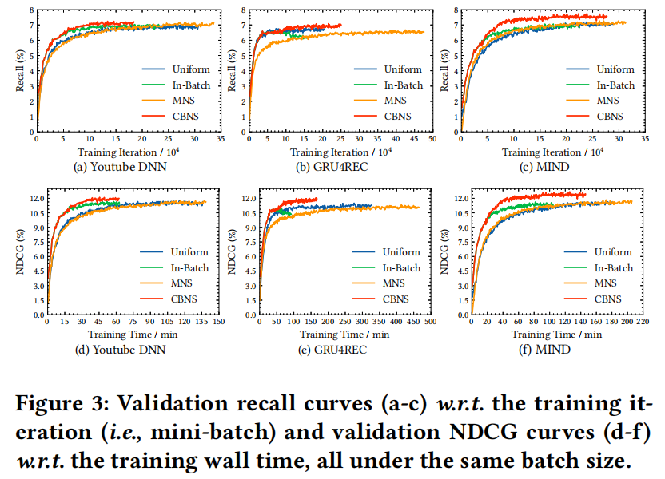

### 2021-arxiv-Diversity Regularized Interests Modeling for Recommender Systems

实验表明多兴趣模型提取出的向量有时是同质性的，本文提出DRIM，介绍了三种策略作为多样性正则化分离器，使得不同的兴趣向量尽量有区别。

- 多兴趣提取器：从Item序列中提取出多个兴趣向量
  - 胶囊网络、动态路由
  - 训练过程中，对于target item使用argmax操作选一个用户兴趣表示来训练
- 多样性正则化分离器
  - 最大熵
  - 距离 使得每个向量和平均中心离得远
  - pair difference求sum
- Baseline：MostPopular、YouTube DNN、MIND、ComiRec
- 实验中感兴趣部分——可视化：将用户兴趣数设置为2，将兴趣嵌入维度将为2，将每个用户的2个点连接起来

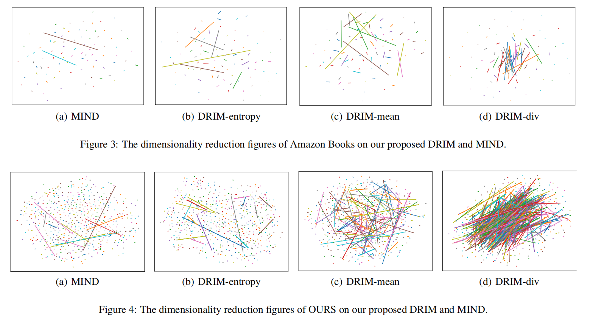

### 2021-KDD-Embedding-based Product Retrieval in Taobao Search

EBR系统面临的问题：

- 对于给定的query，低相关性
- 训练阶段和推理阶段的差异

电商检索中主要的挑战是：如何在考虑查询语义与历史用户行为的关系时，有效地检索出满足用户最相关的产品

由于无法精准匹配出查询术语，EBR方法对于相关性的可控性是很低的。

#### 相关工作

- 基于表示和基于交互
- 工业界主流趋势是基于表示的检索模型+ANN

#### 模型

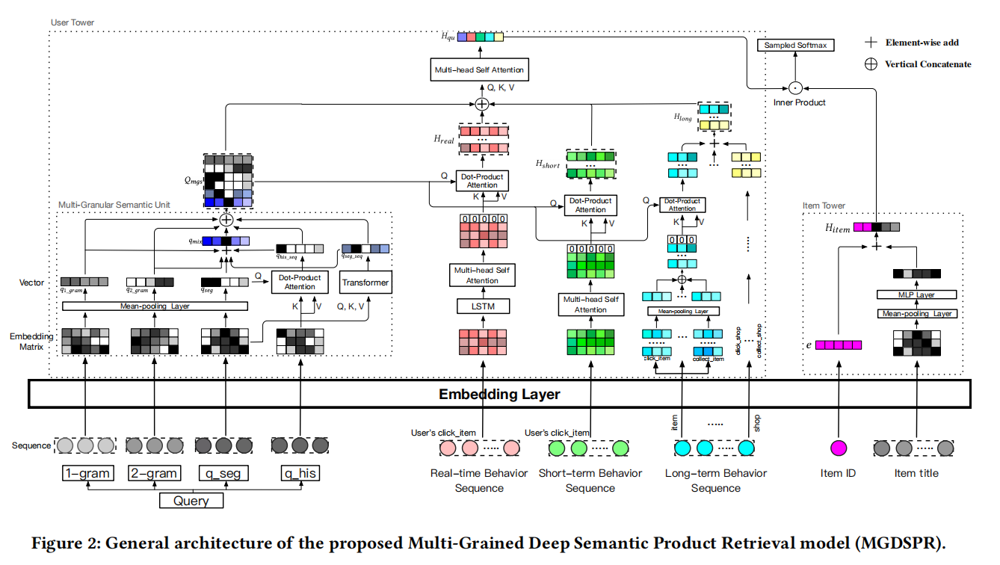

**损失函数**

- 常规：训练的时候随机负采样，使用pairwise(hinge) loss；
- ==本文认为pairwise使得训练和测试的行为不一致，因为在线上服务时，模型需要在所有的候选集中选出和cur query最接近的top-K个items，所以模型需要有全局比较的能力，然而pairwise loss只能有局部比较能力==
- 本文：训练的时候采样softmax交叉熵loss，
  - 具体使用sampled softmax
  - **对于当前batch的每个训练样本，使用相同set的随机负采样和对于每一个训练样本使用不同set的负采样效果类似**，所以采用前者，节省资源

损失函数这一部分中介绍了两个方案

1. **平滑有有噪声的训练数据***（这个噪声应该指的是 用户点击的pos item和query相关性较小，这种情况下不一定要让pos item和query的嵌入接近）*
   - 在softmax中加入温度系数
     - 系数越趋近于0：模型强行使得pos item和neg items离得很远，虽然pos item和query的相关性不大
     - 系数越趋近于正无穷：模型不会完全按照监督信号
     - 所以增大系数，可以减少训练数据中的噪声
2. **生成相关性提升的hard负样本**
   - 从items pool中选出和query内积最近的 top-N个item做为hard采样集合 $I_{hard}$，按照下式生成负样本，$\alpha$ 越大，生成的负样本离正样本越近，表明负采样越hard
   - 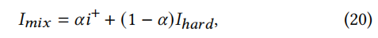

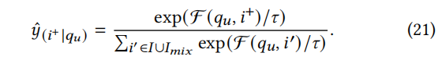

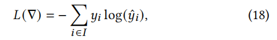

#### 系统结构

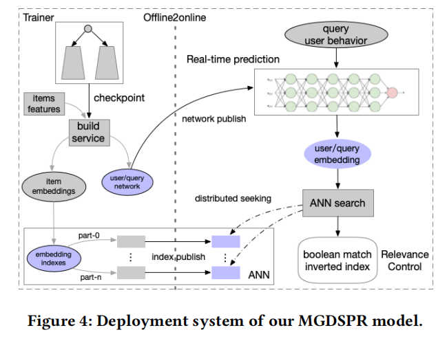

- build service优化和构造一个 user tower的user/query 网络，然后传输到实时计算平台
- 物品嵌入从item tower导出，并且传输到ANN索引系统

### 2020-KDD-PinnerSage: Multi-Modal User Embedding Framework for Recommendations at Pinterest

大多先前的工作推断出一个高维的嵌入来表示用户，但是很难充分地理解用户的兴趣。如何高效地编码一个用户的多个方面？一个好的嵌入必须编码用户的多种口味、兴趣、style等

记录以下本文吸引到自己的设计：

- **item emb是固定的（这里的解释很有趣）**：之前一些工作是 user item emb 联合学习得到的，但是如图联合学习会使得 v1 v2 v3的嵌入更加接近，而我们希望不同topic的物品嵌入可以距离得较远

  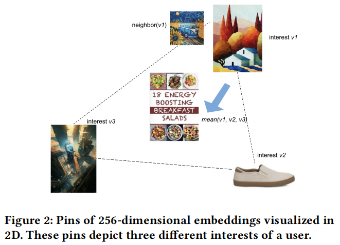

- **不限制用户的嵌入数量（这里引发了一些疑问）**：很多工作从item序列中提取一个user嵌入，比如mean(v1,v2,v3) 使得用户嵌入落入一个中间区域，这样最近的item都是和原有兴趣不同的

- 挑选出聚类中的3个最重要的item来表示用户

- 

  - *注：个人之前的理解是mean(v1,v2,v3)已经是得到的用户最佳的嵌入，因为在这个位置上的user嵌入是离history items整体而言最近的，这样再次进行近邻检索到的就是离user最近的，或者说离history items整体最近的，就是想 item-based CF一样，也是计算的target item和所有his items的相似度之和*
  - *注：刚看完这突然觉得好像很有道理，检索出来最近的item和之前的兴趣都不像了，有的冲击到自己的理解，但是仔细想了下，本文是用欧式距离来举例的，所以的确会出现这种情况；但是如果用内积或者cos指标的话，这种情况会稍微缓解一些；但是好像如果his items分的特别散的话，的确也会出现本文这种现象；比如cos的话，出现4个item (0,1) (0,-1) (1,0) (-1,0)，这样的user 嵌入的确无法兼顾离散方向*
  - *注：所以个人的理解是如果一个user的history items就是极端分散，那么联合学习的一个user嵌入的确会出现四不像情况，多个不同user嵌入是很有必要的；如果一个user的history items比较集中，那么学到的一个user嵌入能很好的表示这个user，不需要多个嵌入*

### 2021-KDD-Learning to Embed Categorical Features without Embedding Tables for Recommendation
谷歌 记录一下这篇文章种对嵌入的处理方案和常规的对嵌入的处理方案。

针对于嵌入表遇到的特征数量大、新特征经常出现的问题，提出了DHE。DHE（1）使用dense hash encoding 为每个特征获取一个唯一ID；（2）使用deep embedding network生成特征的嵌入。

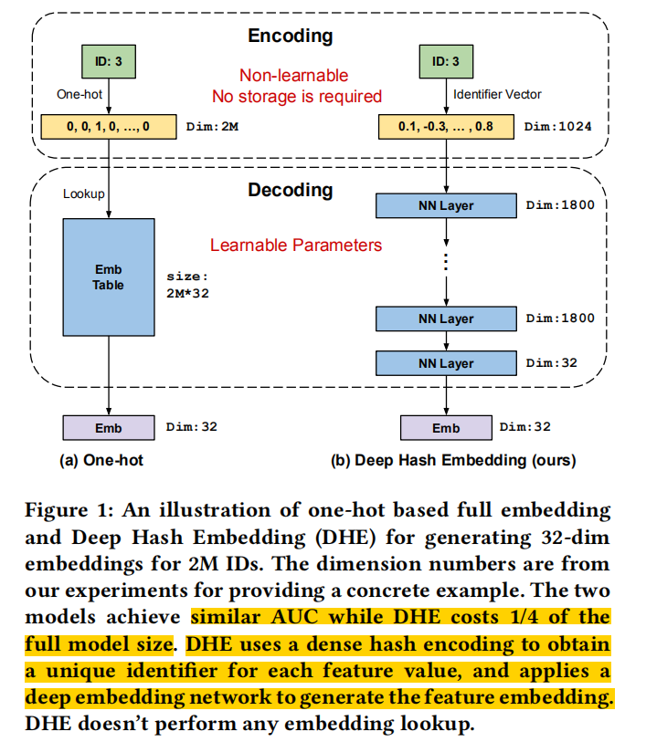

#### 嵌入方案

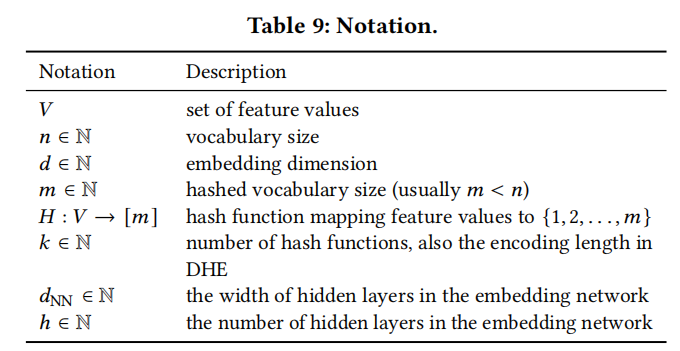

##### one-hot 全嵌入

id 查嵌入表

##### one-hot 哈希嵌入

- 为了解决特征id数量大以及新id的问题，发展出很多基于哈希的方法。哈希函数H把特征id映射到{1,2,m}中，其中m是哈希词汇表大小，拿映射之后的id去查表。
- 但是这种方法不可避免遇到嵌入碰撞问题，因为n>m。为了解决这个问题，使用多个哈希函数来生成多个one-hot（把一个id映射成多个id），然后拿多个id去查表，得到k个嵌入进行整合（一般相加）得到最终的嵌入。现存的这类方法大多使用双哈希。

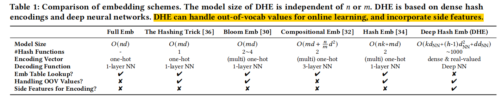

### 2021-KDD-An Embedding Learning Framework for Numerical Features in CTR Prediction

华为，数值型嵌入

- 对之前的数值型嵌入进行一个梳理
- 本文提出的对数值型嵌入处理的方法

### 2019-DLP-KDD-Behavior Sequence Transformer for E-commerce Recommendation in Alibaba

### 2020-MM-Graph-Refined Convolutional Network for Multimedia Recommendation with Implicit Feedback

### 2021-CIKM-Seq2Bubbles_Region-Based Embedding Learning for User Behaviors in Sequential Recommenders

